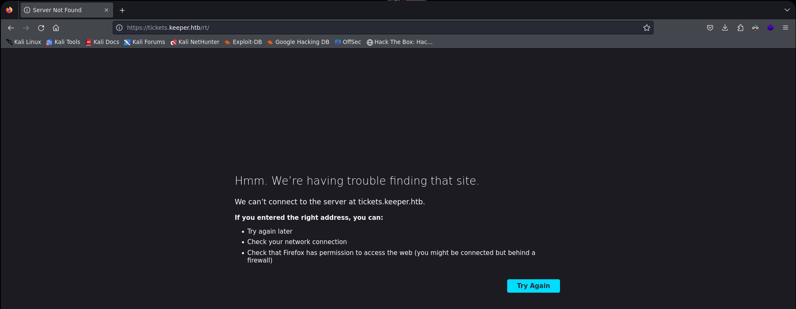

<h3 style="text-align:center">DESCRIPCIÓN</h3><hr>

En este post realizaremos el write up de la máquina Keeper. Tocaremos los conceptos fuga de información, abusamos de Request Tracker, contraseña de KeePass mediante volcado de memoria,Es una máquina facil.


<h3 style="text-align:center">INDICE</h3><hr>

- [Reconocimiento](#fase-de-reconocimiento)
    - [Enumeración de puertos](#enumeracion-de-puertos)
    - [Enumeración de servicios](#enumeracion-de-servicios)
- [Explotación](#explotacion)
    - [Volcado de memoria de Keepass](#volcadodememoriadekeepass)
- [Escalada de privilegios](#escalada-de-privilegios)
- [Autores y referencias](#autores-y-referencias)


<h3 style="text-align:center" id="fase-de-reconocimiento">RECONOCIMIENTO</h3><hr>


El objetivo principal de la etapa de reconocimiento es obtener una visión general de la infraestructura, sistemas, aplicaciones y posibles puntos débiles de la organización o sistema que se va a someter a la prueba de penetración. Esta información es esencial para planificar y ejecutar el resto del proceso de pentesting de manera más efectiva.

Durante la etapa de reconocimiento, el equipo de pentesting puede realizar diferentes acciones y técnicas, que incluyen:

1.`Búsqueda de información pública:` Se recopila información de dominios, subdominios, direcciones IP, registros de DNS, información de contacto de la empresa, etc., que está disponible públicamente a través de fuentes como el sitio web de la empresa, registros WHOIS, redes sociales, motores de búsqueda, entre otros.

2.`Escaneo de red:` Se utilizan herramientas de escaneo de puertos y servicios para identificar los sistemas en línea y los puertos abiertos en el objetivo. Esto ayuda a tener una idea de la infraestructura de red y los servicios disponibles.

3.`Enumeración de servicios:` Una vez identificados los servicios y puertos abiertos, se intenta obtener información más detallada sobre los servicios, como las versiones de software, para determinar si existen vulnerabilidades conocidas asociadas con esos servicios.

4.`Búsqueda de subdominios y directorios ocultos:` Se busca información adicional sobre posibles subdominios, directorios ocultos o páginas web no enlazadas públicamente, lo que podría revelar puntos de entrada adicionales o información sensible.

5.`Análisis de arquitectura de red:` Se investiga la topología de la red para comprender la relación entre diferentes sistemas y cómo se conectan, lo que ayuda a identificar posibles rutas para movimientos laterales.

6.`Búsqueda de vulnerabilidades conocidas:` Se investigan bases de datos de vulnerabilidades conocidas y bases de datos de exploits para identificar posibles vulnerabilidades que puedan existir en el software o servicios utilizados por el objetivo.

- Lo primero que vamos hacer es un ping a la maquina victima ping -c 1 10.10.11.227 ping: Es el comando utilizado para enviar solicitudes de eco (ping) a una dirección IP específica para verificar la conectividad de red y la latencia de la conexión. -c 1: Es una opción que se utiliza para especificar el número de solicitudes de eco que se enviarán. En este caso, se envía solo una solicitud (-c 1). 10.10.11.227: Es la dirección IP del host o máquina que será objeto del comando ping.

```ruby
❯ ping -c 1 10.10.11.227
PING 10.10.11.227 (10.10.11.227) 56(84) bytes of data.
64 bytes from 10.10.11.227: icmp_seq=1 ttl=63 time=92.0 ms

--- 10.10.11.227 ping statistics ---
1 packets transmitted, 1 received, 0% packet loss, time 0ms
rtt min/avg/max/mdev = 92.022/92.022/92.022/0.000 ms
```
El TTL---> 64 indica que es una máquina Linux

Con whichSytem.py nos arroja ante que nos estamos enfrentando con solo poner la dirección ip.
```ruby
❯ whichSystem.py 10.10.11.227
10.10.11.227 (ttl -> 63): Linux

```

Si quieren esa utilidad la guardan en el -usr-bin
```python
#!/usr/bin/python3
#coding: utf-8

import re, sys, subprocess

# python3 wichSystem.py 10.10.10.188 

if len(sys.argv) != 2:
    print("\n[!] Uso: python3 " + sys.argv[0] + " <direccion-ip>\n")
    sys.exit(1)

def get_ttl(ip_address):

    proc = subprocess.Popen(["/usr/bin/ping -c 1 %s" % ip_address, ""], stdout=subprocess.PIPE, shell=True)
    (out,err) = proc.communicate()

    out = out.split()
    out = out[12].decode('utf-8')

    ttl_value = re.findall(r"\d{1,3}", out)[0]

    return ttl_value

def get_os(ttl):

    ttl = int(ttl)

    if ttl >= 0 and ttl <= 64:
        return "Linux"
    elif ttl >= 65 and ttl <= 128:
        return "Windows"
    else:
        return "Not Found"

if __name__ == '__main__':

    ip_address = sys.argv[1]

    ttl = get_ttl(ip_address)

    os_name = get_os(ttl)
	print("%s (ttl -> %s): %s" % (ip_address, ttl, os_name))
```

<h3 style="text-align:center" id="enumeracion-de-puertos">ENUMERACIÓN DE PUERTOS</h3><hr>

Realizamos un escaneo de puertos usando la herramienta `nmap`:

`nmap -p- --open -sS --min-rate 5000 -vvv -n -Pn 10.10.11.227 -oG scanPorts`

Veamos el significado de cada opción utilizada en el comando:

- `nmap`: Es el comando para ejecutar la herramienta de escaneo de puertos `nmap`.
    
- `-p-`: Esta opción indica que se deben escanear todos los puertos, es decir, desde el puerto 1 hasta el puerto 65535.
    
- `--open`: Filtra los resultados del escaneo para mostrar solo los puertos que están abiertos, es decir, aquellos que responden a la solicitud de escaneo.
    
- `-sS`: Indica un escaneo de tipo “SYN scan”. Este tipo de escaneo envía paquetes SYN (sincronización) a los puertos y analiza las respuestas para determinar si están abiertos, cerrados o filtrados por firewall.
    
- `--min-rate 5000`: Establece la velocidad mínima de envío de paquetes. En este caso, se envían al menos 5000 paquetes por segundo.
    
- `-vvv`: Habilita el modo de salida muy detallado, lo que significa que se mostrarán niveles de verbosidad muy altos para obtener información detallada del escaneo.
    
- `-n`: Indica que no se realice la resolución de DNS para las direcciones IP, lo que acelera el escaneo.
    
- `-Pn`: Esta opción indica que no se realice el “ping” para determinar si los hosts están en línea o no. Se ignoran las respuestas del ping y se escanea directamente.
    
- `10.10.11.227`: Es la dirección IP del objetivo que será escaneado.
    
- `-oG scanPorts`: Especifica que se debe guardar la salida del escaneo en un formato “grepable” (formato de texto plano) con el nombre de archivo “scanPorts”.

```ruby
❯ nmap -p- --open -sS --min-rate 5000 -vvv -n -Pn 10.10.11.227 -oG scanPorts
Host discovery disabled (-Pn). All addresses will be marked 'up' and scan times may be slower.
Starting Nmap 7.94SVN ( https://nmap.org ) at 2024-02-18 20:47 -05
Initiating SYN Stealth Scan at 20:47
Scanning 10.10.11.227 [65535 ports]
Discovered open port 80/tcp on 10.10.11.227
Discovered open port 22/tcp on 10.10.11.227
Completed SYN Stealth Scan at 20:47, 14.73s elapsed (65535 total ports)
Nmap scan report for 10.10.11.227
Host is up, received user-set (0.20s latency).
Scanned at 2024-02-18 20:47:37 -05 for 14s
Not shown: 65533 closed tcp ports (reset)
PORT   STATE SERVICE REASON
22/tcp open  ssh     syn-ack ttl 63
80/tcp open  http    syn-ack ttl 63

Read data files from: /usr/bin/../share/nmap
Nmap done: 1 IP address (1 host up) scanned in 14.89 seconds
           Raw packets sent: 71874 (3.162MB) | Rcvd: 71764 (2.871MB)
```

Escaneamos al objetivo con los scripts básicos de reconocimiento de nmap, apuntando a los puertos abiertos en busca de más información. Los resultados incluirán información sobre los servicios que se están ejecutando en los puertos escaneados y sus versiones correspondientes.

`nmap -sCV -p21,80 10.10.11.227 -oN targeted`

```ruby
❯ nmap -p22,80 -sCV 10.10.11.227 -oN targeted
Starting Nmap 7.94SVN ( https://nmap.org ) at 2024-02-18 20:50 -05
Nmap scan report for 10.10.11.227 (10.10.11.227)
Host is up (0.12s latency).

PORT   STATE SERVICE VERSION
22/tcp open  ssh     OpenSSH 8.9p1 Ubuntu 3ubuntu0.3 (Ubuntu Linux; protocol 2.0)
| ssh-hostkey: 
|   256 35:39:d4:39:40:4b:1f:61:86:dd:7c:37:bb:4b:98:9e (ECDSA)
|_  256 1a:e9:72:be:8b:b1:05:d5:ef:fe:dd:80:d8:ef:c0:66 (ED25519)
80/tcp open  http    nginx 1.18.0 (Ubuntu)
|_http-title: Site doesn't have a title (text/html).
|_http-server-header: nginx/1.18.0 (Ubuntu)
Service Info: OS: Linux; CPE: cpe:/o:linux:linux_kernel

Service detection performed. Please report any incorrect results at https://nmap.org/submit/ .
Nmap done: 1 IP address (1 host up) scanned in 15.21 seconds
```

- Tenemos el puerto 22 abierto SSH pero como la versión es mayor a la 7.7 no  realizar enumeración de usuarios, no tenemos credenciales de ingreso
- Tenemos el puerto 80, lo que nos arroja indica que es una interfaz web


<h3 style="text-align:center" id="enumeracion-de-servicios">ENUMERACIÓN DE SERVICIOS</h3><hr>


````ruby
❯ whatweb 10.10.11.227
http://10.10.11.227 [200 OK] Country[RESERVED][ZZ], HTTPServer[Ubuntu Linux][nginx/1.18.0 (Ubuntu)], IP[10.10.11.227], nginx[1.18.0]
````
- No vemos mayor cosa, visitemos la pagina:

- Nos indica que para enviar una solicitud de asistencia informática, visite tickets.keeper.htb/rt/.

- No reconoce el dominio porque mi sistema no sabe lo que es, para ello debemos poner el dominio en /etc/hosts.


- Ahora si vemos la web, vemos en la parte superior request tracker, investiguemos un poco de que se trata.

- Cuando realizamos la búsqueda vemos que nos indica algunas credenciales por defecto así que buscamos, y vemos que nos dan un usuario y contraseña por defecto, probememos!.


Funciono!
- lo primero que vamos hacer es ver la pagina, tratar de encontrar algo que nos pueda servir.
- Si que vamos al apartado de users:

- Tenemos dos usuarios, vamos ver un poco de cada uno, empezamos con el usario inorgaard: 

- Vemos una contraseña que podemos probar con ssh Welcome2023!, efectivamente funciona. 

- xterm TERM=xterm 


- Vemos un comprimido y vamos a traerlo a nuestro equipo.

Lo recibimos como comprimido.zip y comprobamos con md5sum si llego completo verificando su hash que sea el mismo.
- Con el comando `7z l comprimido.zip` podemos ver que tiene el comprimido.

- Vemos un archivo de keepass


<h3 style="text-align:center" id="explotacion">EXPLOTACIÓN</h3><hr>
La fase de explotación en una prueba de penetración (pentesting) es la etapa en la que los profesionales de seguridad intentan activamente aprovechar las vulnerabilidades iden
tificadas en el sistema objetivo. En esta fase, los pentesters intentan explotar debilidades y brechas de seguridad con el objetivo de demostrar la capacidad de un atacante ma
lintencionado para comprometer el sistema.

Aquí hay algunas actividades clave que suelen llevarse a cabo durante la fase de explotación:

Identificación de Vulnerabilidades: Después de completar la fase de escaneo, donde se identifican activos y servicios, se procede a identificar vulnerabilidades en esos servic
ios y aplicaciones. Esto puede hacerse mediante el uso de herramientas automáticas y análisis manual.

Selección de Objetivos: Con la información sobre las vulnerabilidades disponibles, los pentesters eligen objetivos específicos para intentar explotar. Esto puede incluir siste
mas, aplicaciones o servicios específicos que son críticos para la organización.

Desarrollo de Exploits: Los pentesters pueden desarrollar o utilizar exploits existentes para aprovechar las vulnerabilidades identificadas. Un exploit es un conjunto de instr
ucciones o código diseñado para aprovechar una vulnerabilidad específica y lograr un objetivo, como obtener acceso no autorizado.

Ejecución de Exploits: Una vez que se tiene un exploit listo, se ejecuta contra los objetivos seleccionados. Esto implica intentar activamente aprovechar las vulnerabilidades 
para lograr un acceso no autorizado, escalada de privilegios u otros objetivos definidos en el alcance del pentesting.

Documentación: Se documentan cuidadosamente todas las actividades de explotación, incluidos los éxitos y los fallos. Esto ayuda a los equipos de seguridad a comprender cómo se
podrían haber evitado los exploits y cómo mejorar la postura de seguridad.

<h3 style="text-align:center" id="volcadodememoriadekeepass">CONTRASEÑA DE KEEPASS A TRAVÉS DE VOLCADO DE MEMORIA</h3><hr>
 - Con el comando  `7z x comprimido.zip` lo descomprimimos

- Instalamos keepassxc  `apt install keepassxc` para ver el archivo 
- `keepassxc passcodes.kdbx`

- También tenemos un archivo KeePassDumpFull.dmp  que corresponde a un volcado de memoria. Estos archivos a menudo contienen información sobre el estado de la memoria de un programa o sistema en un momento específico, y a menudo se utilizan con fines de depuración o análisis forense.
- Haremos lo siguiente:
1. keepass retrieve password buscamos en google para saber si existe alguna manera y encontramos esta pagina https://www.bleepingcomputer.com/news/security/keepass-exploit-helps-retrieve-cleartext-master-password-fix-coming-soon/
2. Nos envia a una prueba de concepto https://github.com/vdohney/keepass-password-dumper y ahora trataremos de buscarla en python.

3. Encontramos una prueba de concepto en pytnon y la llevaremos a nuestra maquina.

- Ahora usamos la herramienta para tratar de encontrar la contraseña.

- Encontró algunas posibles contraseñas, pero existen caracteres que no conocemos, así que lo pasaremos por Google quizá los reconozca.

- Usaremos esa cadena de texto para probar, en mayusculas, en minusculas, pegado, etc \

- Esa es la contraseña 


<h3 style="text-align:center" id="escalada-de-privilegios">ESCALADA DE PRIVILEGIOS</h3><hr>

- Encontramos una para ssh como root y la vamos a probar, y no funciona, también vemos una clave de Putty que vamos a convertir en una clave privada ssh.
- Creamos un archivo llamado private_key y guardamos la clave.


- Nos pide instalar putty-tools

- Una vez ya exportada la clave la usamos para conectarnos por ssh
`ssh -i id_rsa root@10.10.11.227` y listo tenemos la flag


<h3 style="text-align:center" id="autores-y-referencias">AUTORES y REFERENCIAS</h3><hr>

Autor del write up: John Osorio (Balthael) <a href="https://app.hackthebox.com/profile/1366059" target="_blank">HTB</a>. Si quieres contactarme por cualquier motivo lo puedes hacer a través de <a href="https://www.instagram.com/joh_sb/" target="_blank">Instagram</a>.

Autor de la máquina:  <em> MrJoeyMelo & ryuki</em>, muchas gracias por la creación de Keeper, la disfrute mucho, aquí el link de la máquina <a href="https://app.hackthebox.com/machines/Keeper" target="_blank">HTB</a>
